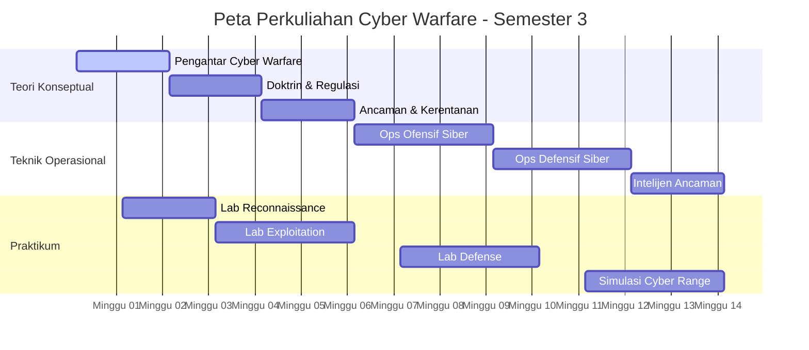

# **RENCANA PEMBELAJARAN SEMESTER (RPS)**  
**MATA KULIAH CYBER WARFARE**  
**PROGRAM STUDI D3 PERTAHANAN SIBER - STTAL**

---

## **IDENTITAS MATA KULIAH**
| **Komponen** | **Keterangan** |
|--------------|----------------|
| **Nama Mata Kuliah** | Cyber Warfare |
| **Kode Mata Kuliah** | CPS301 |
| **Bobot SKS** | 3 SKS (2-1) - Teori: 2 SKS, Praktikum: 1 SKS |
| **Semester** | 3 (Tiga) |
| **Program Studi** | D3 Pertahanan Siber |
| **Jurusan** | Teknologi Informasi Pertahanan |
| **Dosen Pengampu** | [Nama Dosen] |
| **Sekolah Tinggi** | STTAL (Sekolah Tinggi Teknologi Angkatan Laut) |

---

## **CAPAIAN PEMBELAJARAN**
### **A. Capaian Pembelajaran Lulusan (CPL) yang Dibebankan**
Setelah menyelesaikan mata kuliah ini, mahasiswa mampu:
1. **CPL-1**: Menganalisis konsep dan strategi cyber warfare dalam operasi militer
2. **CPL-2**: Merancang taktik operasi siber ofensif dan defensif
3. **CPL-3**: Mengimplementasikan teknik pertahanan siber berbasis Zero Trust Architecture
4. **CPL-4**: Mengevaluasi ancaman cyber warfare dalam skenario pertahanan maritim

### **B. Capaian Pembelajaran Mata Kuliah (CPMK)**
| **Kode** | **Deskripsi** |
|----------|---------------|
| **CPMK-1** | Menjelaskan konsep dasar cyber warfare dan doktrin operasi siber militer |
| **CPMK-2** | Menganalisis teknik serangan siber dan metode pertahanannya |
| **CPMK-3** | Merancang strategi operasi siber ofensif dan defensif |
| **CPMK-4** | Mengimplementasikan sistem deteksi dan respons insiden siber |

---

## **PETA PERKULIAHAN**

---

## **RINCIAN MINGGUAN PERKULIAHAN**

### **BAGIAN 1: TEORI (2 SKS - 14 MINGGU)**

#### **Minggu 1-2: Pengantar Cyber Warfare**
**Sub CPMK**: CPMK-1  
**Materi**:
- Konsep dasar cyber warfare
- Sejarah dan evolusi perang siber
- Ruang lingkup operasi siber militer
- Cyber warfare vs cyber crime

**Kegiatan**:
- Kuliah interaktif
- Studi kasus: Stuxnet attack
- Diskusi: Dampak cyber warfare pada pertahanan maritim

**Evaluasi**: Quiz 1 (10%)

---

#### **Minggu 3-4: Doktrin & Regulasi Cyber Warfare**
**Sub CPMK**: CPMK-1  
**Materi**:
- Doktrin operasi siber TNI AL
- Regulasi nasional (Perpres 47/2023, Perpres 82/2022)
- Hukum internasional (Tallinn Manual 2.0)
- Etika dalam cyber warfare

**Kegiatan**:
- Analisis dokumen doktrin
- Simulasi debat hukum operasi siber
- Studi kasus: Operasi siber dalam konflik Rusia-Ukraina

**Evaluasi**: Tugas 1 - Analisis Doktrin (15%)

---

#### **Minggu 5-6: Ancaman & Kerentanan Siber**
**Sub CPMK**: CPMK-2  
**Materi**:
- Klasifikasi ancaman siber militer
- Advanced Persistent Threat (APT)
- Kerentanan infrastruktur kritis maritim
- Teknik social engineering targeting militer

**Kegiatan**:
- Pemetaan ancaman terhadap AL
- Analisis kerentanan sistem komando
- Workshop threat modeling

**Evaluasi**: UTS (25%)

---

#### **Minggu 7-9: Operasi Ofensif Siber**
**Sub CPMK**: CPMK-3  
**Materi**:
- Teknik reconnaissance dan scanning
- Eksploitasi kerentanan
- Persistence dan lateral movement
- Command and Control (C2) techniques

**Kegiatan**:
- Studi teknik APT kelompok nation-state
- Analisis malware militer
- Simulasi penetration testing

**Evaluasi**: Tugas 2 - Red Team Exercise (20%)

---

#### **Minggu 10-12: Operasi Defensif Siber**
**Sub CPMK**: CPMK-3, CPMK-4  
**Materi**:
- Konsep Zero Trust Architecture
- Sistem deteksi intrusi (IDS/IPS)
- Security Information and Event Management (SIEM)
- Incident response dan recovery

**Kegiatan**:
- Desain arsitektur pertahanan ZTA
- Konfigurasi tools deteksi
- Table-top exercise respons insiden

**Evaluasi**: Tugas 3 - Blue Team Exercise (20%)

---

#### **Minggu 13-14: Intelijen & Masa Depan Cyber Warfare**
**Sub CPMK**: CPMK-2  
**Materi**:
- Cyber threat intelligence
- AI dan machine learning dalam cyber warfare
- Quantum computing threats
- Tren future warfare

**Kegiatan**:
- Workshop OSINT techniques
- Analisis prediksi tren ancaman
- Presentasi proyek akhir

**Evaluasi**: UAS (30%)

---

### **BAGIAN 2: PRAKTIKUM (1 SKS - 14 MINGGU)**

#### **Lab 1-2: Environmental Familiarization**
**Tools**: VirtualBox, Kali Linux, Security Onion  
**Aktivitas**:
- Setup lab environment
- Network reconnaissance dengan Nmap
- Vulnerability scanning dengan OpenVAS

**Output**: Laporan teknik reconnaissance

---

#### **Lab 3-5: Offensive Operations**
**Tools**: Metasploit, Burp Suite, Cobalt Strike  
**Aktivitas**:
- Exploitation exercises
- Web application penetration testing
- Post-exploitation techniques

**Output**: Laporan penetration test

---

#### **Lab 6-8: Defensive Operations**
**Tools**: Wazuh, Snort, ELK Stack  
**Aktivitas**:
- IDS/IPS configuration
- Log analysis dan monitoring
- Incident response procedures

**Output**: Laporan insiden dan mitigasi

---

#### **Lab 9-14: Integrated Cyber Range**
**Scenario**: Maritime Cyber Defense  
**Aktivitas**:
- Red Team vs Blue Team exercise
- Shipboard system protection
- Coordination with command center

**Output**: Comprehensive exercise report

---

## **EVALUASI PEMBELAJARAN**
| **Komponen** | **Bobot** | **Keterangan** |
|--------------|-----------|----------------|
| **Kehadiran & Partisipasi** | 10% | Keaktifan di kelas dan diskusi |
| **Quiz** | 10% | 2 kali quiz @5% |
| **Tugas 1** | 15% | Analisis doktrin dan regulasi |
| **Tugas 2** | 20% | Red team exercise |
| **Tugas 3** | 20% | Blue team exercise |
| **UTS** | 25% | Ujian tengah semester |
| **UAS** | 30% | Ujian akhir semester + proyek |

---

## **KRITERIA PENILAIAN**
| **Nilai Huruf** | **Skala** | **Kriteria** |
|-----------------|-----------|--------------|
| A | 85-100 | Penguasaan konsep sangat baik, kemampuan praktikal outstanding |
| B | 70-84 | Penguasaan konsep baik, kemampuan praktikal memadai |
| C | 55-69 | Penguasaan konsep cukup, kemampuan praktikal minimal |
| D | 40-54 | Penguasaan konsep terbatas, kemampuan praktikal kurang |
| E | 0-39 | Tidak memenuhi standar kelulusan |

---

## **SUMBER PEMBELAJARAN**

### **A. Buku Wajib**
1. Andress, J. & Winterfeld, S. (2023). *Cyber Warfare: Techniques, Tactics and Tools for Security Practitioners*
2. Singer, P.W. & Friedman, A. (2024). *Cybersecurity and Cyberwar: What Everyone Needs to Know*
3. Departemen Pertahanan RI. (2023). *Doktrin Operasi Siber TNI*

### **B. Buku Pendukung**
1. Rid, T. (2023). *Cyber War Will Not Take Place*
2. Kuehl, D.T. (2023). *From Cyberspace to Cyber Power: Defining the Problem*
3. NATO CCDCOE. (2023). *Tallinn Manual 2.0 on the International Law Applicable to Cyber Operations*

### **C. Sumber Digital**
1. Portal BSSN: https://bssn.go.id
2. NATO CCDCOE: https://ccdcoe.org
3. STTAL Learning Management System

### **D. Perangkat Lunak**
- Kali Linux
- Metasploit Framework
- Wazuh SIEM
- VirtualBox/VMware
- Docker containers

---

## **RENCANA TINDAK LANJUT**
1. **Magang Operasional**: Penempatan di satuan siber TNI AL
2. **Sertifikasi**: Persiapan ujian BSSN CCSA
3. **Proyek Lanjutan**: Pengembangan tools keamanan spesifik AL
4. **Partisipasi Latihan**: Bergabung dalam latihan siber gabungan

---

**Tanggal:** 15 Desember 2024  
**Revisi:** 1.0

---
*Catatan: RPS ini mengacu pada Kurikulum STTAL dan disesuaikan dengan kebutuhan operasional TNI AL serta perkembangan terkini cyber warfare.*
