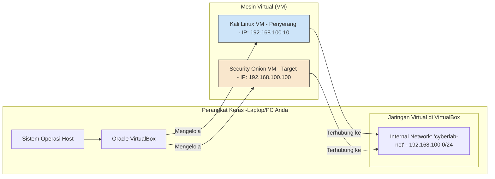

## **MODUL PRAKTIKUM MINGGU 1-2: FAMILIARISASI LINGKUNGAN SIBER**

**Mata Kuliah:** Keamanan Siber Terapan
**Kode Modul:** KS-LAB-01
**Durasi:** 2 Sesi x 4 Jam Praktikum

-----

### **A. TUJUAN PEMBELAJARAN**

Setelah menyelesaikan modul praktikum ini, mahasiswa diharapkan mampu:

1.  **Membangun (Setup)** sebuah lingkungan laboratorium siber virtual yang terisolasi menggunakan VirtualBox.
2.  **Melakukan Deployment** mesin virtual Kali Linux sebagai platform ofensif dan Security Onion sebagai platform target/pemantauan.
3.  **Melaksanakan** teknik-teknik dasar *network reconnaissance* (pengintaian jaringan) menggunakan tool **Nmap**.
4.  **Menjalankan** proses *vulnerability scanning* (pemindaian kerentanan) menggunakan tool **OpenVAS (GVM)**.
5.  **Menyusun** sebuah laporan teknis hasil pengintaian dan pemindaian sesuai format standar.

-----

### **B. KEBUTUHAN ALAT DAN BAHAN**

Sebelum memulai praktikum, pastikan perangkat keras dan perangkat lunak berikut telah siap.

**1. Kebutuhan Perangkat Keras (Spesifikasi Minimal):**

  * **CPU:** Prosesor 64-bit, 4 Core atau lebih, dengan fitur Virtualisasi (Intel VT-x atau AMD-V) **diaktifkan** pada BIOS/UEFI.
  * **RAM:** **16 GB**. (Alokasi: 8-12 GB untuk Security Onion, 2 GB untuk Kali, sisa untuk OS Host).
  * **Penyimpanan:** **150 GB** ruang kosong pada Hard Disk (disarankan menggunakan SSD untuk performa lebih baik).

**2. Kebutuhan Perangkat Lunak (Unduh Versi Terbaru):**

  * **Oracle VirtualBox**: Unduh dari [situs resmi VirtualBox](https://www.virtualbox.org/wiki/Downloads).
  * **VirtualBox Extension Pack**: Unduh dari halaman yang sama dengan VirtualBox.
  * **Kali Linux (VirtualBox Image)**: Unduh file `.ova` dari [situs resmi Kali](https://www.google.com/search?q=https://www.kali.org/get-kali/%23kali-virtual-machines). Memilih *virtual machine image* lebih cepat daripada instalasi manual.
  * **Security Onion (ISO Image)**: Unduh file ISO dari [situs resmi Security Onion](https://securityonionsolutions.com/software/).

-----

### **C. MODUL 1: PENYIAPAN LINGKUNGAN LABORATORIUM VIRTUAL**

**Tujuan:** Membangun arena digital yang aman dan terisolasi untuk semua kegiatan praktikum.

#### **1.1. Arsitektur Laboratorium**

Kita akan membangun jaringan virtual seperti pada diagram berikut. Tujuannya adalah agar mesin Kali (penyerang) dapat "melihat" dan menyerang mesin Security Onion (target) dalam sebuah jaringan internal yang terisolasi (`cyberlab-net`), tanpa membahayakan jaringan luar.



#### **1.2. Langkah-langkah Konfigurasi**

Ikuti setiap langkah dengan teliti. Kesalahan konfigurasi pada tahap ini akan menyebabkan masalah konektivitas pada modul berikutnya.

**Langkah 1: Instalasi VirtualBox dan Konfigurasi Jaringan**

1.  **Instalasi**: Lakukan instalasi VirtualBox dan Extension Pack pada komputer Anda.
2.  **Buat Jaringan Internal**:
      * Buka VirtualBox.
      * Klik **File \> Tools \> Network Manager**.
      * Pilih tab **Internal Networks**.
      * Klik tombol **Create**.
      * Sebuah jaringan baru bernama `intnet` akan muncul. Klik kanan padanya, pilih **Properties**.
      * Ubah namanya menjadi `cyberlab-net`.
      * Pastikan opsi "Enable DHCP" **TIDAK DICENTANG**.
      * Klik **Apply**.

**Langkah 2: Import dan Konfigurasi VM Kali Linux (Penyerang)**

1.  **Import**: Klik **File \> Import Appliance...**. Pilih file `.ova` Kali Linux yang sudah diunduh. Ikuti wizard impor dengan pengaturan default.
2.  **Konfigurasi**: Setelah impor selesai, pilih VM Kali, lalu klik **Settings**.
      * **System \> Motherboard**: Atur Base Memory menjadi **2048 MB**.
      * **System \> Processor**: Atur Processors menjadi **2**.
      * **Network**:
          * **Adapter 1**: Centang *Enable Network Adapter*. Atur *Attached to* menjadi **Internal Network** dan *Name* menjadi **`cyberlab-net`**.
3.  **Konfigurasi IP Statis**:
      * Nyalakan VM Kali. Login dengan `kali`/`kali`.
      * Klik ikon jaringan di pojok kanan atas, pilih **Wired Connected \> Wired Settings**.
      * Klik ikon gerigi di sebelah koneksi "Wired".
      * Pilih tab **IPv4**.
      * Ubah *Method* menjadi **Manual**.
      * Isi konfigurasi sebagai berikut:
          * Address: `192.168.100.10`
          * Netmask: `255.255.255.0`
      * Klik **Apply**. Matikan dan nyalakan kembali koneksi jaringan untuk menerapkan perubahan.
      * Buka Terminal dan ketik `ip a` untuk memverifikasi. Anda harus melihat `eth0` memiliki IP `192.168.100.10/24`.

**Langkah 3: Instalasi dan Konfigurasi VM Security Onion (Target)**

1.  **Buat VM Baru**: Klik **New**.
      * Name: `Security-Onion-Target`
      * Type: `Linux`
      * Version: `Red Hat (64-bit)`
2.  **Alokasi Sumber Daya**:
      * Memory size: **12288 MB** (12 GB). **PERHATIAN:** Jangan kurang dari 8 GB.
      * Hard disk: Create a virtual hard disk now, VDI, Dynamically allocated. Size: **120 GB**.
3.  **Konfigurasi**: Pilih VM Security Onion, klik **Settings**.
      * **System \> Processor**: Atur Processors menjadi **4**.
      * **Storage**: Klik ikon CD kosong di bawah *Controller: IDE*. Di panel kanan, klik ikon CD kecil dan pilih *Choose a disk file...*. Arahkan ke file ISO Security Onion.
      * **Network**:
          * **Adapter 1 (Management)**: Enable, *Attached to*: **Internal Network**, *Name*: `cyberlab-net`.
          * **Adapter 2 (Monitoring)**: Enable, *Attached to*: **Internal Network**, *Name*: `cyberlab-net`. Di bawah *Advanced*, set *Promiscuous Mode* ke **Allow All**.
4.  **Proses Instalasi**:
      * Nyalakan VM Security Onion. Tekan Enter saat diminta untuk memulai instalasi.
      * Ikuti wizard instalasi:
          * Username: `so-admin` (atau pilihan Anda)
          * Password: `[Buat password yang kuat dan catat]`
          * Saat ditanya "How would you like to proceed?", pilih **Install**.
          * Pilih **EVAL** mode.
          * Saat diminta memilih *Management Network*, pilih adapter pertama (biasanya `ens33`).
          * Konfigurasi IP statis untuk *Management*: `192.168.100.100/24`.
          * Untuk Gateway, masukkan `192.168.100.1` (meskipun tidak ada, ini diperlukan).
          * Lanjutkan instalasi. Proses ini akan memakan waktu **sangat lama** (bisa lebih dari 1 jam). Bersabarlah.
5.  **Verifikasi**: Setelah instalasi selesai dan VM reboot, buka browser di mesin Kali dan akses `https://192.168.100.100`. Login dengan akun yang Anda buat.

**Langkah 4: Uji Konektivitas**

  * Dari terminal Kali, jalankan `ping 192.168.100.100`. Pastikan ada balasan.
  * Login ke terminal Security Onion (melalui konsol VirtualBox), jalankan `ping 192.168.100.10`. Pastikan ada balasan.

Jika kedua tes berhasil, laboratorium Anda siap digunakan.

-----

### **D. MODUL 2: PRAKTIKUM NETWORK RECONNAISSANCE DENGAN NMAP**

**Tujuan:** Menggunakan Nmap untuk memetakan jaringan lab, mengidentifikasi host aktif, dan menemukan layanan (port) yang berjalan pada target.

**PERHATIAN:** Semua perintah dijalankan dari terminal VM **Kali Linux**.

#### **Kegiatan 1: Penemuan Host (Host Discovery)**

  * **Tujuan**: Mengidentifikasi perangkat mana saja yang aktif di jaringan `192.168.100.0/24`.
  * **Perintah**:
    ```bash
    nmap -sn 192.168.100.0/24
    ```
  * **Analisis Perintah**:
      * `nmap`: Menjalankan tool Nmap.
      * `-sn`: Mode "Ping Scan". Nmap tidak akan melakukan scan port. Tujuannya hanya untuk menemukan host yang merespons.
      * `192.168.100.0/24`: Target jaringan yang akan di-scan.
  * **Contoh Hasil**:
    ```text
    Starting Nmap 7.94 ( https://nmap.org ) at 2025-10-21 10:00 WIB
    Nmap scan report for 192.168.100.10
    Host is up (0.00012s latency).
    Nmap scan report for 192.168.100.100
    Host is up (0.00045s latency).
    Nmap done: 256 IP addresses (2 hosts up) scanned in 2.08 seconds
    ```
  * **Interpretasi**: Ditemukan 2 host yang aktif di jaringan lab, yaitu mesin kita sendiri (`.10`) dan mesin target (`.100`).

#### **Kegiatan 2: Pemindaian Port dan Layanan**

  * **Tujuan**: Mengidentifikasi port mana yang terbuka pada target `192.168.100.100` dan mencoba menebak layanan serta versi software yang berjalan di port tersebut.
  * **Perintah**:
    ```bash
    sudo nmap -sS -sV -O -oN nmap_report.txt 192.168.100.100
    ```
  * **Analisis Perintah**:
      * `sudo`: Diperlukan untuk mode `-sS`.
      * `-sS`: Mode "SYN Stealth Scan". Cepat dan relatif tersembunyi.
      * `-sV`: Mode "Version Detection". Mencoba mendeteksi versi dari layanan yang berjalan.
      * `-O`: Mode "OS Detection". Mencoba menebak sistem operasi target.
      * `-oN nmap_report.txt`: Menyimpan hasil scan ke dalam file `nmap_report.txt`.
      * `192.168.100.100`: IP target.
  * **Contoh Hasil (Diringkas)**:
    ```text
    Starting Nmap 7.94 ( https://nmap.org ) at 2025-10-21 10:15 WIB
    Nmap scan report for 192.168.100.100
    Host is up (0.00052s latency).
    Not shown: 994 closed tcp ports
    PORT    STATE SERVICE  VERSION
    22/tcp  open  ssh      OpenSSH 8.0p1 (protocol 2.0)
    80/tcp  open  http     nginx
    443/tcp open  ssl/http nginx
    ... (dan port lainnya) ...

    Device type: general purpose
    Running: Linux 5.x
    OS details: Linux 5.4 - 5.10
    ...
    Nmap done: 1 IP address (1 host up) scanned in 45.31 seconds
    ```
  * **Interpretasi**:
      * Ditemukan port `22` (SSH), `80` (HTTP), dan `443` (HTTPS) dalam keadaan terbuka.
      * Layanan teridentifikasi: **OpenSSH versi 8.0p1** dan web server **nginx**. Informasi versi ini sangat krusial untuk langkah selanjutnya.
      * Sistem Operasi teridentifikasi sebagai **Linux Kernel 5.x**.

-----

### **E. MODUL 3: PRAKTIKUM VULNERABILITY SCANNING DENGAN OPENVAS (GVM)**

**Tujuan:** Menggunakan hasil reconnaissance Nmap untuk melakukan pemindaian kerentanan yang mendalam terhadap target.

#### **Kegiatan 3: Penyiapan dan Pelaksanaan Scan**

1.  **Mulai GVM**: Buka terminal di Kali dan jalankan:
    ```bash
    sudo gvm-start
    ```
2.  **Login**: Browser akan terbuka ke `https://127.0.0.1:9392`. Login dengan `admin` dan password yang Anda dapatkan saat setup.
3.  **Buat Target**:
      * Arahkan ke **Configuration \> Targets**.
      * Klik ikon bintang biru (⭐) di pojok kiri atas.
      * Isi form:
          * Name: `Target-SO`
          * Hosts: `192.168.100.100`
      * Klik **Save**.
4.  **Buat Tugas Scan**:
      * Arahkan ke **Scans \> Tasks**.
      * Klik ikon bintang biru (⭐).
      * Isi form:
          * Name: `Initial Scan on Target-SO`
          * Scan Config: Biarkan default (`Full and fast`).
          * Scan Targets: Pilih `Target-SO`.
      * Klik **Save**.
5.  **Jalankan Scan**: Temukan task yang baru Anda buat di daftar, lalu klik ikon "Play" (▶️) untuk memulai. Proses ini akan memakan waktu.

#### **Kegiatan 4: Analisis Laporan Kerentanan**

1.  **Buka Laporan**: Setelah status scan "Done", klik pada nama scan tersebut.
2.  **Tinjau Dasbor**: Lihat ringkasan visual kerentanan berdasarkan tingkat keparahan (High, Medium, Low).
3.  **Analisis Detail**: Klik tab **Results**. Halaman ini menampilkan daftar semua kerentanan yang ditemukan.
4.  **Investigasi Kerentanan**:
      * Filter hasil untuk menampilkan hanya kerentanan dengan severity **High**.
      * Klik pada salah satu temuan. Perhatikan informasi yang disajikan:
          * **Summary**: Deskripsi singkat kerentanan.
          * **Impact**: Apa yang bisa dilakukan penyerang jika berhasil mengeksploitasi ini.
          * **Solution**: Bagaimana cara memperbaikinya.
          * **Vulnerability Insight**: Penjelasan teknis lebih dalam.
          * **References**: Tautan ke database CVE, advisori vendor, dll.

-----

### **F. TUGAS: PENYUSUNAN LAPORAN PRAKTIKUM**

**Tujuan:** Mendokumentasikan semua temuan dari kegiatan praktikum ke dalam sebuah laporan teknis yang terstruktur.

**Format Laporan:**

-----

**LAPORAN PRAKTIKUM 1: RECONNAISSANCE & VULNERABILITY SCANNING**

**Nama:** [Nama Anda]
**NIM:** [NIM Anda]
**Kelas:** [Kelas Anda]
**Tanggal:** [Tanggal Pelaksanaan]

-----

**1. TUJUAN PRAKTIKUM**
*(Jelaskan secara singkat tujuan dari praktikum ini berdasarkan poin A di modul).*

**2. LINGKUNGAN UJI**

  * Jelaskan arsitektur lab yang Anda bangun (IP Penyerang, IP Target).

**3. METODOLOGI**

  * Jelaskan langkah-langkah yang Anda lakukan secara ringkas, sebutkan tool yang digunakan untuk setiap fase (Nmap untuk reconnaissance, GVM/OpenVAS untuk vulnerability scanning).

**4. HASIL DAN ANALISIS**
**4.1. Hasil Reconnaissance (Nmap)**

  * Sajikan daftar host yang aktif.
  * Sajikan tabel port, layanan, dan versi yang teridentifikasi pada target `192.168.100.100`.
  * Sebutkan hasil deteksi sistem operasi.

**4.2. Hasil Vulnerability Scanning (OpenVAS)**

  * Sajikan ringkasan jumlah kerentanan berdasarkan tingkat keparahan.
  * Buat daftar **3 kerentanan paling kritis (High Severity)** yang Anda temukan. Untuk masing-masing dari 3 kerentanan tersebut, jelaskan:
      * **Nama Kerentanan & CVE ID**: (Contoh: "Nginx HTTP Server Line-Ending Handling Vulnerability - CVE-2017-7529")
      * **Deskripsi & Dampak**: Jelaskan apa itu kerentanan ini dan apa risiko terburuknya.
      * **Rekomendasi Perbaikan**: Berikan saran perbaikan yang konkret.

**5. KESIMPULAN**

  * Berikan kesimpulan umum mengenai postur keamanan dari mesin target berdasarkan temuan Anda. Identifikasi area kelemahan utamanya.

-----

### **G. SUMBER PEMBELAJARAN**

  * **Dokumentasi Nmap**: [https://nmap.org/book/man.html](https://nmap.org/book/man.html)
  * **Dokumentasi Greenbone (OpenVAS)**: [https://docs.greenbone.net/](https://docs.greenbone.net/)
  * **Database CVE**: [https://cve.mitre.org/](https://cve.mitre.org/)
