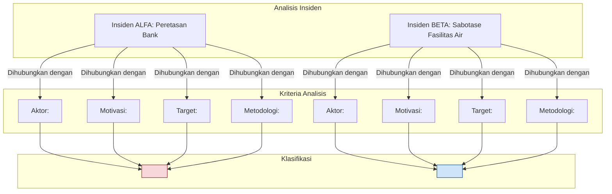
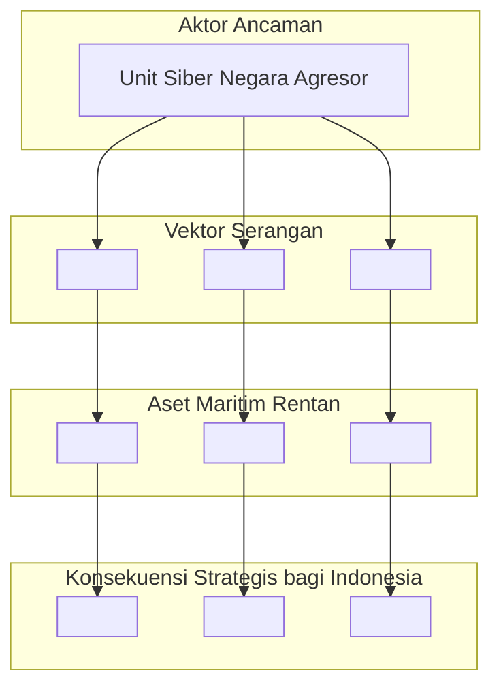

## **Soal Latihan dan Tugas Analisis: Minggu 1-2**

### **Bagian A: Soal Latihan Pilihan Ganda & Esai Singkat**

Tujuan bagian ini adalah untuk menguji pemahaman Anda terhadap konsep-konsep kunci, definisi, dan fakta-fakta historis yang disajikan dalam materi.

-----

#### **I. Pilihan Ganda (Pilih jawaban yang paling tepat)**

1.  Menurut definisi yang disajikan dalam materi, elemen **paling fundamental** yang membedakan *Cyber Warfare* dari bentuk serangan siber lainnya adalah...

    a.  Penggunaan *malware* yang canggih

    b.  **Aktornya adalah negara-bangsa (atau proksi-nya)**

    c.  Menargetkan infrastruktur digital

    d.  Menyebabkan kerugian finansial yang besar

2.  Pengakuan *Cyberspace* sebagai domain peperangan kelima berarti bahwa...

    a.  Perang hanya akan terjadi di dunia maya.

    b.  Semua negara wajib memiliki angkatan siber.

    c.  **Aktivitas di ruang siber dapat dianggap setara dengan aksi militer di domain fisik.**

    d.  Hukum perang tidak berlaku di internet.

3.  Serangan yang menargetkan persepsi manusia, seperti kampanye disinformasi dan operasi psikologis (PSYOP), terjadi pada lapisan *Cyberspace* yang mana?

    a.  *Physical Layer*
    b.  *Logical Layer*

    c.  ***Cognitive Layer***

    d.  *Application Layer*

4.  Peristiwa historis yang dianggap sebagai "titik balik" di mana serangan siber pertama kali berhasil melumpuhkan infrastruktur digital sebuah negara secara masif adalah...

    a.  Morris Worm (1988)

    b.  Moonlight Maze (1998)

    c.  **Serangan Siber terhadap Estonia (2007)**

    d.  Penemuan Stuxnet (2010)

5.  Tindakan proaktif yang diambil di luar jaringan sendiri untuk memproyeksikan kekuatan dan mencapai tujuan militer, seperti melakukan spionase atau melancarkan serangan, diklasifikasikan sebagai...

    a.  Operasi Siber Defensif (DCO)

    b.  **Operasi Siber Ofensif (OCO)**

    c.  Operasi Informasi (IO)

    d.  Jaminan Misi (*Mission Assurance*)

-----

#### **II. Esai Singkat (Jawab dengan jelas dan ringkas dalam 2-4 kalimat)**

6.  Jelaskan **dua** karakteristik unik dari *Cyberspace* sebagai domain peperangan dan mengapa karakteristik tersebut mengubah sifat konflik modern\!
7.  Apa perbedaan fundamental antara **motivasi** di balik *Cyber Warfare* dan *Cyber Crime*? Berikan satu contoh untuk masing-masing.
8.  Mengapa insiden **Morris Worm** pada tahun 1988 dianggap sebagai peristiwa penting dalam sejarah keamanan siber, meskipun tidak dirancang untuk tujuan jahat?
9.  Dalam konteks Operasi Siber Militer, apa yang dimaksud dengan ***Mission Assurance*** dan mengapa hal ini menjadi tujuan utama dari Operasi Siber Defensif (DCO)?
10. Jelaskan mengapa serangan **Stuxnet** dianggap sebagai momen "melintasi Rubicon" dalam sejarah *cyber warfare*\!

-----

### **Bagian B: Tugas Analisis dan Studi Kasus**

Tujuan bagian ini adalah untuk mendorong pemikiran kritis, analisis, dan penerapan konsep yang telah dipelajari dalam skenario yang lebih kompleks.

-----

#### **Tugas 1: Analisis Komparatif – *Cyber Warfare* vs. *Cyber Crime***

Anda adalah seorang analis intelijen siber yang ditugaskan untuk memberikan pengarahan kepada para perwira baru mengenai perbedaan lanskap ancaman. Anda menemukan dua insiden:

  * **Insiden ALFA:** Sebuah kelompok meretas sistem perbankan nasional dan berhasil mencuri dana nasabah senilai miliaran rupiah. Jejak digital menunjukkan mereka menggunakan *ransomware* yang dibeli dari pasar gelap dan beroperasi dari Eropa Timur.
  * **Insiden BETA:** Sebuah fasilitas pengolahan air milik negara tiba-tiba mengalami malfungsi pada sistem kontrol industrinya (PLC), menyebabkan tekanan air yang tidak stabil. Analisis forensik menemukan *malware* kustom yang sangat canggih dan tidak pernah terlihat sebelumnya, yang tampaknya hanya menargetkan tipe PLC spesifik tersebut. Tidak ada permintaan tebusan. Insiden ini terjadi di tengah meningkatnya ketegangan diplomatik dengan negara tetangga.

**Instruksi:**

1.  Buatlah analisis komparatif untuk kedua insiden tersebut berdasarkan kriteria yang telah dipelajari (Aktor, Motivasi, Target, Metodologi, Tujuan Akhir).
2.  Klasifikasikan Insiden ALFA dan Insiden BETA sebagai kemungkinan *Cyber Crime* atau *Cyber Warfare*, dan berikan justifikasi yang kuat untuk setiap klasifikasi.
3.  Gambarkan analisis Anda dalam diagram Mermaid untuk memvisualisasikan perbedaan fundamental antara kedua insiden tersebut.

**Diagram Analisis Komparatif (Contoh):**

-----

#### **Tugas 2: Studi Kasus Mendalam – Anatomi Serangan Stuxnet**

Berdasarkan materi mengenai Stuxnet, Anda ditugaskan untuk membuat sebuah "rantai serangan" (*kill chain*) yang menjelaskan bagaimana operasi tersebut dieksekusi dari awal hingga akhir.

**Instruksi:**

1.  Identifikasi dan jelaskan setiap fase utama dari serangan Stuxnet, mulai dari bagaimana ia berhasil menjembatani "celah udara" (*air gap*) hingga bagaimana ia mencapai tujuan akhirnya.
2.  Fokus pada dua mekanisme kunci yang membuatnya sangat efektif: **sabotase fisik** dan **penipuan/penyembunyian serangan**.
3.  Gambarkan alur serangan ini menggunakan diagram sekuens Mermaid. Diagram harus secara jelas menunjukkan interaksi antara berbagai komponen (Penyerang, USB, Workstation, PLC, Sentrifugal, Ruang Kontrol).

-----

#### **Tugas 3: Analisis Kontekstual – Dampak *Cyber Warfare* pada Pertahanan Maritim Indonesia**

Sebagai negara maritim terbesar di dunia, Indonesia memiliki ketergantungan yang sangat tinggi pada domain laut untuk perdagangan, keamanan, dan kedaulatan.

**Instruksi:**

1.  Identifikasi **tiga (3)** sistem atau aset digital spesifik di domain maritim (baik di kapal perang/KRI, kapal komersial, maupun infrastruktur pelabuhan) yang menurut Anda paling rentan dan paling kritis.
2.  Untuk setiap sistem/aset yang Anda pilih, deskripsikan sebuah **skenario serangan siber** yang realistis. Jelaskan vektor serangan yang mungkin digunakan dan apa **konsekuensi strategisnya** bagi pertahanan atau ekonomi maritim Indonesia.
3.  Buatlah diagram alur (graph) menggunakan Mermaid yang memetakan hubungan antara Aktor Ancaman, Vektor Serangan, Aset Maritim yang Rentan, dan Konsekuensi Strategis yang mungkin timbul.

**Diagram Analisis Dampak Maritim (Contoh Kerangka):**

Selamat mengerjakan\! Tugas-tugas ini dirancang untuk memastikan Anda tidak hanya menghafal materi, tetapi benar-benar memahaminya secara konseptual dan mampu menerapkannya dalam analisis.
