Tentu, berikut adalah materi pembelajaran yang sangat komprehensif dan mendalam untuk dua minggu pertama, mencakup pengantar *cyber warfare* dengan semua komponen yang Anda minta.

-----

## **Materi Pembelajaran Minggu 1-2: Pengantar Komprehensif *Cyber Warfare***

**Abstrak**

Selamat datang di modul pengantar *Cyber Warfare*. Selama dua minggu ke depan, kita akan memulai perjalanan untuk memahami salah satu domain konflik yang paling dinamis, kompleks, dan menentukan di abad ke-21. Modul ini dirancang untuk memberikan fondasi yang kokoh, dimulai dari dekonstruksi konsep dasar perang siber, menelusuri jejak evolusinya dari eksperimen teoretis menjadi instrumen kekuatan negara yang nyata, hingga memetakan ruang lingkup operasi siber militer modern. Kita akan membuat distingsi yang jelas antara tindakan perang siber yang disponsori negara (*cyber warfare*) dan aktivitas kriminal di dunia maya (*cyber crime*). Puncak dari modul ini adalah sesi diskusi mendalam yang akan membedah studi kasus paradigmatik—serangan Stuxnet—dan menganalisis implikasi strategis dari perang siber terhadap domain pertahanan maritim, sebuah area yang sangat vital bagi negara kepulauan seperti Indonesia. Materi ini dilengkapi dengan diagram visual dan tautan ke sumber-sumber otoritatif untuk memperkaya pengalaman belajar Anda.

-----

### **1. Konsep Dasar *Cyber Warfare***

Sebelum kita dapat menganalisis serangan atau merancang pertahanan, kita harus terlebih dahulu membangun pemahaman yang sama tentang terminologi dan konsep fundamental yang menopang seluruh disiplin ini. *Cyber warfare* lebih dari sekadar "peretasan"; ia adalah perpanjangan dari politik negara dengan cara lain, seperti yang dikatakan oleh Clausewitz, namun diwujudkan dalam medium digital.

#### **1.1. Mendefinisikan *Cyber Warfare***

Secara akademis, ***Cyber Warfare* (Perang Siber)** didefinisikan sebagai **tindakan yang dilakukan oleh suatu negara-bangsa (atau proksinya) untuk menembus komputer atau jaringan negara lain dengan tujuan menyebabkan kerusakan, disrupsi, atau kehancuran untuk mencapai tujuan politik atau militer.**

Mari kita bedah elemen-elemen kunci dari definisi ini:

  * **Aktor: Negara-Bangsa (*Nation-State*)**: Ini adalah pembeda utama. Aktor di balik *cyber warfare* adalah entitas negara, yang bertindak melalui angkatan bersenjata, badan intelijen, atau kelompok proksi yang disponsori. Mereka memiliki sumber daya, persistensi, dan motivasi yang jauh melampaui peretas individu atau kelompok kriminal. Tujuannya bukan keuntungan finansial, melainkan keuntungan geopolitik.
  * **Tindakan: Penetrasi (*Penetration*)**: Ini merujuk pada tindakan mendapatkan akses tidak sah ke dalam sistem atau jaringan target. Ini adalah esensi dari operasi siber.
  * **Tujuan: Kerusakan, Disrupsi, Kehancuran (*Damage, Disruption, Destruction*)**: Ini adalah spektrum efek yang ingin dicapai.
      * **Disrupsi**: Membuat layanan tidak tersedia (misalnya, melumpuhkan situs web pemerintah dengan serangan DDoS).
      * **Kerusakan**: Merusak integritas data atau fungsi sistem (misalnya, menghapus basis data penting).
      * **Kehancuran**: Menyebabkan efek fisik di dunia nyata (misalnya, menyebabkan mesin industri rusak atau jaringan listrik padam). Ini adalah eskalasi tertinggi dari serangan siber.
  * **Motivasi: Tujuan Politik atau Militer**: Setiap operasi *cyber warfare* pada akhirnya melayani agenda kebijakan luar negeri atau strategi militer suatu negara. Baik itu untuk mencuri rahasia, menyabotase program senjata musuh, atau membentuk medan perang sebelum invasi fisik.

#### **1.2. *Cyberspace* sebagai Domain Peperangan Kelima**

Secara tradisional, peperangan berlangsung di empat domain fisik: **Darat  जमीन, Laut 🌊, Udara ✈️, dan Antariksa 🛰️**. Namun, dengan digitalisasi global, komunitas militer dan strategis di seluruh dunia sekarang secara resmi mengakui ***Cyberspace* (Ruang Siber)** sebagai **domain peperangan kelima**.

*Cyberspace* adalah lingkungan global buatan manusia yang terdiri dari infrastruktur teknologi informasi yang saling terhubung, termasuk internet, jaringan telekomunikasi, sistem komputer, serta prosesor dan pengontrol tertanam di dalamnya.

Domain ini memiliki karakteristik unik yang secara fundamental mengubah sifat konflik:

  * **Tanpa Batas Geografis yang Jelas**: Serangan dapat diluncurkan dari mana saja di dunia, melewati perbatasan negara dalam hitungan milidetik.
  * **Masalah Atribusi yang Sulit**: Sangat sulit untuk membuktikan secara pasti siapa dalang di balik sebuah serangan. Penyerang dapat dengan mudah menyamarkan jejak mereka dengan merutekan serangan melalui server di berbagai negara.
  * **Asimetri**: Negara atau kelompok kecil dengan kapabilitas siber yang canggih dapat menimbulkan kerusakan yang tidak proporsional terhadap negara yang jauh lebih besar dan kuat secara konvensional.
  * **Kecepatan**: Operasi dapat dieksekusi dan menghasilkan efek dalam hitungan detik atau menit, jauh lebih cepat daripada pengerahan pasukan fisik.
  * **Biaya Relatif Rendah**: Mengembangkan senjata siber yang kuat jauh lebih murah daripada membangun sebuah kapal induk atau jet tempur.

#### **1.3. Tiga Lapisan *Cyberspace***

Untuk memahami bagaimana operasi siber bekerja, penting untuk memvisualisasikan *cyberspace* dalam tiga lapisan yang saling terkait:

1.  ***Physical Layer* (Lapisan Fisik)**: Ini adalah fondasi dari *cyberspace*. Ini mencakup semua perangkat keras dan infrastruktur fisik: kabel serat optik bawah laut, satelit, pusat data, menara seluler, router, server, dan komputer Anda. Serangan pada lapisan ini bisa bersifat kinetik, seperti memotong kabel atau mengebom pusat data.
2.  ***Logical Layer* (Lapisan Logis)**: Lapisan ini berada di atas lapisan fisik. Ini terdiri dari perangkat lunak, protokol, dan arsitektur jaringan yang memungkinkan data mengalir. Ini adalah ranah di mana sebagian besar "peretasan" terjadi—kode, *malware*, dan protokol jaringan dieksploitasi di sini.
3.  ***Cognitive Layer* (Lapisan Kognitif)**: Ini adalah lapisan manusia. Ini tentang bagaimana kita, sebagai manusia, memandang, memahami, dan berinteraksi dengan informasi yang disajikan kepada kita melalui lapisan logis dan fisik. Operasi di lapisan ini berfokus pada manipulasi persepsi, seperti kampanye disinformasi dan operasi psikologis (PSYOP).

Operasi *cyber warfare* yang paling efektif seringkali menargetkan ketiga lapisan ini secara bersamaan untuk menciptakan efek sinergis.

-----

### **2. Sejarah dan Evolusi Perang Siber**

Perang siber bukanlah fenomena yang muncul dalam semalam. Ia telah berevolusi selama lebih dari empat dekade, seiring dengan pertumbuhan internet itu sendiri. Memahami linimasa ini membantu kita mengapresiasi bagaimana kita sampai pada lanskap ancaman yang kompleks saat ini.

#### **Timeline Evolusi Perang Siber**


#### **Analisis Setiap Era**

  * **Era 1980-an: Kelahiran Ancaman**: Pada masa-masa awal internet (ARPANET), keamanan bukanlah prioritas. Insiden seperti **Morris Worm** pada tahun 1988, meskipun tidak disengaja, adalah sebuah kejutan besar. Ia menunjukkan bagaimana sebuah program tunggal dapat menyebar dengan cepat dan menyebabkan disrupsi ekonomi yang signifikan, membuka mata dunia terhadap potensi ancaman baru ini.
  * **Era 1990-an: Spionase dan Konflik Awal**: Dengan berakhirnya Perang Dingin, spionase tidak berhenti; ia hanya berpindah medium. Kasus seperti **Moonlight Maze** menunjukkan bahwa negara-bangsa mulai melihat *cyberspace* sebagai ranah yang subur untuk mencuri rahasia militer dan teknologi. **Perang Kosovo** menandai pertama kalinya serangan siber digunakan sebagai bagian dari doktrin militer yang terintegrasi, mendukung operasi pengeboman NATO.
  * **Era 2000-an: Eskalasi Skala Nasional**: Dekade ini menyaksikan lompatan besar dalam skala dan kecanggihan serangan. **Titan Rain** menunjukkan spionase yang sistematis dan terorganisir untuk keuntungan ekonomi dan militer. Namun, peristiwa yang benar-benar mengubah permainan adalah **serangan siber terhadap Estonia pada tahun 2007**. Selama tiga minggu, negara yang sangat terdigitalisasi ini lumpuh total oleh serangan DDoS yang terkoordinasi. Ini membuktikan bahwa serangan siber dapat digunakan sebagai instrumen koersi negara yang kuat, setara dengan blokade angkatan laut. Sebagai tanggapan langsung, NATO mendirikan Cooperative Cyber Defence Centre of Excellence (CCDCOE) di Tallinn.
  * **Era 2010-an: Senjata Siber dan Kerusakan Fisik**: Jika Estonia menunjukkan *cyber warfare* dapat melumpuhkan, **Stuxnet** (ditemukan pada 2010) menunjukkan ia dapat menghancurkan. Ini adalah momen "melintasi Rubicon", di mana kode digital terbukti mampu menyebabkan kerusakan kinetik di dunia nyata. Tren ini dilanjutkan dengan **serangan terhadap jaringan listrik Ukraina**, yang membuktikan bahwa infrastruktur kritis yang menopang kehidupan modern sangat rentan. Dekade ini juga melihat fokus bergeser ke lapisan kognitif, dengan **intervensi dalam proses demokrasi** menjadi fitur utama dalam konflik internasional.
  * **Era 2020-an: Norma Perang Hibrida**: **Invasi Rusia ke Ukraina pada tahun 2022** adalah contoh paling jelas dari perang hibrida modern. Serangan siber tidak lagi menjadi pendahuluan atau tambahan, melainkan bagian integral dari setiap fase konflik—mulai dari serangan terhadap komunikasi satelit sesaat sebelum invasi hingga penyebaran *wiper malware* dan kampanye disinformasi yang berkelanjutan.

-----

-----

### **3. Ruang Lingkup Operasi Siber Militer**

Ketika militer mengadopsi *cyberspace* sebagai domain operasional, mereka mengembangkan doktrin untuk mengklasifikasikan dan mengatur tindakan mereka. Operasi siber militer secara umum dibagi menjadi tiga kategori besar: Operasi Siber Defensif (DCO), Operasi Siber Ofensif (OCO), dan Operasi Informasi (IO).

#### **Diagram Ruang Lingkup Operasi Siber Militer**


#### **a. Operasi Siber Defensif (DCO) - Perisai 🛡️**

Ini adalah misi prioritas utama dan berkelanjutan bagi setiap unit siber militer. Tujuannya adalah untuk melindungi, memantau, menganalisis, mendeteksi, dan merespons aktivitas tidak sah di dalam jaringan militer (misalnya, jaringan Departemen Pertahanan atau DoD).

  * **Tujuan Utama**: *Mission Assurance*. Memastikan bahwa komandan dapat mengandalkan jaringan dan sistem data mereka untuk menjalankan operasi.
  * **Aktivitas Kunci**:
      * **Keamanan Jaringan**: Mengkonfigurasi *firewall*, sistem deteksi intrusi (IDS/IPS), dan kontrol akses untuk mempertahankan perimeter.
      * **Perlindungan Infrastruktur Kritis**: Bekerja sama dengan lembaga sipil untuk membantu mempertahankan infrastruktur vital nasional (jaringan listrik, keuangan, dll.) dari serangan besar.
      * **Perburuan Ancaman (*Threat Hunting*)**: Secara proaktif mencari penyusup di dalam jaringan, daripada hanya menunggu alarm berbunyi.
      * **Respons Insiden**: Ketika pelanggaran terjadi, tim DCO bertanggung jawab untuk menahan kerusakan, mengusir penyerang, dan memulihkan sistem.

#### **b. Operasi Siber Ofensif (OCO) - Pedang ⚔️**

OCO adalah tindakan proaktif yang diambil di luar jaringan sendiri untuk memproyeksikan kekuatan dan mencapai tujuan militer. OCO dirancang untuk menyebabkan efek tertentu pada musuh.

  * **Tujuan Utama**: Mendegradasi, mengganggu, atau menghancurkan kapabilitas musuh.
  * **Aktivitas Kunci**:
      * **ISR Siber (*Intelligence, Surveillance, and Reconnaissance*)**: Ini adalah spionase. Menyusup ke jaringan musuh untuk mengumpulkan intelijen tentang kapabilitas, rencana, atau disposisi mereka.
      * **Persiapan Medan Tempur Siber**: Mirip dengan pasukan khusus yang menyusup di belakang garis musuh sebelum pertempuran, operator OCO akan mendapatkan akses ke sistem musuh pada masa damai dan menanamkan *malware* "tidur" (*sleeper malware*) yang dapat diaktifkan nanti.
      * **Serangan Siber**: Melancarkan serangan untuk mencapai efek tertentu. Contoh: melumpuhkan sistem pertahanan udara musuh, mengganggu jaringan komando dan kendali mereka, atau menyabotase infrastruktur pendukung perang mereka.
      * **Dukungan untuk Operasi Kinetik**: Mengintegrasikan efek siber dengan operasi darat, laut, dan udara. Contoh: menonaktifkan jaringan radar musuh beberapa detik sebelum pesawat tempur memasuki wilayah udara mereka.

#### **c. Operasi Informasi (IO) - Pertarungan Pikiran 🧠**

IO beroperasi di lapisan kognitif. Tujuannya adalah untuk menggunakan informasi (dan disinformasi) untuk mempengaruhi persepsi, kemauan, dan pemahaman audiens target, baik musuh maupun populasi netral. Di era modern, IO sebagian besar dilakukan melalui *cyberspace*.

  * **Tujuan Utama**: Mengontrol narasi dan mendominasi lingkungan informasi.
  * **Aktivitas Kunci**:
      * **Operasi Psikologis (PSYOP)**: Menyampaikan pesan yang ditargetkan untuk mempengaruhi emosi dan perilaku musuh, seperti merusak moral atau mendorong desersi.
      * **Penipuan Militer (MILDEC - *Military Deception*)**: Menyebarkan informasi palsu untuk menipu musuh tentang niat atau kapabilitas kita.
      * **Propaganda dan Kontra-Propaganda**: Menyebarkan narasi yang mendukung tujuan kita sambil melawan narasi musuh.

-----

### **4. *Cyber Warfare* vs. *Cyber Crime***

Meskipun keduanya menggunakan teknik yang serupa (misalnya, *malware*, *phishing*), *cyber warfare* dan *cyber crime* adalah dua hal yang secara fundamental berbeda. Memahami perbedaan ini sangat penting untuk atribusi, respons, dan penegakan hukum. Perbedaan utamanya terletak pada **Aktor, Motivasi, dan Target**.

Di permukaan, serangan yang dilancarkan oleh unit siber militer dan sindikat kejahatan siber mungkin terlihat identik. Keduanya bisa menggunakan *malware* canggih, keduanya bisa melumpuhkan jaringan. Namun, perbedaan fundamental terletak pada **niat (*intent*)** di balik tindakan tersebut. Memahami perbedaan ini sangat penting untuk atribusi, respons (apakah ini masalah penegakan hukum atau masalah keamanan nasional?), dan penerapan hukum yang relevan.

#### **Diagram Perbandingan Aktor dan Motivasi Serangan Siber**

```mermaid
graph LR
    subgraph "Serangan Siber"
        direction LR
        A[Finansial Murni 💰] --> B[Ideologis/Politis] --> C[Geopolitik/Militer 🗺️]
    end

    subgraph "Kategori Aktor"
        CC[Cyber Criminals]
        H[Hacktivists]
        APT[Advanced Persistent Threats / State-Sponsored]
    end

    subgraph "Contoh Taktik Umum"
        T1[Ransomware]
        T2[Pencurian Kartu Kredit]
        T3[DDoS]
        T4[Defacement Situs Web]
        T5[Spionase Jangka Panjang]
        T6[Sabotase Infrastruktur Kritis]
    end

    A -- Motivasi untuk --> CC;
    B -- Motivasi untuk --> H;
    C -- Motivasi untuk --> APT;

    CC -- Menggunakan --> T1 & T2;
    H -- Menggunakan --> T3 & T4;
    APT -- Menggunakan --> T5 & T6;

    style CC fill:#f8d7da,stroke:#333
    style H fill:#fff3cd,stroke:#333
    style APT fill:#cde4f9,stroke:#333
```



#### **Analisis Komparatif Mendalam**

| **Kriteria** | ***Cyber Warfare* (Perang Siber)** | ***Cyber Crime* (Kejahatan Siber)** | ***Hacktivism* (Aktivisme Siber)** |
| :--- | :--- | :--- | :--- |
| **Aktor Utama** | **Negara-bangsa** atau proksi yang mereka kontrol. Terorganisir dalam hierarki militer/intelijen. | **Sindikat kejahatan terorganisir** (seperti bisnis), atau individu yang bekerja sendiri. | Kelompok ideologis yang terdesentralisasi dan seringkali anonim (misalnya, Anonymous), atau individu. |
| **Motivasi Inti** | **Kepentingan Nasional.** Keuntungan geopolitik, superioritas militer, keamanan ekonomi nasional, proyeksi kekuatan. | **Keuntungan Finansial.** Keserakahan, pencurian langsung, pemerasan, penipuan. | **Agenda Politik/Sosial.** Protes, penyampaian pesan, mempermalukan target, mendukung sebuah tujuan. |
| **Horizon Waktu** | **Jangka Panjang (Persisten).** Kampanye dapat berlangsung bertahun-tahun, dengan tujuan mempertahankan akses tersembunyi. | **Jangka Pendek hingga Menengah.** Bertujuan untuk mendapatkan keuntungan secepat mungkin dan kemudian pindah ke target berikutnya. | **Jangka Pendek (Episodik).** Aktivitas seringkali bertepatan dengan peristiwa politik atau berita tertentu. |
| **Target Utama** | Target bernilai strategis tinggi: **pemerintah, militer, kontraktor pertahanan, infrastruktur kritis.** | Target dengan potensi monetisasi tinggi: **bank, perusahaan e-commerce, rumah sakit (untuk ransomware), individu kaya.** | Target simbolis: **situs web pemerintah, perusahaan yang dianggap tidak etis, lembaga penegak hukum.** |
| **Toleransi Risiko** | **Risiko Rendah.** Sangat berhati-hati untuk menghindari deteksi dan atribusi. Operasi "low and slow". | **Risiko Sedang hingga Tinggi.** Seringkali lebih "berisik" karena kecepatan lebih penting daripada kesenyapan total. | **Risiko Tinggi.** Seringkali bertujuan untuk mendapatkan publisitas, sehingga tindakannya sengaja dibuat terlihat. |
| **Kecanggihan (TTPs)** | **Sangat Tinggi.** Mengembangkan alat kustom, menggunakan *zero-day exploits*, serangan rantai pasok. | **Bervariasi (Rendah hingga Tinggi).** Sering menggunakan *malware-as-a-service* dari pasar gelap, tetapi kelompok papan atas juga sangat canggih. | **Umumnya Rendah hingga Sedang.** Sering mengandalkan alat yang tersedia umum seperti LOIC untuk DDoS atau mengeksploitasi kerentanan web yang sederhana. |
| **Ukuran Keberhasilan** | **Misi Tercapai.** Apakah data intelijen berhasil dicuri? Apakah program nuklir musuh berhasil diperlambat? | **Return on Investment (ROI).** Berapa banyak uang yang berhasil dicuri atau diperas? | **Dampak dan Publisitas.** Seberapa banyak perhatian media yang didapat? Apakah pesan mereka tersampaikan? |
| **Contoh Paradigmatik**| Serangan **Stuxnet** terhadap Iran. Kampanye spionase **Titan Rain**. | Serangan **ransomware WannaCry**. Pembobolan data kartu kredit **Target Corp**. | Serangan **Anonymous** terhadap Gereja Scientology. Operasi melawan ISIS secara online. |

#### **Area Abu-abu dan Konvergensi yang Berbahaya**

Meskipun model di atas berguna, realitas di lapangan semakin kompleks. Garis antara kategori-kategori ini semakin kabur.

  * **Kejahatan yang Disponsori Negara (*State-Sponsored Crime*)**: Ini adalah ancaman hibrida yang paling menonjol. Beberapa negara, terutama yang berada di bawah sanksi ekonomi berat seperti **Korea Utara**, secara eksplisit menggunakan unit siber mereka (seperti **Lazarus Group**) untuk melakukan kejahatan finansial skala besar. Mereka merampok bank sentral melalui jaringan SWIFT dan mencuri ratusan juta dolar dari bursa mata uang kripto. Dalam kasus ini, motivasi finansial (*cyber crime*) secara langsung melayani tujuan strategis negara (*cyber warfare*), yaitu untuk mendanai rezim dan program senjatanya.
  * **Outsourcing ke Sindikat Kriminal**: Negara lain mungkin tidak melakukan kejahatan secara langsung, tetapi mereka memberikan "surga yang aman" (*safe haven*) bagi sindikat *ransomware* dan kejahatan siber lainnya. Secara implisit (atau eksplisit), ada pemahaman bahwa sindikat ini tidak akan dituntut selama mereka tidak menyerang target di dalam negara tuan rumah dan mungkin bersedia melakukan "pekerjaan" untuk badan intelijen jika diminta. Ini memberikan negara sponsor kemampuan ofensif dengan *plausible deniability*.
  * **Nasionalisme Kriminal (*Patriotic Hackers*)**: Di beberapa negara, ada budaya di mana peretas kriminal juga melihat diri mereka sebagai patriot. Mereka mungkin melakukan operasi kriminal untuk keuntungan pribadi, tetapi pada saat ketegangan geopolitik meningkat, mereka akan secara sukarela mengarahkan kemampuan mereka untuk menyerang negara-negara yang dianggap musuh.


Membedakan keduanya sangat penting. *Cyber crime* ditangani melalui penegakan hukum. *Cyber warfare* ditangani melalui diplomasi, intelijen, dan potensi respons militer. Ketika merespons sebuah insiden, pertanyaan pertama yang harus dijawab adalah: "Apakah kita sedang menghadapi Al Capone digital, James Bond digital, atau sesuatu di antaranya?" Jawabannya akan menentukan apakah respons yang tepat, mulai dari surat perintah penangkapan dari Interpol atau hingga mobilisasi Komando Pertahanan Siber.

-----

### **5. Diskusi dan Studi Kasus**

Pada bagian ini, kita akan menerapkan konsep-konsep yang telah kita pelajari ke dalam skenario dunia nyata dan analisis strategis.

#### **a. Studi Kasus Mendalam: Serangan Stuxnet**

Stuxnet adalah sebuah mercusuar dalam sejarah *cyber warfare*. Ini adalah senjata yang mengubah segalanya, membuktikan tanpa keraguan bahwa kode dapat menghasilkan efek fisik yang destruktif.

  * **Latar Belakang**: Awal tahun 2000-an, komunitas internasional khawatir dengan program pengayaan uranium Iran di fasilitas bawah tanah yang dijaga ketat di Natanz. Serangan militer konvensional dianggap terlalu berisiko. Sebuah alternatif rahasia di domain siber pun dikembangkan.

  * **Target**: Stuxnet tidak dirancang untuk menyebar secara acak. Ia adalah "rudal presisi" digital yang mencari satu target spesifik: **Programmable Logic Controllers (PLC)** buatan Siemens seri S7-300 dan S7-400 yang mengontrol kecepatan putaran mesin sentrifugal gas di Natanz.

  * **Vektor Infeksi**: Fasilitas Natanz terisolasi dari internet (*air-gapped*). Stuxnet dirancang untuk menyebar melalui **USB drive**. Ia mengeksploitasi **empat kerentanan *zero-day*** yang berbeda pada sistem operasi Windows untuk menyebar di dalam jaringan internal setelah berhasil masuk.

  * **Mekanisme Serangan Ganda**:

    1.  **Sabotase Fisik**: Setelah menemukan PLC yang tepat, Stuxnet secara diam-diam dan berkala sedikit mengubah frekuensi putaran sentrifugal—terkadang mempercepatnya hingga di atas batas aman, terkadang memperlambatnya. Fluktuasi ini dirancang untuk menciptakan tekanan mekanis yang luar biasa, menyebabkan sentrifugal retak dan hancur seiring waktu.
    2.  **Penyembunyian Serangan (*Deception*)**: Ini adalah bagian paling jenius. Sambil menyabotase sentrifugal, Stuxnet juga mencegat data yang dikirim PLC kembali ke ruang kontrol. Ia akan merekam beberapa detik data operasional normal dan kemudian memutarnya kembali dalam sebuah *loop*. Bagi para insinyur Iran, semua tampak berjalan sempurna di layar monitor mereka, sementara di lantai pabrik, mesin-mesin mereka hancur.

  * **Atribusi dan Dampak**: Meskipun tidak pernah diakui secara resmi, konsensus luas adalah bahwa Stuxnet merupakan operasi gabungan antara Amerika Serikat dan Israel. Diperkirakan Stuxnet berhasil merusak sekitar 1.000 sentrifugal (sekitar 20% dari total saat itu) dan membuat program nuklir Iran mundur setidaknya 1-2 tahun.

  * **Diagram Alur Serangan Stuxnet**:

    ```mermaid
    sequenceDiagram
        participant Attacker
        participant Contractor as Kontraktor/Insinyur
        participant USB
        participant Workstation as Workstation di Natanz
        participant PLC as Siemens PLC
        participant Centrifuge as Mesin Sentrifugal
        participant ControlRoom as Ruang Kontrol

        Attacker->>USB: Menginfeksi USB dengan Stuxnet
        Contractor->>Workstation: Mencolokkan USB yang terinfeksi
        USB->>Workstation: Stuxnet menyebar via Zero-Day Exploit
        Workstation->>Workstation: Stuxnet mencari target PLC spesifik di jaringan internal
        Workstation-->>PLC: Stuxnet menemukan target dan menginfeksi PLC
        PLC->>Centrifuge: Mengirim perintah berbahaya (ubah kecepatan putaran)
        Centrifuge-->>Centrifuge: Kerusakan fisik terjadi secara bertahap
        PLC-->>ControlRoom: Mengirim data operasional normal yang direkam ulang (menipu insinyur)
        Note over Attacker, ControlRoom: Misi Tercapai: Program Nuklir Melambat
    ```

#### **b. Analisis Dampak *Cyber Warfare* pada Pertahanan Maritim**

Domain maritim, dengan ketergantungan yang semakin meningkat pada digitalisasi dan konektivitas, telah menjadi medan pertempuran siber yang sangat rentan.

  * **Permukaan Serangan Digital di Laut**:

      * **Sistem Navigasi**: GPS, ECDIS (Peta Digital), dan AIS sangat rentan terhadap *spoofing* (pemalsuan) dan *jamming*.
      * **Sistem Kontrol Kapal (OT)**: Mesin, kemudi, dan sistem ballast kini dikendalikan oleh komputer yang dapat diretas.
      * **Sistem Komunikasi**: Komunikasi satelit (SATCOM) dapat disadap atau diganggu.
      * **Pelabuhan Cerdas (*Smart Ports*)**: Sistem operasi terminal yang mengelola logistik peti kemas adalah target bernilai tinggi.

  * **Diagram Skenario Ancaman Maritim**:

    ```mermaid
    graph TD
        subgraph "Aktor Ancaman -- Negara-Bangsa"
            A[Operator Siber Musuh]
        end

        subgraph "Vektor Serangan"
            V1[GPS Spoofing]
            V2[Malware via USB/SATCOM Update]
            V3[Peretasan Sistem Manajemen Pelabuhan]
        end

        subgraph "Target & Dampak Langsung"
            T1[Kapal Perang/KRI dialihkan dari jalurnya]
            T2[Sistem Peta/ECDIS menampilkan data palsu]
            T3[Sistem kontrol kemudi/mesin diambil alih]
            T4[Operasi pelabuhan lumpuh total]
        end

        subgraph "Konsekuensi Strategis"
            C1[Insiden Internasional / Konfrontasi Militer]
            C2[Kapal kandas atau tabrakan]
            C3[Pembajakan kapal jarak jauh]
            C4[Blokade ekonomi virtual]
        end

        A --> V1 --> T1 --> C1
        A --> V2 --> T2 --> C2
        A --> V2 --> T3 --> C3
        A --> V3 --> T4 --> C4
    ```

  * **Implikasi Strategis bagi Pertahanan Maritim**:

      * **Kelumpuhan Armada**: Serangan siber dapat menonaktifkan sistem tempur sebuah kapal perang, membuatnya buta dan tuli di tengah pertempuran.
      * **Blokade Virtual**: Musuh tidak perlu lagi menempatkan ranjau atau kapal perang untuk memblokade pelabuhan. Mereka cukup melumpuhkan sistem manajemennya secara digital.
      * **Penciptaan Krisis**: Bayangkan skenario di mana peretas melakukan *GPS spoofing* pada kapal perang suatu negara, membuatnya tanpa sengaja memasuki perairan teritorial negara lain. Ini dapat memicu perang.
      * **Ancaman terhadap Rantai Pasok**: Sebagai negara maritim, ketergantungan Indonesia pada pelabuhan sangat tinggi. Serangan siber yang melumpuhkan pelabuhan-pelabuhan utama seperti Tanjung Priok atau Surabaya dapat menghentikan perekonomian nasional.

-----

### **Sumber Pembelajaran dan Bacaan Lanjutan**

1.  **Konsep Dasar & Sejarah**:

      * **Buku:** "*Cybersecurity and Cyberwar: What Everyone Needs to Know*" oleh P.W. Singer dan Allan Friedman. (Sangat direkomendasikan sebagai buku pengantar).
      * **Artikel:** "*Tallinn Manual 2.0 on the International Law Applicable to Cyber Operations*". (Dokumen rujukan utama tentang hukum *cyber warfare*). Tersedia di situs NATO CCDCOE: [https://ccdcoe.org/library/publications/tallinn-manual-2-0/](https://www.google.com/search?q=https://ccdcoe.org/library/publications/tallinn-manual-2-0/)

2.  **Studi Kasus Stuxnet**:

      * **Buku:** "*Countdown to Zero Day: Stuxnet and the Launch of the World's First Digital Weapon*" oleh Kim Zetter. (Investigasi jurnalistik terbaik tentang Stuxnet).
      * **Dokumenter:** "*Zero Days*" (2016) oleh Alex Gibney.

3.  **Ancaman Maritim**:

      * **Laporan:** "*Guidelines on Maritime Cyber Risk Management*" oleh International Maritime Organization (IMO).
      * **Artikel:** Laporan-laporan dari pusat keamanan siber maritim seperti [https://www.cyberkeel.com/](https://www.cyberkeel.com/) dan [https://maritimecyprus.com/](https://maritimecyprus.com/).

4.  **Laporan Intelijen Ancaman (untuk memahami tren terkini)**:

      * **Mandiant M-Trends Report**: [https://www.mandiant.com/m-trends](https://www.mandiant.com/m-trends)
      * **CrowdStrike Global Threat Report**: [https://www.crowdstrike.com/global-threat-report/](https://www.crowdstrike.com/global-threat-report/)
