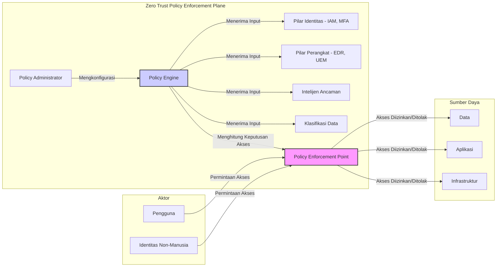
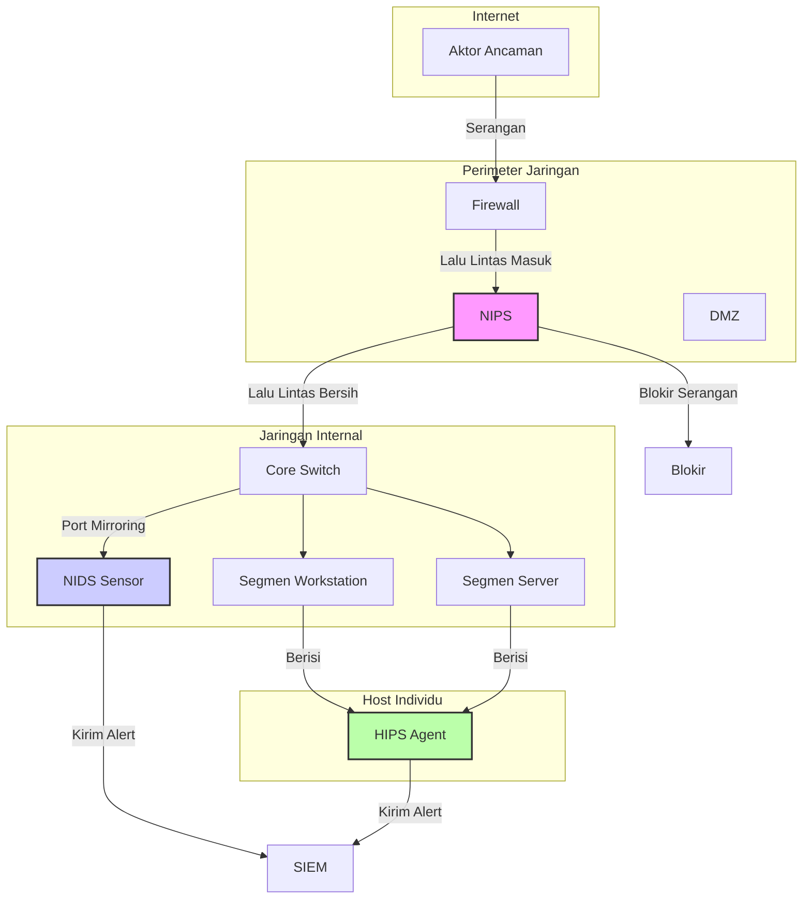
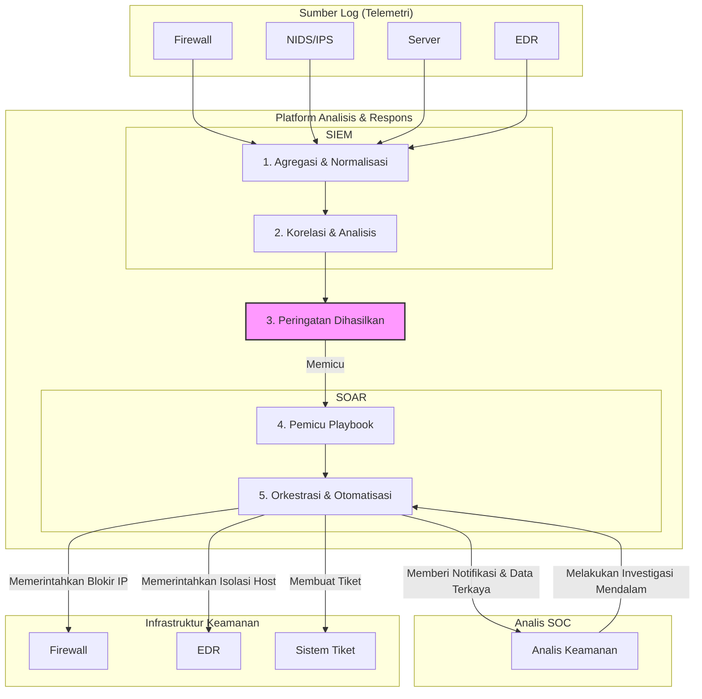
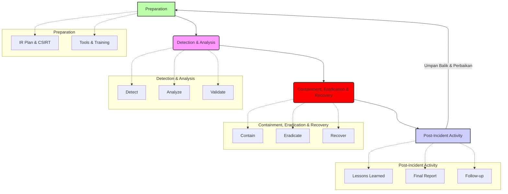

## **Modul Pembelajaran Mendalam Minggu 10-12: Paradigma dan Praktik Operasi Siber Defensif (DCO)**

**Abstrak**

Modul pembelajaran lanjutan selama tiga minggu ini akan memfokuskan analisis pada domain Operasi Siber Defensif (DCO), sebuah komponen fundamental dan paling kritis dari postur pertahanan siber suatu negara. Setelah sebelumnya mengkaji lanskap ancaman dan metodologi ofensif, modul ini secara sistematis akan melakukan dekonstruksi terhadap paradigma, arsitektur, dan proses yang membentuk pertahanan siber modern yang tangguh. Kita akan beralih dari model pertahanan berbasis perimeter yang usang ke paradigma **Zero Trust Architecture (ZTA)** yang dinamis dan berpusat pada identitas. Selanjutnya, modul ini akan melakukan penyelaman teknis ke dalam "sistem saraf" pertahanan jaringan, yaitu **Sistem Deteksi dan Pencegahan Intrusi (IDS/IPS)**, serta "pusat komando dan kendali" analitisnya, yaitu **Security Information and Event Management (SIEM)**. Puncak dari modul ini adalah pembahasan komprehensif mengenai doktrin dan praktik **Respons Insiden (*Incident Response*) dan Pemulihan (*Recovery*)**, yang merupakan ujian akhir dari ketahanan siber sebuah organisasi. Seluruh pengetahuan teoretis ini akan disintesiskan melalui serangkaian sesi interaktif, termasuk perancangan arsitektur pertahanan ZTA, simulasi konfigurasi alat deteksi, dan sebuah *table-top exercise* respons insiden yang realistis.

-----

### **Bagian 1: Konsep *Zero Trust Architecture* (ZTA) – Merevolusi Paradigma Pertahanan**

Selama beberapa dekade, model dominan dalam keamanan siber adalah **model pertahanan berbasis perimeter**, yang secara konseptual dapat dianalogikan dengan **benteng abad pertengahan (*castle-and-moat*)**. Model ini mengasumsikan bahwa segala sesuatu di dalam jaringan internal ("di dalam tembok benteng") dapat dipercaya, sementara segala sesuatu di luar ("di luar parit") tidak dapat dipercaya. Seluruh upaya pertahanan difokuskan pada penguatan perimeter (tembok, gerbang, parit) menggunakan teknologi seperti *firewall* dan proksi. Namun, paradigma ini telah runtuh secara fundamental di hadapan realitas lanskap ancaman modern.

#### **1.1. Kegagalan Model Perimeter: Pendorong Lahirnya Zero Trust**

  * **Disolusi Perimeter Jaringan:** Konsep "perimeter" yang jelas tidak lagi ada. Pengguna bekerja dari jarak jauh (*remote work*), data disimpan di *cloud* publik, dan perangkat pribadi (*Bring Your Own Device* - BYOD) mengakses sumber daya internal. Batas antara "dalam" dan "luar" telah menjadi kabur dan tidak relevan.
  * **Ancaman dari Dalam (*Insider Threats*):** Model perimeter secara inheren tidak berdaya melawan ancaman dari dalam, baik yang berniat jahat (*malicious insider*) maupun yang tidak disengaja (*unintentional insider*). Sekali seorang penyerang berhasil menembus perimeter (misalnya melalui *spear phishing*), mereka seringkali memiliki kebebasan untuk bergerak secara lateral di dalam jaringan internal yang "dipercaya".
  * **Serangan Rantai Pasok (*Supply Chain Attacks*):** Aktor ancaman tidak lagi hanya menyerang perimeter secara langsung. Mereka mengkompromikan vendor perangkat lunak atau perangkat keras yang dipercaya, menanamkan *malware* di dalam produk yang sah yang kemudian dibawa masuk melewati perimeter.

Kegagalan sistemik inilah yang melahirkan kebutuhan akan paradigma baru yang radikal. Konsep ini pertama kali diartikulasikan oleh John Kindervag saat di Forrester Research pada tahun 2010, dengan sebuah postulat yang sederhana namun kuat: **"Never trust, always verify."** Inilah esensi dari *Zero Trust Architecture* (ZTA).

#### **1.2. Definisi dan Tiga Prinsip Inti Zero Trust**

**Zero Trust** adalah sebuah model keamanan strategis yang beroperasi berdasarkan asumsi bahwa tidak ada kepercayaan implisit yang diberikan kepada aset atau akun pengguna berdasarkan lokasi fisik atau jaringan mereka (baik di dalam maupun di luar perimeter jaringan). ZTA bukanlah sebuah produk tunggal yang dapat dibeli, melainkan sebuah **filosofi dan pendekatan arsitektural** yang memerlukan integrasi berbagai teknologi dan proses.

ZTA dibangun di atas tiga prinsip inti:

1.  **Verifikasi Secara Eksplisit (*Verify Explicitly*):** Selalu lakukan otentikasi dan otorisasi berdasarkan semua titik data yang tersedia, termasuk identitas pengguna, lokasi, kesehatan perangkat, layanan atau beban kerja, klasifikasi data, dan anomali. Jangan pernah mempercayai permintaan akses hanya karena ia berasal dari alamat IP internal.
2.  **Gunakan Akses dengan Hak Istimewa Terendah (*Use Least Privilege Access*):** Batasi akses pengguna hanya pada sumber daya yang benar-benar mereka butuhkan untuk melakukan pekerjaan mereka (*need-to-know*). Implementasikan akses *just-in-time* (JIT) dan *just-enough-access* (JEA), di mana hak akses yang lebih tinggi diberikan hanya untuk durasi yang diperlukan dan dicabut secara otomatis sesudahnya.
3.  **Asumsikan Telah Terjadi Pelanggaran (*Assume Breach*):** Perlakukan setiap permintaan akses seolah-olah berasal dari jaringan yang tidak terpercaya. Lakukan segmentasi mikro pada jaringan untuk membatasi ruang gerak penyerang jika mereka berhasil mendapatkan akses. Enkripsi semua komunikasi dari ujung ke ujung (*end-to-end*). Kumpulkan telemetri dari seluruh lingkungan untuk mendeteksi anomali dan merespons ancaman dengan cepat.

#### **1.3. Pilar Fundamental Implementasi Zero Trust Architecture**

Implementasi ZTA yang komprehensif melibatkan penguatan dan integrasi kapabilitas di lima pilar fundamental.

  * **a. Identitas (*Identity*)**

      * **Konsep:** Identitas (baik pengguna manusia maupun identitas non-manusia seperti layanan atau perangkat) menjadi **perimeter keamanan yang baru**.
      * **Teknologi Kunci:**
          * ***Identity and Access Management* (IAM):** Sistem terpusat untuk mengelola identitas digital dan hak aksesnya.
          * ***Identity Provider* (IdP):** Sistem yang menciptakan, memelihara, dan mengelola informasi identitas sambil menyediakan layanan otentikasi (Contoh: Microsoft Entra ID/Azure AD, Okta).
          * ***Multi-Factor Authentication* (MFA):** Mengharuskan pengguna untuk menyediakan lebih dari satu bukti identitas (misalnya, kata sandi + kode dari aplikasi authenticator + sidik jari). Ini adalah kontrol keamanan paling efektif untuk melawan pencurian kredensial.
          * ***Single Sign-On* (SSO):** Memungkinkan pengguna untuk login sekali dan mendapatkan akses ke berbagai aplikasi tanpa perlu memasukkan kredensial berulang kali, sambil tetap menerapkan kebijakan keamanan yang terpusat.

  * **b. Perangkat (*Devices* / *Endpoints*)**

      * **Konsep:** Setiap perangkat yang mencoba mengakses sumber daya harus diverifikasi kesehatannya dan kepatuhannya terhadap kebijakan keamanan. Perangkat yang tidak aman atau terinfeksi tidak boleh diizinkan mengakses data sensitif, bahkan jika kredensial penggunanya valid.
      * **Teknologi Kunci:**
          * ***Unified Endpoint Management* (UEM) / *Mobile Device Management* (MDM):** Alat untuk mengelola dan memberlakukan kebijakan keamanan pada laptop, ponsel, dan tablet (misalnya, mewajibkan enkripsi disk, menginstal pembaruan keamanan).
          * ***Endpoint Detection and Response* (EDR):** Generasi berikutnya dari antivirus. EDR secara kontinu memonitor aktivitas di level *endpoint* (proses yang berjalan, koneksi jaringan, modifikasi file) untuk mendeteksi perilaku berbahaya yang mungkin lolos dari deteksi berbasis *signature*.

  * **c. Jaringan (*Network*)**

      * **Konsep:** Jaringan tidak lagi dianggap sebagai zona terpercaya. Tujuannya adalah untuk memecah jaringan besar yang datar menjadi segmen-segmen kecil yang terisolasi untuk mencegah gerakan lateral.
      * **Teknologi Kunci:**
          * ***Microsegmentation* (Segmentasi Mikro):** Menggunakan *firewall* perangkat lunak (*software-defined firewall*) untuk menciptakan zona keamanan yang sangat granular di sekitar setiap aplikasi atau bahkan setiap beban kerja (*workload*). Jika satu server dikompromikan, aturan segmentasi mikro akan mencegahnya berkomunikasi dengan server lain kecuali secara eksplisit diizinkan.
          * **Enkripsi Jaringan:** Semua lalu lintas, bahkan di dalam jaringan internal (lalu lintas *east-west*), harus dienkripsi untuk mencegah penyadapan.

  * **d. Aplikasi dan Beban Kerja (*Applications & Workloads*)**

      * **Konsep:** Setiap aplikasi harus diamankan, baik itu aplikasi lawas di pusat data lokal maupun aplikasi modern berbasis *microservices* di *cloud*.
      * **Teknologi Kunci:**
          * ***Secure Software Development Lifecycle* (SSDLC):** Mengintegrasikan praktik keamanan sejak fase awal pengembangan aplikasi.
          * ***Web Application Firewall* (WAF):** *Firewall* yang dirancang khusus untuk melindungi aplikasi web dari serangan umum seperti injeksi SQL dan *Cross-Site Scripting* (XSS).
          * **API Security Gateways:** Mengamankan *Application Programming Interfaces* (API) yang merupakan tulang punggung aplikasi modern.

  * **e. Data**

      * **Konsep:** Pada akhirnya, semua pilar lain ada untuk melindungi data. Keamanan harus melekat pada data itu sendiri.
      * **Teknologi Kunci:**
          * **Klasifikasi Data:** Mengidentifikasi dan melabeli data berdasarkan tingkat sensitivitasnya (misalnya, Rahasia Negara, Rahasia Militer, Publik).
          * ***Data Loss Prevention* (DLP):** Alat yang memonitor dan memblokir upaya untuk memindahkan data sensitif keluar dari jaringan atau ke lokasi yang tidak sah.
          * **Enkripsi Data:** Melindungi data baik saat diam (*at rest* - di hard drive), saat bergerak (*in transit* - melalui jaringan), maupun saat digunakan (*in use* - di memori).

#### **1.4. Diagram Konseptual Zero Trust Architecture**

Diagram di atas mengilustrasikan alur kerja ZTA. Setiap permintaan akses dari **Aktor** ke **Sumber Daya** tidak langsung dihubungkan. Sebaliknya, ia harus melewati **Policy Enforcement Point (PEP)**. PEP akan meminta keputusan dari **Policy Engine (PE)**, yang secara dinamis menghitung apakah akses harus diberikan berdasarkan sinyal *real-time* dari berbagai pilar (identitas pengguna, kesehatan perangkat, dll.).

-----

### **Bagian 2: Sistem Deteksi dan Pencegahan Intrusi (IDS/IPS) – Sistem Saraf Pusat Pertahanan Jaringan**

Jika ZTA adalah strategi besar, maka IDS/IPS adalah salah satu komponen taktis paling vital di garis depan. Sistem ini berfungsi sebagai "penjaga" atau "sistem saraf" jaringan, yang secara terus-menerus memonitor lalu lintas untuk mencari tanda-tanda aktivitas berbahaya atau pelanggaran kebijakan. Memahami perbedaan, jenis, dan metodologi deteksi mereka adalah fundamental bagi setiap praktisi pertahanan siber.

#### **2.1. Perbedaan Fundamental: IDS vs. IPS**

  * **Intrusion Detection System (IDS) - Sistem Deteksi Intrusi**

      * **Fungsi:** Bekerja secara pasif. IDS "mendengarkan" lalu lintas jaringan (biasanya melalui salinan lalu lintas dari *port mirroring* atau *network tap*) dan menganalisisnya. Jika ia mendeteksi aktivitas yang mencurigakan, tugasnya adalah **mencatatnya dan mengirimkan peringatan (alert)** kepada administrator keamanan.
      * **Analogi:** Sebuah **sistem alarm pencuri** di sebuah gedung. Ia akan berbunyi keras dan memberi tahu penjaga keamanan ketika ada penyusup, tetapi ia tidak secara fisik menghentikan penyusup tersebut.
      * **Keuntungan:** Tidak menambah latensi pada jaringan karena tidak berada di jalur lalu lintas utama (*out-of-band*).
      * **Kerugian:** Bersifat reaktif. Ia hanya memberi tahu Anda bahwa sesuatu yang buruk telah terjadi; ia tidak mencegahnya.

  * **Intrusion Prevention System (IPS) - Sistem Pencegahan Intrusi**

      * **Fungsi:** Bekerja secara aktif. IPS ditempatkan *inline* di jalur lalu lintas utama (seperti *firewall*). Ia menganalisis setiap paket yang lewat. Jika ia mendeteksi paket atau aliran lalu lintas yang berbahaya, ia dapat **secara aktif memblokirnya** sebelum mencapai target.
      * **Analogi:** Sebuah **penjaga keamanan bersenjata atau pintu putar otomatis** di pintu masuk gedung. Ia tidak hanya mendeteksi penyusup, tetapi juga secara fisik mencegah mereka masuk.
      * **Keuntungan:** Mampu mencegah serangan secara *real-time*.
      * **Kerugian:** Jika terjadi kesalahan konfigurasi atau kegagalan perangkat keras, ia dapat menjadi titik tunggal kegagalan yang melumpuhkan lalu lintas jaringan yang sah. Ia juga menambah sedikit latensi.

Saat ini, sebagian besar vendor menawarkan perangkat terintegrasi yang disebut **Unified Threat Management (UTM)** atau **Next-Generation Firewall (NGFW)** yang memiliki fungsionalitas IDS dan IPS.

#### **2.2. Klasifikasi Berdasarkan Penempatan: NIDS/NIPS vs. HIDS/HIPS**

  * **a. Network-based IDS/IPS (NIDS/NIPS)**

      * **Penempatan:** Sensor NIDS/NIPS ditempatkan di titik-titik strategis dalam jaringan (misalnya, di belakang *firewall* perimeter, atau di antara segmen jaringan internal) untuk memonitor lalu lintas yang mengalir di antara banyak sistem.
      * **Kelebihan:**
          * **Visibilitas Luas:** Dapat memonitor seluruh segmen jaringan dari satu titik.
          * **Deteksi Dini:** Dapat mendeteksi aktivitas pemindaian dan upaya serangan sebelum mencapai *host* target.
          * **Independen dari OS:** Tidak bergantung pada sistem operasi dari *host* yang dilindunginya.
      * **Kelemahan:**
          * **Titik Buta pada Lalu Lintas Terenkripsi:** Jika lalu lintas dienkripsi (misalnya, HTTPS), NIDS/NIPS tidak dapat memeriksa isinya kecuali ada proses dekripsi.
          * **Kesulitan pada Jaringan Berkecepatan Sangat Tinggi:** Mungkin tidak mampu memeriksa setiap paket tanpa kehilangan (*packet drop*) pada jaringan yang sangat sibuk.
          * **Tidak Dapat Melihat Aktivitas Internal Host:** NIDS/NIPS tidak tahu apa yang terjadi di dalam sebuah *host* (misalnya, proses mana yang berjalan).

  * **b. Host-based IDS/IPS (HIDS/HIPS)**

      * **Penempatan:** Agen perangkat lunak HIDS/HIPS diinstal pada setiap *endpoint* individual (server, laptop).
      * **Kelebihan:**
          * **Visibilitas Mendalam:** Dapat memonitor aktivitas internal *host*, seperti panggilan sistem (*system calls*), modifikasi file log dan registry, serta proses yang berjalan. Ini memberikan konteks yang sangat kaya.
          * **Dapat Menganalisis Lalu Lintas Terenkripsi:** Karena berada di *host*, ia dapat memeriksa lalu lintas setelah didekripsi oleh sistem operasi.
          * **Deteksi Serangan Spesifik Host:** Dapat mendeteksi serangan yang tidak terlihat di tingkat jaringan, seperti *buffer overflow* atau upaya eskalasi hak istimewa.
      * **Kelemahan:**
          * **Memerlukan Deployment dan Manajemen yang Kompleks:** Harus diinstal dan dipelihara pada setiap *host*.
          * **Mengonsumsi Sumber Daya Host:** Agen HIDS/HIPS menggunakan sebagian kecil CPU dan RAM dari *host* tempat ia berjalan.
          * **Dapat Dinonaktifkan:** Jika penyerang berhasil mendapatkan hak akses administrator pada sebuah *host*, mereka dapat mencoba menonaktifkan atau merusak agen HIDS/HIPS.

**Strategi Pertahanan Terbaik:** Menggunakan pendekatan berlapis (*defense-in-depth*) dengan **mengkombinasikan NIDS/NIPS dan HIDS/HIPS**. NIDS/NIPS memberikan pertahanan di perimeter dan segmen jaringan, sementara HIDS/HIPS (atau EDR modern) memberikan pertahanan mendalam di setiap aset kritis.

#### **2.3. Metodologi Deteksi**

Bagaimana IDS/IPS tahu bahwa sesuatu itu berbahaya? Mereka menggunakan beberapa metode utama:

  * **a. Deteksi Berbasis Tanda Tangan (*Signature-Based Detection*)**

      * **Konsep:** Metode tradisional dan paling dasar. IDS/IPS memiliki basis data besar berisi "tanda tangan" atau *signature* dari serangan yang diketahui. Tanda tangan ini bisa berupa urutan byte spesifik dalam *payload* paket (misalnya, untuk mendeteksi *shellcode*), pola lalu lintas tertentu, atau *hash* dari file *malware* yang dikenal.
      * **Analogi:** Petugas keamanan di bandara yang memiliki buku berisi foto-foto buronan. Dia membandingkan setiap wajah yang lewat dengan foto-foto di bukunya.
      * **Kelebihan:** Sangat akurat dalam mendeteksi ancaman yang diketahui. Tingkat positif palsu (*false positives*) sangat rendah.
      * **Kelemahan:** **Sama sekali tidak efektif melawan serangan baru atau *zero-day*** yang belum memiliki tanda tangan. Basis data tanda tangan harus terus menerus diperbarui.

  * **b. Deteksi Berbasis Anomali (*Anomaly-Based Detection*)**

      * **Konsep:** Metode ini bekerja dengan terlebih dahulu membangun sebuah "garis dasar" (*baseline*) dari perilaku jaringan yang normal selama periode waktu tertentu. Setelah *baseline* terbentuk, IDS/IPS akan memonitor jaringan untuk setiap deviasi atau anomali yang signifikan dari perilaku normal tersebut.
      * **Analogi:** Petugas keamanan yang telah bekerja di gedung yang sama selama bertahun-tahun. Dia mungkin tidak tahu persis siapa penyusupnya, tetapi dia memiliki intuisi yang kuat ketika dia melihat seseorang atau sesuatu yang "tidak pada tempatnya" atau "aneh".
      * **Kelebihan:** **Mampu mendeteksi serangan baru atau *zero-day*** yang belum pernah terlihat sebelumnya.
      * **Kelemahan:** Cenderung menghasilkan **tingkat positif palsu yang tinggi**. Perubahan perilaku jaringan yang sah (misalnya, pengenalan aplikasi baru) dapat secara keliru ditandai sebagai anomali. Memerlukan periode "pembelajaran" dan penyetelan (*tuning*) yang hati-hati.

  * **c. Deteksi Berbasis Analisis Protokol Statefull (*Stateful Protocol Analysis*)**

      * **Konsep:** Metode ini membandingkan lalu lintas jaringan dengan definisi standar dan ekspektasi dari protokol yang digunakan (misalnya, RFC untuk HTTP atau DNS). Ia mencari penyimpangan dari penggunaan protokol yang sah.
      * **Contoh:** Jika sebuah perintah HTTP GET dikirim ke port yang biasanya digunakan untuk SMTP (email), atau jika sebuah respons DNS memiliki format yang tidak standar, metode ini akan menandainya sebagai anomali.
      * **Keuntungan:** Dapat mendeteksi serangan yang mencoba menyembunyikan diri di dalam protokol yang tampaknya sah.

  * **d. Deteksi Berbasis Heuristik dan Kecerdasan Buatan (AI/ML)**

      * **Konsep:** Merupakan evolusi dari deteksi berbasis anomali. Menggunakan algoritma *machine learning* (ML) dan model statistik untuk menganalisis miliaran titik data dari jaringan dan *host* untuk mengidentifikasi pola-pola kompleks yang berkorelasi tinggi dengan perilaku berbahaya, bahkan jika pola tersebut belum pernah terlihat sebelumnya.
      * **Aplikasi:** Sangat efektif dalam mendeteksi TTPs canggih seperti gerakan lateral atau eksfiltrasi data yang "low and slow".

#### **2.4. Diagram Penempatan IDS/IPS dalam Jaringan**

-----
Sangat baik. Saya akan melanjutkan naskah materi pembelajaran dari titik terakhir, menyelami "otak" dari pusat operasi keamanan dan proses yang krusial ketika pertahanan berhasil ditembus.

-----

### **Bagian 3: *Security Information and Event Management* (SIEM) – Pusat Komando, Kendali, dan Analisis Pertahanan**

Jika IDS/IPS dan EDR adalah "sistem saraf" yang merasakan rangsangan ancaman di seluruh jaringan dan *endpoint*, maka SIEM adalah **"otak" analitis** yang menerima semua sinyal sensorik ini, memahaminya dalam konteks yang lebih luas, dan membuat keputusan. Tanpa SIEM, sebuah pusat operasi keamanan (*Security Operations Center* - SOC) akan tenggelam dalam lautan peringatan (*alert fatigue*) dari puluhan alat keamanan yang berbeda, tidak mampu membedakan antara *noise* (gangguan) dan sinyal ancaman yang sebenarnya. SIEM menyediakan **visibilitas terpusat** dan **kapabilitas korelasi cerdas**, mengubah data mentah menjadi intelijen yang dapat ditindaklanjuti.

#### **3.1. Permasalahan yang Diselesaikan oleh SIEM: Dari Lautan Data ke Intelijen**

Lingkungan IT militer modern menghasilkan volume data log yang luar biasa (sering disebut telemetri) dari ratusan atau ribuan sumber yang berbeda:

  * Firewall
  * NIDS/IPS
  * Server (Windows Event Logs, Linux Syslog)
  * Endpoint Detection and Response (EDR)
  * Aplikasi
  * Basis Data
  * Sistem kontrol akses
  * Proksi Web

Setiap log ini menceritakan sebagian kecil dari sebuah cerita dalam formatnya sendiri. Mustahil bagi seorang analis manusia untuk secara manual meninjau semua log ini dan menghubungkan titik-titik antara sebuah peristiwa di *firewall*, sebuah proses aneh di server, dan sebuah koneksi keluar dari laptop pengguna. Inilah masalah yang dipecahkan oleh SIEM.

#### **3.2. Arsitektur Fungsional dan Alur Kerja SIEM**

Sebuah sistem SIEM modern melakukan serangkaian fungsi inti secara berurutan untuk mengubah log mentah menjadi deteksi ancaman yang berharga.

  * **a. Agregasi dan Pengumpulan Log (*Log Aggregation & Collection*)**

      * **Fungsi:** Langkah pertama adalah mengumpulkan log dari semua sumber data yang beragam di seluruh lingkungan.
      * **Mekanisme:** SIEM menggunakan "kolektor" atau "agen" yang ditempatkan di berbagai segmen jaringan atau diinstal pada *host* untuk menarik (*pull*) atau menerima (*push*) data log. Protokol standar seperti Syslog, SNMP, atau API khusus vendor digunakan untuk mentransfer data ini secara aman ke penyimpanan pusat SIEM.

  * **b. Normalisasi dan Parsing (*Normalization & Parsing*)**

      * **Fungsi:** Ini adalah langkah "penerjemahan" yang krusial. Log dari vendor yang berbeda (misalnya, log *firewall* Cisco vs. log *firewall* Palo Alto) memiliki format yang sama sekali berbeda. Normalisasi adalah proses di mana SIEM mengurai (*parse*) setiap log, mengekstrak bidang-bidang data kunci (misalnya, alamat IP sumber, alamat IP tujuan, port, nama pengguna, nama proses), dan memetakannya ke dalam sebuah **skema data umum (*common data schema*)**.
      * **Analogi:** Bayangkan seorang komandan di ruang operasi gabungan yang menerima laporan dari Angkatan Darat, Laut, dan Udara. Setiap matra mungkin menggunakan jargon dan format laporan yang berbeda. Tugas perwira intelijen (parser SIEM) adalah mengambil semua laporan tersebut dan menuliskannya kembali dalam satu format laporan standar yang dapat dipahami oleh semua orang.

  * **c. Korelasi (*Correlation*)**

      * **Fungsi:** Inilah **jantung kecerdasan** dari SIEM. Setelah semua data berada dalam format yang sama, mesin korelasi (*correlation engine*) dapat menerapkan aturan-aturan logika untuk mencari pola serangan yang membentang di beberapa sumber data dan periode waktu.
      * **Cara Kerja:** Administrator keamanan akan menulis **aturan korelasi** yang mendefinisikan skenario serangan. Aturan ini pada dasarnya adalah pernyataan "JIKA X terjadi, LALU Y terjadi dalam Z menit, MAKA picu peringatan ABC."
      * **Contoh Skenario Aturan Korelasi (Serangan *Brute Force* yang Diikuti Gerakan Lateral):**
        > **IF** `[Log Firewall]` mendeteksi 100 percobaan login gagal dari `IP_Sumber_X` ke `Server_A` dalam 1 menit
        > **AND THEN** `[Log Server_A]` mendeteksi 1 login berhasil dari `IP_Sumber_X`
        > **AND THEN WITHIN 5 MINUTES** `[Log EDR di Server_A]` mendeteksi eksekusi `mimikatz.exe`
        > **AND THEN WITHIN 10 MINUTES** `[Log Server_A]` mendeteksi percobaan login dari `Server_A` ke `Server_B` menggunakan akun `Admin_Y`
        > **THEN** Peringkatkan analis dengan **"Aktivitas Gerakan Lateral Terdeteksi Setelah Kemungkinan Kompromi Kredensial"** dengan prioritas **KRITIS**.
      * **Implikasi:** Tidak ada satu pun dari peristiwa individual di atas yang mungkin cukup untuk memicu peringatan serius. Namun, ketika dikorelasikan bersama, mereka menceritakan kisah yang jelas tentang sebuah intrusi.

  * **d. Peringatan (*Alerting*) dan Manajemen Kasus (*Case Management*)**

      * **Fungsi:** Ketika sebuah aturan korelasi terpenuhi, SIEM akan menghasilkan sebuah peringatan (*alert*) atau insiden. SIEM modern seringkali menyertakan sistem tiket atau manajemen kasus dasar yang memungkinkan analis untuk melacak, menugaskan, dan mendokumentasikan investigasi terhadap setiap peringatan.

  * **e. Dasbor (*Dashboarding*) dan Pelaporan (*Reporting*)**

      * **Fungsi:** SIEM menyediakan antarmuka visual (dasbor) yang memungkinkan analis dan manajer untuk memonitor postur keamanan organisasi secara *real-time*. Dasbor dapat disesuaikan untuk menampilkan metrik kunci seperti "Top 10 Peringatan," "Aktivitas Jaringan dari Negara Berisiko Tinggi," atau "Percobaan Login Gagal pada Aset Kritis." SIEM juga dapat menghasilkan laporan secara otomatis untuk tujuan kepatuhan (*compliance*) atau tinjauan manajemen.

  * **f. Penyimpanan Jangka Panjang dan Forensik (*Long-Term Storage & Forensics*)**

      * **Fungsi:** SIEM menyimpan semua log yang dikumpulkan dalam arsip yang terindeks dan dapat dicari untuk periode waktu yang lama (seringkali satu tahun atau lebih), sesuai dengan persyaratan regulasi atau kebijakan. Penyimpanan ini sangat berharga selama investigasi insiden atau perburuan ancaman proaktif (*threat hunting*), memungkinkan analis untuk "memutar kembali waktu" dan merekonstruksi aktivitas penyerang.

#### **3.3. Evolusi Berikutnya: Dari SIEM ke SOAR**

SIEM sangat baik dalam **deteksi**. Namun, setelah sebuah ancaman terdeteksi, apa yang terjadi selanjutnya? Secara tradisional, seorang analis harus secara manual melakukan tindakan respons: login ke *firewall* untuk memblokir IP, login ke EDR untuk mengisolasi *host*, dll. Proses ini bisa lambat dan rentan terhadap kesalahan. Inilah masalah yang dipecahkan oleh **SOAR (*Security Orchestration, Automation, and Response*)**.

  * **Orkestrasi (*Orchestration*):** Menghubungkan semua alat keamanan yang berbeda (SIEM, EDR, *firewall*, intelijen ancaman) melalui API sehingga mereka dapat "berbicara" satu sama lain dan berbagi data secara terprogram.
  * **Otomatisasi (*Automation*):** Menggunakan "buku pedoman" (*playbooks*) untuk mengotomatiskan alur kerja respons insiden yang berulang. *Playbook* adalah serangkaian langkah kondisional yang telah ditentukan sebelumnya.
  * **Respons (*Response*):** Menggabungkan orkestrasi dan otomatisasi untuk memungkinkan respons yang jauh lebih cepat dan lebih konsisten.

**Contoh Alur Kerja SIEM + SOAR:**

1.  **SIEM:** Aturan korelasi mendeteksi *malware* di laptop seorang perwira. Sebuah peringatan KRITIS dihasilkan.
2.  **Pemicu SOAR:** Peringatan dari SIEM secara otomatis memicu *playbook* SOAR.
3.  ***Playbook* Berjalan:**
      * **Langkah 1 (Pengayaan):** SOAR secara otomatis mengambil *hash* file *malware* dari peringatan SIEM dan mengirimkannya ke platform intelijen ancaman (seperti VirusTotal) untuk mendapatkan reputasi dan informasi tambahan.
      * **Langkah 2 (Tindakan di EDR):** SOAR memerintahkan alat EDR untuk secara otomatis mengisolasi laptop perwira tersebut dari jaringan untuk mencegah penyebaran.
      * **Langkah 3 (Tindakan di Firewall):** SOAR mengambil alamat IP dari server C2 yang teridentifikasi dalam peringatan dan memerintahkan *firewall* untuk memblokirnya.
      * **Langkah 4 (Notifikasi):** SOAR secara otomatis membuat tiket di sistem Help Desk, mengirim email ke tim respons insiden, dan mengirim pesan Slack ke saluran darurat.
4.  **Intervensi Manusia:** Seorang analis sekarang dapat meninjau semua informasi yang telah dikumpulkan dan tindakan yang telah diambil secara otomatis, dan fokus pada analisis yang lebih dalam.

#### **3.4. Diagram Alur Kerja Terintegrasi SOC (SIEM + SOAR)**

-----

### **Bagian 4: Respons Insiden (*Incident Response*) dan Pemulihan (*Recovery*)**

Tidak peduli seberapa canggih arsitektur pertahanan, seberapa cerdas SIEM, atau seberapa cepat SOAR, prinsip fundamental dari Zero Trust tetap berlaku: **Asumsikan Telah Terjadi Pelanggaran (*Assume Breach*)**. Insiden keamanan siber **akan** terjadi. Oleh karena itu, kapabilitas suatu organisasi untuk **merespons** insiden secara efektif dan **pulih** darinya adalah ujian akhir dari ketahanan sibernya. Respons insiden (IR) bukanlah aktivitas teknis semata; ia adalah sebuah disiplin yang terstruktur, menggabungkan kesiapan teknis, proses yang terdefinisi dengan baik, dan komunikasi yang tenang di bawah tekanan.

Kerangka kerja IR yang paling diakui secara global adalah yang didefinisikan oleh **NIST (National Institute of Standards and Technology) dalam Special Publication 800-61**. Kerangka ini membagi proses IR ke dalam empat fase utama: (1) **Persiapan**; (2) **Deteksi & Analisis**; (3) **Penahanan, Pemberantasan & Pemulihan**; dan (4) **Aktivitas Pasca-Insiden**.

#### **4.1. Fase 1: Persiapan (*Preparation*) – Memenangkan Pertempuran Sebelum Dimulai**

Ini adalah fase yang paling penting, namun paling sering diabaikan. Fase ini dilakukan pada masa "damai" dan menentukan seberapa efektif organisasi akan bertindak ketika krisis melanda. Persiapan yang buruk adalah resep untuk respons yang kacau dan kerusakan yang lebih besar.

  * **a. Mengembangkan Rencana Respons Insiden (IRP - *Incident Response Plan*)**
      * **Deskripsi:** IRP adalah dokumen formal yang mendefinisikan secara rinci apa yang merupakan insiden, siapa yang bertanggung jawab untuk apa, prosedur yang harus diikuti, dan bagaimana komunikasi harus dikelola.
      * **Komponen Kunci IRP:** Misi dan strategi, peran dan tanggung jawab, ambang batas untuk aktivasi rencana, prosedur komunikasi (internal dan eksternal), dan metrik untuk mengukur keberhasilan respons.
  * **b. Membentuk Tim Respons Insiden Keamanan Komputer (CSIRT - *Computer Security Incident Response Team*)**
      * **Deskripsi:** Tim inti yang bertanggung jawab untuk melaksanakan IRP. Tim ini harus terdiri dari perwakilan dari berbagai departemen, bukan hanya IT.
      * **Peran Kunci dalam CSIRT:**
          * **Pimpinan Insiden (*Incident Lead*):** Manajer keseluruhan dari respons, membuat keputusan strategis.
          * **Analis Teknis (*Technical Analysts*):** Para ahli forensik, analis *malware*, dan spesialis jaringan yang melakukan investigasi teknis.
          * **Pimpinan Komunikasi (*Communications Lead*):** Mengelola komunikasi dengan manajemen, departemen hukum, humas, dan pihak eksternal.
          * **Penasihat Hukum (*Legal Counsel*):** Memberikan nasihat tentang implikasi hukum, peraturan, dan kewajiban pelaporan.
  * **c. Mempersiapkan Alat dan Sumber Daya (*Tooling & Resources*)**
      * **Deskripsi:** Memastikan bahwa CSIRT memiliki semua perangkat keras dan perangkat lunak yang mereka butuhkan, siap sedia dalam "tas darurat" (*go-bag*) digital dan fisik.
      * **Contoh:** Laptop forensik yang terisolasi dengan perangkat lunak seperti EnCase atau FTK Imager, drive USB yang bersih dengan *live OS* untuk analisis, *hard drive* kosong untuk membuat citra disk, dan akses ke langganan intelijen ancaman.
  * **d. Pelatihan dan Latihan (*Training & Drills*)**
      * **Deskripsi:** Rencana dan tim tidak ada gunanya jika tidak pernah diuji. Latihan teratur sangat penting untuk membangun "memori otot" dan mengidentifikasi kelemahan dalam rencana.
      * **Jenis Latihan:**
          * ***Table-Top Exercise:*** Latihan berbasis diskusi di mana tim berjalan melalui skenario insiden hipotetis untuk menguji proses pengambilan keputusan dan komunikasi.
          * **Simulasi Fungsional:** Latihan yang lebih teknis di mana tim benar-benar menggunakan alat mereka untuk merespons serangan yang disimulasikan dalam lingkungan yang terisolasi.

#### **4.2. Fase 2: Deteksi dan Analisis (*Detection & Analysis*)**

Fase ini dimulai ketika sebuah peristiwa keamanan teridentifikasi dan berakhir ketika insiden tersebut telah divalidasi dan dinilai.

  * **a. Mendeteksi Insiden:**
      * **Vektor Deteksi:** Insiden dapat dideteksi melalui peringatan dari alat keamanan (SIEM, EDR, IDS), laporan dari pengguna ("Laptop saya berperilaku aneh"), atau notifikasi dari pihak eksternal (penegak hukum, peneliti keamanan).
  * **b. Melakukan Analisis Awal (Triage):**
      * **Tujuan:** Tim respons harus dengan cepat memvalidasi apakah peringatan tersebut merupakan insiden yang sebenarnya atau positif palsu. Jika valid, mereka harus melakukan penilaian awal untuk memahami:
          * **Apa yang terjadi?** (Tipe serangan)
          * **Sistem apa saja yang terpengaruh?** (*Scope*)
          * **Bagaimana dampaknya terhadap operasi?** (*Severity*)
          * **Siapa penyerangnya?** (Atribusi, jika memungkinkan)
  * **c. Dokumentasi:** Semua temuan, tindakan, dan keputusan harus didokumentasikan secara cermat dengan cap waktu (*timestamp*). Dokumentasi ini sangat penting untuk analisis pasca-insiden dan potensi proses hukum.

#### **4.3. Fase 3: Penahanan, Pemberantasan, dan Pemulihan (*Containment, Eradication & Recovery*)**

Ini adalah fase "pemadaman api". Tujuannya adalah untuk menghentikan kerusakan, menghilangkan akar penyebab, dan mengembalikan sistem ke operasi normal.

  * **a. Penahanan (*Containment*)**
      * **Tujuan:** Mencegah insiden menyebar lebih jauh dan membatasi kerusakan.
      * **Strategi:**
          * **Penahanan Jangka Pendek:** Tindakan cepat untuk mengisolasi sistem yang terpengaruh. Contoh: memutuskan koneksi jaringan dari *host* yang terinfeksi, memblokir alamat IP C2 di *firewall*, menonaktifkan akun pengguna yang dikompromikan.
          * **Penahanan Jangka Panjang:** Membangun kembali sistem yang bersih dan terisolasi untuk menggantikan sistem yang terpengaruh, sambil membiarkan sistem yang terinfeksi tetap berjalan (dalam "kotak pasir") untuk tujuan pengumpulan intelijen.
  * **b. Pemberantasan (*Eradication*)**
      * **Tujuan:** Menghapus semua jejak dan artefak penyerang dari lingkungan. Ini adalah langkah yang paling sulit dan paling penting untuk dilakukan dengan benar.
      * **Tindakan:** Mengidentifikasi dan menghilangkan *malware*, menghapus *backdoor* dan mekanisme persistensi, serta menambal kerentanan yang dieksploitasi. Seringkali, strategi yang paling aman adalah **"Nuke and Pave"**: menghapus total sistem yang terinfeksi dan membangunnya kembali dari citra emas (*golden image*) yang diketahui bersih.
  * **c. Pemulihan (*Recovery*)**
      * **Tujuan:** Mengembalikan sistem yang telah dibersihkan dan diperkuat ke dalam lingkungan produksi.
      * **Tindakan:** Memulihkan data dari cadangan (*backup*), menguji fungsionalitas sistem secara menyeluruh, dan memonitor sistem dengan sangat ketat untuk memastikan penyerang tidak kembali.

#### **4.4. Fase 4: Aktivitas Pasca-Insiden (*Post-Incident Activity*)**

Fase ini sering disebut sebagai **"pelajaran yang dipetik" (*lessons learned*)** dan sangat penting untuk meningkatkan ketahanan organisasi di masa depan.

  * **a. Mengadakan Pertemuan Pasca-Insiden:**
      * **Tujuan:** Mengumpulkan semua pemangku kepentingan untuk meninjau seluruh siklus hidup insiden secara jujur dan terbuka, tanpa menyalahkan (*blameless post-mortem*).
  * **b. Menganalisis Insiden:**
      * **Pertanyaan Kunci:** Apa yang terjadi dan kapan? Seberapa baik staf dan manajemen menanganinya? Apakah prosedur yang didokumentasikan diikuti? Apakah prosedur tersebut memadai? Informasi apa yang kurang? Tindakan apa yang dapat mencegah insiden terjadi lagi?
  * **c. Menghasilkan Laporan Akhir:**
      * **Tujuan:** Membuat laporan komprehensif yang merangkum insiden, tindakan yang diambil, biaya yang dikeluarkan, dan yang terpenting, **rekomendasi konkret** untuk perbaikan di masa depan (baik dalam teknologi, proses, maupun pelatihan).
  * **d. Menindaklanjuti Rekomendasi:** Memastikan bahwa rekomendasi dari laporan akhir benar-benar diimplementasikan.

#### **4.5. Diagram Siklus Hidup Respons Insiden NIST**

-----

### **Bagian 5: Sesi Interaktif – Desain Arsitektur, Konfigurasi Deteksi, dan Simulasi Respons Insiden**

Tujuan dari bagian terakhir modul ini adalah untuk mentransisikan pemahaman teoretis menjadi kapabilitas praktis. Melalui serangkaian diskusi kelompok terstruktur dan simulasi, peserta akan ditantang untuk menerapkan konsep Zero Trust, konfigurasi alat deteksi, dan prosedur respons insiden ke dalam skenario yang realistis dan relevan dengan domain militer maritim.

#### **5.1. Diskusi Kelompok A: Desain Arsitektur Pertahanan *Zero Trust Architecture* (ZTA)**

* **Tujuan:** Menerapkan prinsip-prinsip dan pilar-pilar ZTA untuk merancang sebuah arsitektur pertahanan konseptual yang tangguh untuk aset militer modern.
* **Skenario:**
    > TNI AL sedang dalam proses mengakuisisi sebuah **fregat multi-peran baru** yang sangat terdigitalisasi. Kapal ini dilengkapi dengan sistem manajemen tempur (*Combat Management System* - CMS) canggih, sensor terintegrasi, sistem komunikasi satelit (SATCOM) *broadband*, dan jaringan IT terpisah untuk administrasi dan kesejahteraan kru. Terdapat juga konektivitas nirkabel (Wi-Fi) di beberapa area kapal untuk kru. Kapal ini perlu mampu beroperasi secara aman baik saat terhubung dengan jaringan Komando Armada di darat maupun saat beroperasi secara mandiri di laut lepas. **Tugas kelompok Anda adalah untuk merancang kerangka arsitektur pertahanan ZTA untuk fregat baru ini.**

* **Instruksi:** Berdasarkan skenario di atas, diskusikan dan uraikan pendekatan Anda untuk setiap pilar ZTA. Jelaskan **"mengapa"** (justifikasi) dan **"bagaimana"** (teknologi/proses spesifik) Anda akan menerapkannya.
* **Pertanyaan Panduan untuk Diskusi:**
    1.  **Pilar Identitas:**
        * Bagaimana Anda akan mengelola identitas untuk **pengguna manusia** (kru kapal, dari komandan hingga teknisi junior) dan **identitas non-manusia** (misalnya, layanan perangkat lunak pada CMS yang perlu berkomunikasi satu sama lain)?
        * Di mana dan bagaimana Anda akan menerapkan **Multi-Factor Authentication (MFA)** secara ketat tanpa menghambat efektivitas operasional di tengah pertempuran? (Contoh: MFA wajib untuk akses administratif ke sistem kritis, tetapi mungkin tidak untuk setiap login ke stasiun kerja taktis).
    2.  **Pilar Perangkat (*Endpoints*):**
        * Perangkat apa saja di atas kapal yang Anda anggap sebagai *endpoint* yang perlu dikelola? (Konsol CMS, laptop administrasi, tablet navigasi, bahkan perangkat pribadi kru di jaringan Wi-Fi).
        * Kontrol keamanan apa yang akan Anda berlakukan pada **konsol sistem tempur** yang sangat kritis vs. **laptop di ruang administrasi**? Bagaimana Anda akan memastikan "kesehatan" perangkat sebelum mengizinkannya terhubung ke jaringan sensitif?
    3.  **Pilar Jaringan:**
        * Bagaimana Anda akan menerapkan **segmentasi mikro** di atas kapal? Jaringan apa saja yang harus **diisolasi secara total** dari yang lain? (Contoh: Jaringan OT yang mengontrol mesin dan kemudi harus diisolasi dari jaringan IT administrasi. Jaringan Wi-Fi kru harus diisolasi dari keduanya).
        * Bagaimana Anda akan mengamankan tautan komunikasi SATCOM, yang merupakan jalur utama ke dunia luar dan vektor serangan potensial?
    4.  **Pilar Aplikasi & Beban Kerja:**
        * Bagaimana Anda akan memastikan keamanan perangkat lunak CMS itu sendiri, yang kemungkinan besar dipasok oleh vendor pihak ketiga? (Contoh: Menuntut hasil *code review* dan uji penetrasi dari vendor sebagai syarat akuisisi).
    5.  **Pilar Data:**
        * Bagaimana Anda akan mengklasifikasikan data di atas kapal (misalnya, data target dari sonar, data personalia kru, data logistik)?
        * Kontrol apa yang akan Anda terapkan untuk mencegah **eksfiltrasi data rahasia** melalui tautan SATCOM atau melalui perangkat USB yang dibawa oleh kru?
* **Output yang Diharapkan:** Sebuah presentasi singkat yang menguraikan visi arsitektur ZTA untuk fregat, menyoroti keputusan desain kunci di setiap pilar dan justifikasi strategisnya.

#### **5.2. Diskusi Kelompok B: Konfigurasi *Tools* Deteksi untuk Menghadapi Ancaman Spesifik**

* **Tujuan:** Menerjemahkan intelijen ancaman mengenai TTPs musuh menjadi konfigurasi alat deteksi yang konkret dan efektif.
* **Skenario Intelijen Ancaman:**
    > Tim intelijen siber telah mengeluarkan buletin peringatan. **APT39 (kelompok yang diatribusikan ke Iran dengan fokus pada spionase maritim dan telekomunikasi)** terdeteksi meningkatkan aktivitasnya di kawasan. Profil TTPs mereka yang paling umum adalah:
    >
    > * ***Initial Access:*** *Spear phishing* dengan tautan ke halaman login Office 365 palsu untuk mencuri kredensial.
    > * ***Execution & Persistence:*** Penggunaan **PowerShell** secara ekstensif untuk operasi *fileless* dan persistensi melalui **Windows Management Instrumentation (WMI) Event Subscription**.
    > * ***Command & Control:*** Komunikasi C2 disamarkan sebagai lalu lintas **DNS** normal (DNS Tunneling).
    >
    > **Tugas kelompok Anda adalah merancang strategi deteksi untuk TTPs spesifik ini menggunakan SIEM, NIDS/IPS, dan EDR.**

* **Instruksi:** Untuk setiap alat (SIEM, NIDS/IPS, EDR), jelaskan secara spesifik **apa yang akan Anda konfigurasikan** untuk mendeteksi aktivitas APT39.
* **Pertanyaan Panduan untuk Diskusi:**
    1.  **Konfigurasi NIDS/IPS:**
        * Dapatkah NIDS/IPS mendeteksi *spear phishing* awal? Apa keterbatasannya?
        * Bagaimana Anda akan mengkonfigurasi NIDS/IPS untuk **mendeteksi DNS Tunneling**? (Contoh: Mencari anomali pada volume permintaan DNS dari satu *host*, panjang *query* DNS yang tidak biasa, atau permintaan ke domain yang baru terdaftar). Aturan *signature* atau anomali yang akan Anda gunakan?
    2.  **Konfigurasi EDR (*Endpoint Detection and Response*):**
        * Ini adalah alat kunci untuk mendeteksi aktivitas di *host*. Bagaimana Anda akan mengkonfigurasi EDR untuk **mendeteksi penggunaan PowerShell yang berbahaya**? (Contoh: Mengaktifkan *PowerShell Script Block Logging* dan *Module Logging*, membuat aturan deteksi untuk perintah PowerShell yang mencurigakan seperti `IEX (New-Object Net.WebClient).DownloadString`).
        * Bagaimana EDR dapat mendeteksi **persistensi melalui WMI**? (Contoh: Memonitor pembuatan *WMI event consumers*, *filters*, dan *bindings* yang tidak biasa).
    3.  **Konfigurasi SIEM:**
        * Sumber log apa saja yang **wajib** Anda kumpulkan ke dalam SIEM untuk skenario ini? (Log EDR, log server DNS, log proksi web, log otentikasi Entra ID/Azure AD).
        * Tuliskan sebuah **pseudocode untuk aturan korelasi SIEM** yang akan menggabungkan beberapa peristiwa untuk mendeteksi seluruh rantai serangan APT39 dengan keyakinan tinggi. Contoh:
            > **IF** `[Log Proksi]` menunjukkan pengguna mengklik tautan di email
            > **AND THEN WITHIN 2 MINUTES** `[Log Entra ID]` menunjukkan login berhasil ke Office 365 dari alamat IP yang tidak biasa (di luar negeri)
            > **AND THEN WITHIN 10 MINUTES** `[Log EDR]` di mesin pengguna tersebut mendeteksi eksekusi `powershell.exe` oleh proses `outlook.exe`
            > **AND THEN** `[Log DNS]` menunjukkan mesin tersebut mulai membuat volume besar permintaan DNS ke domain `*.xyz` yang baru terdaftar
            > **THEN** Peringkatkan analis dengan **"Potensi Rantai Serangan APT39 Terdeteksi"**.

* **Output yang Diharapkan:** Sebuah matriks deteksi yang memetakan setiap TTP APT39 ke kontrol deteksi spesifik di setiap alat keamanan, termasuk contoh aturan atau konfigurasi.

#### **5.3. Simulasi *Table-Top Exercise*: Respons Insiden Ransomware Kritis**

* **Tujuan:** Menguji proses pengambilan keputusan, komunikasi, dan koordinasi tim dalam menanggapi insiden siber yang berkembang pesat, menggunakan kerangka kerja NIST IR.
* **Struktur Latihan:** Latihan ini akan berjalan secara real-time (dipercepat). Instruktur akan bertindak sebagai "fasilitator" dan akan memberikan "suntikan" (*injects*) informasi baru pada interval waktu yang ditentukan. Kelompok peserta akan bertindak sebagai **Tim Respons Insiden Keamanan Komputer (CSIRT)**.
* **Skenario Awal (Inject #1 - T=0 jam):**
    > **Waktu:** Senin, 09:00 WIB.
    > **Laporan Awal:** Sistem Help Desk menerima beberapa panggilan dari personel di Departemen Logistik Pangkalan Utama Angkatan Laut. Mereka melaporkan bahwa mereka tidak dapat membuka file di *shared drive* departemen. File-file tersebut tampaknya memiliki ekstensi aneh (`.locked`) dan ketika dibuka, menampilkan sebuah catatan tebusan (*ransom note*) yang meminta pembayaran dalam Bitcoin. Beberapa staf juga melaporkan bahwa *wallpaper* desktop mereka telah berubah menjadi gambar catatan tebusan tersebut. **CSIRT diaktivasi.**

* **Tugas Fase 1: Deteksi & Analisis (T=0 hingga T+2 jam)**
    * **Diskusi Kelompok:** Sebagai CSIRT, apa **lima (5) langkah pertama** yang akan Anda ambil untuk menganalisis dan memahami cakupan insiden ini? Siapa yang perlu Anda hubungi segera? Informasi apa yang menjadi prioritas tertinggi untuk Anda kumpulkan?
    * **Contoh Tindakan:** Mengisolasi beberapa mesin yang terinfeksi untuk analisis forensik, memeriksa log server file untuk aktivitas enkripsi, mewawancarai pengguna yang pertama kali melapor, memeriksa peringatan SIEM/EDR terbaru.

* **Inject #2 (T=2 jam):**
    > **Update:** Analis EDR mengkonfirmasi bahwa proses enkripsi tampaknya berasal dari akun milik seorang perwira logistik, Letnan A. Log otentikasi menunjukkan bahwa akun Letnan A digunakan untuk mengakses server file dari stasiun kerjanya dan beberapa server lain. Analis jaringan melihat lalu lintas keluar yang tidak biasa dari stasiun kerja Letnan A ke beberapa alamat IP yang diketahui terkait dengan infrastruktur *ransomware* Conti.

* **Tugas Fase 2: Penahanan (*Containment*) (T=2 jam hingga T+4 jam)**
    * **Diskusi Kelompok:** Insiden ini tampaknya menyebar. Apa **strategi penahanan** Anda? Opsi apa yang Anda miliki (misalnya, mengisolasi *host* individual, men-shutdown seluruh segmen jaringan logistik, memblokir IP C2)? Apa pro dan kontra dari setiap pilihan? Keputusan apa yang akan Anda ambil sekarang?

* **Inject #3 (T=4 jam):**
    > **Update:** Tim berhasil mengisolasi jaringan logistik. Namun, manajemen senior bertanya: "Apakah data personalia dan operasional di jaringan lain aman? Kapan sistem logistik bisa kembali online? Haruskah kita mempertimbangkan untuk membayar tebusan?"

* **Tugas Fase 3: Pemberantasan & Pemulihan (*Eradication & Recovery*) (T=4 jam hingga T+24 jam)**
    * **Diskusi Kelompok:**
        * Bagaimana Anda akan **memberantas** ancaman ini? Apa rencana Anda untuk memastikan penyerang tidak memiliki *backdoor* lain?
        * Bagaimana Anda akan **memulihkan** server file logistik? Dari mana Anda akan memulihkan data? Berapa lama perkiraan waktu pemulihan (*Recovery Time Objective* - RTO) Anda?
        * Bagaimana Anda akan menjawab pertanyaan dari manajemen senior? Apa pesan kunci yang harus disampaikan oleh pimpinan komunikasi tim?

* **Tugas Fase 4: Aktivitas Pasca-Insiden (T=1 minggu kemudian)**
    * **Diskusi Kelompok:** Insiden telah berhasil diatasi. Sesi **"lessons learned"** diadakan. Identifikasi **tiga (3) kegagalan utama** (baik teknis, proses, atau manusia) yang memungkinkan serangan ini terjadi, dan usulkan **tiga (3) rekomendasi perbaikan konkret** untuk mencegah insiden serupa di masa depan.
* **Output yang Diharapkan:** Notulen dari setiap fase diskusi, yang mencatat keputusan kunci, justifikasi, dan tindakan yang diambil oleh tim.

---
### **Sumber Pembelajaran dan Bacaan Lanjutan Tambahan**

1.  **Arsitektur Zero Trust (ZTA):**
    * **NIST Special Publication 800-207: Zero Trust Architecture:** Dokumen definitif yang menguraikan konsep, prinsip, dan model implementasi ZTA. [https://csrc.nist.gov/publications/detail/sp/800-207/final](https://csrc.nist.gov/publications/detail/sp/800-207/final)
    * **CISA (Cybersecurity and Infrastructure Security Agency) Zero Trust Maturity Model:** Kerangka kerja yang membantu organisasi untuk menilai tingkat kematangan ZTA mereka dan merencanakan implementasi. [https://www.cisa.gov/zero-trust-maturity-model](https://www.cisa.gov/zero-trust-maturity-model)

2.  **Deteksi Intrusi dan SIEM:**
    * **Snort:** Situs web untuk IDS/IPS sumber terbuka yang paling populer. Membaca dokumentasi dan aturan-aturannya memberikan wawasan teknis yang mendalam. [https://www.snort.org/](https://www.snort.org/)
    * **Security Onion:** Sebuah distribusi Linux gratis yang menggabungkan berbagai alat NIDS, HIDS, dan analisis log. Sangat baik untuk membangun laboratorium pembelajaran. [https://securityonionsolutions.com/](https://securityonionsolutions.com/)
    * **SANS Institute Reading Room:** Perpustakaan besar berisi makalah penelitian dan studi kasus mengenai berbagai topik keamanan, termasuk SIEM dan deteksi. [https://www.sans.org/reading-room/](https://www.sans.org/reading-room/)

3.  **Respons Insiden (*Incident Response*):**
    * **NIST Special Publication 800-61 Rev. 2: Computer Security Incident Handling Guide:** Panduan standar industri untuk membangun program respons insiden. [https://csrc.nist.gov/publications/detail/sp/800-61/rev-2/final](https://csrc.nist.gov/publications/detail/sp/800-61/rev-2/final)
    * **The DFIR Report:** Blog yang menyediakan analisis teknis yang sangat mendalam dan terperinci mengenai intrusi dunia nyata, dari akses awal hingga akhir. Bacaan wajib bagi setiap praktisi IR. [https://thedfirreport.com/](https://thedfirreport.com/)
    * **SANS Institute Incident Handler's Handbook:** Panduan praktis yang melengkapi kerangka kerja NIST. (Cari "SANS Incident Handler's Handbook").
