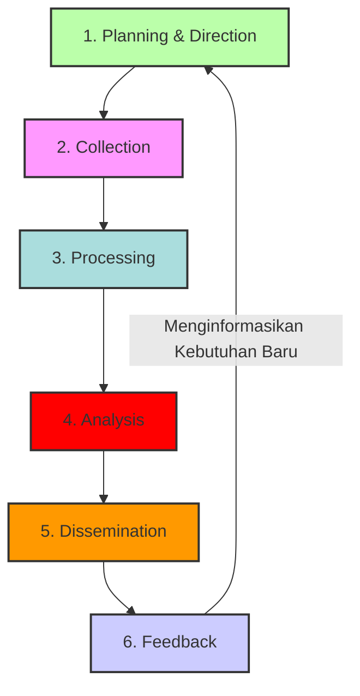

## **Modul Pembelajaran Akhir Minggu 13-14: Intelijen, Teknologi Disruptif, dan Masa Depan Peperangan Siber**

**Abstrak**

Memasuki modul pembelajaran konklusi selama dua minggu ini, kita akan beralih ke cakrawala peperangan siber, mengeksplorasi bagaimana intelijen canggih dan teknologi disruptif secara fundamental membentuk kembali lanskap konflik digital di masa kini dan masa depan. Kita akan memulai dengan penyelaman mendalam ke dalam disiplin **Cyber Threat Intelligence (CTI)**, menganalisis siklus hidupnya dari pengumpulan hingga diseminasi dan perannya yang krusial dalam mengubah postur pertahanan dari reaktif menjadi proaktif. Selanjutnya, modul ini akan melakukan dekonstruksi terhadap dampak ganda (*dual-impact*) dari **Kecerdasan Buatan (AI) dan Pembelajaran Mesin (ML)**, baik sebagai akselerator pertahanan otonom maupun sebagai pengganda kekuatan (*force multiplier*) untuk operasi ofensif yang semakin canggih. Kita kemudian akan mengkaji ancaman eksistensial yang ditimbulkan oleh **Komputasi Kuantum** terhadap fondasi kriptografi modern dan membahas upaya global dalam mengembangkan kriptografi pasca-kuantum. Puncak dari modul ini adalah analisis futurologis terhadap **tren peperangan masa depan**, di mana batas antara domain fisik dan digital menjadi kabur dan konflik berlangsung pada kecepatan mesin. Pengetahuan ini akan disintesiskan melalui **lokakarya praktis mengenai teknik-teknik *Open-Source Intelligence* (OSINT)** dan sebuah **analisis terstruktur untuk memprediksi tren ancaman siber di masa depan**.

-----

### **Bagian 1: *Cyber Threat Intelligence* (CTI) – Mengubah Data Menjadi Keunggulan Keputusan**

Dalam peperangan modern, kemenangan seringkali tidak ditentukan oleh kekuatan senjata semata, tetapi oleh superioritas intelijen. 🧠 Di domain siber, prinsip ini termanifestasi dalam disiplin *Cyber Threat Intelligence* (CTI). CTI adalah proses mengubah data mentah mengenai ancaman menjadi intelijen yang telah dianalisis, diberi konteks, dan dapat ditindaklanjuti. Fungsinya adalah untuk memberikan pemahaman yang mendalam kepada para pembuat keputusan—dari analis SOC hingga komandan strategis—mengenai siapa musuh siber mereka, apa kapabilitas dan motivasi mereka, dan bagaimana mereka kemungkinan besar akan menyerang. Adopsi CTI yang matang adalah faktor pembeda utama antara postur pertahanan yang pasif dan reaktif dengan postur pertahanan yang proaktif, prediktif, dan didorong oleh intelijen.

#### **1.1. Siklus Hidup Intelijen (*Intelligence Lifecycle*): Dari Kebutuhan ke Umpan Balik**

Produksi CTI yang efektif bukanlah sebuah aktivitas tunggal, melainkan sebuah proses siklis yang berkelanjutan, yang diadaptasi dari model siklus hidup intelijen tradisional. Setiap fase saling bergantung dan memberikan masukan untuk fase berikutnya.



  * **Fase 1: Perencanaan dan Pengarahan (*Planning and Direction*)**
      * **Tujuan:** Fase ini adalah fondasi dari seluruh siklus. Tujuannya adalah untuk mendefinisikan secara jelas tujuan dan sasaran dari program intelijen. Ini dimulai dengan mengidentifikasi para pemangku kepentingan (*stakeholders*) dan memahami **Kebutuhan Intelijen Prioritas (Priority Intelligence Requirements - PIRs)** mereka.
      * **Contoh PIRs:**
          * **Untuk Komandan Strategis:** "Kelompok APT mana yang memiliki intensi dan kapabilitas tertinggi untuk menargetkan program pengembangan kapal selam baru kita?"
          * **Untuk Manajer SOC:** "Apa saja TTPs terbaru yang digunakan oleh kelompok *ransomware* yang menargetkan sektor pertahanan?"
          * **Untuk Tim Respons Insiden:** "Indikator Kompromi (IoCs) apa yang dapat kita gunakan untuk mendeteksi *malware* X secara proaktif di jaringan kita?"
      * **Output:** Sebuah rencana pengumpulan intelijen yang terstruktur yang menjawab pertanyaan-pertanyaan ini.

-----

  * **Fase 2: Pengumpulan (*Collection*)**
      * **Tujuan:** Mengumpulkan data mentah dari sebanyak mungkin sumber yang relevan untuk menjawab PIRs.
      * **Sumber Data:**
          * **Data Internal:** Log dari SIEM, NIDS/IPS, EDR, proksi web, server DNS. Ini memberikan gambaran tentang apa yang terjadi di dalam jaringan sendiri.
          * **Data Eksternal (OSINT):** Blog keamanan, laporan vendor, media sosial, forum peretas, repositori kode, dan data dari *dark web*.
          * **Data Teknis:** Umpan data intelijen ancaman (*threat feeds*), analisis *malware* di lingkungan *sandbox*, dan data dari *honeypots* (sistem umpan yang sengaja dibuat rentan untuk menarik penyerang).

-----

  * **Fase 3: Pengolahan (*Processing*)**
      * **Tujuan:** Mengubah data mentah yang dikumpulkan, yang seringkali dalam format yang tidak terstruktur dan bervolume besar, menjadi format yang dapat dianalisis.
      * **Aktivitas:** Parsing log ke dalam skema data umum (seperti yang dilakukan SIEM), menerjemahkan informasi dari bahasa asing, mengekstrak IoCs dari laporan PDF, dan menyaring data yang tidak relevan atau duplikat.

-----

  * **Fase 4: Analisis (*Analysis*)**
      * **Tujuan:** Ini adalah fase di mana data diubah menjadi intelijen. Analis menggunakan keahlian, pengalaman, dan model analitis untuk memberikan **konteks** pada data yang telah diolah. Mereka mencari pola, mengkorelasikan peristiwa, membentuk hipotesis tentang atribusi dan motivasi, dan menilai signifikansi dari sebuah ancaman.
      * **Model Analitis Kunci:**
          * **Pyramid of Pain (David Bianco):** Model ini mengklasifikasikan jenis-jenis indikator ancaman berdasarkan seberapa sulit bagi penyerang untuk mengubahnya. Memblokir *hash* file itu mudah bagi penyerang untuk diubah; memblokir Taktik, Teknik, dan Prosedur (TTPs) mereka jauh lebih sulit dan "menyakitkan".
          * **Diamond Model of Intrusion Analysis:** Model ini memetakan setiap insiden siber ke dalam empat titik simpul yang saling berhubungan: **Adversary** (musuh), **Infrastructure** (infrastruktur yang digunakan musuh), **Capability** (kemampuan/malware musuh), dan **Victim** (korban).

-----

  * **Fase 5: Diseminasi (*Dissemination*)**
      * **Tujuan:** Menyampaikan produk intelijen yang telah selesai kepada para pemangku kepentingan yang tepat, pada waktu yang tepat, dan dalam format yang paling berguna bagi mereka.
      * **Prinsip Kunci:** Intelijen harus **relevan, tepat waktu, dan dapat ditindaklanjuti (*actionable*)**. Laporan setebal 50 halaman yang sangat teknis tidak berguna bagi seorang jenderal, sama seperti ringkasan strategis satu halaman yang tidak berguna bagi seorang analis SOC. Produk harus disesuaikan.

-----

  * **Fase 6: Umpan Balik (*Feedback*)**
      * **Tujuan:** Menutup lingkaran siklus. Tim intelijen harus secara aktif meminta umpan balik dari para pemangku kepentingan: Apakah intelijen yang diberikan berguna? Apakah ia membantu Anda membuat keputusan yang lebih baik? Umpan balik ini kemudian digunakan untuk menyempurnakan fase Perencanaan dan Pengarahan untuk siklus berikutnya.

-----

#### **1.2. Tingkatan *Cyber Threat Intelligence***

CTI bukanlah produk monolitik. Ia ada dalam berbagai tingkatan granularitas, masing-masing melayani audiens dan tujuan yang berbeda.

  * **a. Intelijen Strategis (*Strategic CTI*)**

      * **Audiens:** Pembuat keputusan tingkat tinggi (manajemen eksekutif, komandan militer, pejabat pemerintah).
      * **Fokus:** Menjawab pertanyaan "mengapa" dan "siapa". Berfokus pada gambaran besar, tren ancaman global, motivasi geopolitik dan ekonomi di balik kampanye siber, dan penilaian risiko terhadap organisasi atau misi.
      * **Contoh Produk:** Laporan bulanan tentang "Peningkatan Aktivitas Spionase Siber Tiongkok di Sektor Maritim Asia Tenggara."

  * **b. Intelijen Operasional (*Operational CTI*)**

      * **Audiens:** Manajer pertahanan siber, arsitek keamanan, tim respons insiden.
      * **Fokus:** Menjawab pertanyaan "bagaimana". Memberikan wawasan teknis tentang TTPs musuh, membedah kampanye serangan, alat yang digunakan, dan infrastruktur yang dieksploitasi. Seringkali selaras dengan kerangka kerja seperti **MITRE ATT\&CK®**.
      * **Contoh Produk:** Analisis teknis mendalam tentang *malware* baru yang digunakan oleh APT29.

  * **c. Intelijen Taktis (*Tactical CTI*)**

      * **Audiens:** Analis SOC, sistem keamanan otomatis (SIEM, IDS/IPS, EDR).
      * **Fokus:** Menjawab pertanyaan "apa". Terdiri dari **Indikator Kompromi (IoCs)** yang spesifik dan seringkali dapat dibaca mesin.
      * **Contoh Produk:** Daftar alamat IP server C2, domain berbahaya, *hash* file *malware*, dan *signature* jaringan yang harus segera diblokir.

-----

-----

### **Bagian 2: Kecerdasan Buatan (AI) dan Pembelajaran Mesin (ML) dalam Peperangan Siber**

Kecerdasan Buatan (AI) dan sub-bidangnya, Pembelajaran Mesin (ML), merupakan teknologi transformatif yang paling signifikan di abad ke-21. Dalam konteks peperangan siber, AI/ML adalah **teknologi penggunaan ganda (*dual-use technology*)** yang klasik: ia secara simultan menawarkan potensi untuk menciptakan pertahanan siber yang otonom dan tangguh, sekaligus memungkinkan lahirnya senjata siber ofensif yang lebih cerdas, adaptif, dan destruktif. 🤖

#### **2.1. AI/ML dalam Operasi Siber Defensif: Perisai Algoritmik**

Aplikasi defensif AI/ML berpusat pada kemampuannya untuk memproses volume data yang masif pada kecepatan mesin dan mengidentifikasi pola-pola halus yang tidak mungkin dilihat oleh analis manusia.

  * **a. Deteksi Anomali Berbasis Perilaku (*Behavioral Anomaly Detection*)**

      * **Konsep:** Model ML dilatih pada data historis yang sangat besar dari lalu lintas jaringan dan aktivitas *endpoint* untuk membangun "model normalitas" yang sangat akurat. Sistem EDR dan SIEM modern kemudian menggunakan model ini untuk mendeteksi deviasi sekecil apapun dari perilaku normal secara *real-time*, sehingga mampu mendeteksi serangan *zero-day*.

  * **b. Perburuan Ancaman Otomatis (*Automated Threat Hunting*)**

      * **Konsep:** AI dapat mengotomatiskan proses proaktif mencari jejak penyusup di dalam jaringan dengan menjalankan hipotesis analitis yang kompleks terhadap data historis, mencari sekuens peristiwa yang jarang terjadi namun sangat berkorelasi dengan TTPs musuh.

  * **c. Otomatisasi Respons (SOAR)**

      * **Konsep:** AI/ML meningkatkan platform SOAR dengan memungkinkan pengambilan keputusan yang lebih cerdas. *Playbook* respons insiden dapat secara dinamis menyesuaikan responsnya berdasarkan tingkat keyakinan, jenis ancaman, dan kekritisan aset yang ditargetkan.

-----

#### **2.2. AI/ML dalam Operasi Siber Ofensif: Pedang Otonom**

Aplikasi ofensif AI/ML adalah area yang berkembang pesat dan sangat mengkhawatirkan, berpotensi mengarah pada era baru serangan siber yang otonom.

  * **a. Malware Polimorfik dan Metamorfik yang Ditingkatkan AI**

      * **Konsep:** AI dapat secara dramatis meningkatkan kecanggihan *malware* yang dapat mengubah dirinya sendiri, memungkinkannya untuk secara cerdas beradaptasi dengan lingkungan pertahanan yang dihadapinya dan menghindari deteksi.

  * **b. Rekayasa Sosial dan Disinformasi Skala Besar**

      * **Konsep:** *Large Language Models* (LLM) seperti GPT-4 dapat digunakan untuk secara otomatis menghasilkan email *spear phishing* yang sangat personal dan meyakinkan dalam ribuan variasi.
      * ***Deepfakes:*** Teknologi *Generative Adversarial Networks* (GANs) dapat menciptakan video dan audio palsu yang sangat realistis. Dalam konteks militer, *deepfake* seorang komandan yang memberikan perintah palsu dapat menyebabkan kekacauan total di medan perang.

  * **c. Otomatisasi Rantai Serangan (*Automated Kill Chain*)**

      * **Konsep:** Sistem AI ofensif dapat diberikan sebuah tujuan tingkat tinggi (misalnya, "curi data dari server X") dan kemudian secara otonom melakukan seluruh rantai serangan: melakukan pengintaian, menemukan dan memilih kerentanan, mengembangkan eksploitasi, bergerak secara lateral, dan mengekstrak data, semua dengan sedikit atau tanpa intervensi manusia.

-----

-----

### **Bagian 3: Ancaman Komputasi Kuantum – "Kiamat" Kriptografi**

Jika AI/ML adalah evolusi, maka komputasi kuantum adalah revolusi yang berpotensi mematahkan fondasi paling dasar dari keamanan digital modern: kriptografi. Meskipun komputer kuantum yang mampu memecahkan kriptografi skala besar mungkin masih beberapa tahun atau dekade lagi, ancamannya sudah ada di sini dan sekarang, dan implikasinya bersifat katastrofis. ⚛️

#### **3.1. Ancaman Kuantum terhadap Kriptografi**

Dua algoritma kuantum secara spesifik menimbulkan ancaman eksistensial terhadap kriptografi yang kita gunakan saat ini.

  * **a. Algoritma Shor dan Kematian Kriptografi Kunci Publik**

      * **Masalah yang Dipecahkan:** Memfaktorkan bilangan bulat yang sangat besar menjadi bilangan prima penyusunnya.
      * **Kriptografi yang Terancam:** Keamanan dari hampir semua **kriptografi kunci publik (asimetris)** yang kita gunakan saat ini—termasuk **RSA** dan **Elliptic Curve Cryptography (ECC)**—bergantung pada kesulitan matematis dari masalah pemfaktoran ini. Kriptografi ini adalah tulang punggung dari internet aman (HTTPS/TLS), tanda tangan digital, dan komunikasi militer yang aman.
      * **Dampak:** Sebuah komputer kuantum berskala besar yang menjalankan algoritma Shor akan mampu memecahkan enkripsi RSA-2048 dalam hitungan jam atau hari. Semua komunikasi terenkripsi yang menggunakan algoritma ini akan menjadi transparan.

  * **b. Algoritma Grover dan Pelemahan Kriptografi Kunci Simetris**

      * **Masalah yang Dipecahkan:** Mencari item tertentu dalam basis data yang tidak terstruktur.
      * **Kriptografi yang Terancam:** Algoritma ini secara signifikan mengurangi keamanan **kriptografi kunci simetris** (seperti **AES**). Ia tidak memecahkannya sepenuhnya, tetapi ia mengurangi kekuatan efektifnya.
      * **Dampak:** Untuk mempertahankan tingkat keamanan yang sama terhadap serangan kuantum, panjang kunci AES harus digandakan (misalnya, migrasi dari AES-128 ke AES-256).

-----

#### **3.2. Skenario Ancaman "Harvest Now, Decrypt Later"**

Ancaman kuantum bukanlah masalah di masa depan; ia sudah menjadi masalah keamanan nasional saat ini. Aktor negara-bangsa yang canggih diasumsikan sedang secara aktif melakukan operasi **"Harvest Now, Decrypt Later" (Panen Sekarang, Dekripsi Nanti)**.

  * **Mekanisme:** Mereka mencegat dan menyimpan volume besar data terenkripsi yang sensitif (rahasia diplomatik, data intelijen, desain alutsista) yang saat ini tidak dapat mereka baca. Mereka menyimpannya dengan sabar, menunggu hari ketika mereka memiliki komputer kuantum yang fungsional (**"Q-Day"**). Pada hari itu, semua rahasia masa lalu akan dapat diungkap.
  * **Implikasi:** Data dengan umur kerahasiaan yang panjang (misalnya, identitas agen intelijen, desain senjata strategis) yang dienkripsi hari ini sudah dianggap berisiko.

-----

#### **3.3. Solusi: Migrasi ke Kriptografi Pasca-Kuantum (PQC - *Post-Quantum Cryptography*)**

Sebagai respons terhadap ancaman ini, komunitas kriptografi global, yang dipimpin oleh lembaga seperti **NIST (National Institute of Standards and Technology) AS**, sedang dalam proses menstandarisasi serangkaian algoritma kriptografi baru yang diyakini tahan terhadap serangan dari komputer klasik maupun kuantum. Migrasi global ke standar PQC ini akan menjadi salah satu upaya rekayasa ulang infrastruktur digital yang paling signifikan dalam sejarah.

-----

-----

### **Bagian 4: Analisis Tren Peperangan Masa Depan – Konvergensi Domain Konflik**

Peperangan di masa depan kemungkinan besar akan sangat berbeda dari konflik abad ke-20. Ia akan ditandai oleh hiper-konektivitas, otomatisasi, dan konvergensi yang semakin erat antara domain siber, fisik, kognitif, dan bahkan luar angkasa.

  * **a. Perang Algoritmik dan Kompresi Siklus Keputusan**

      * **Konsep:** Konflik akan berlangsung pada "kecepatan mesin", di mana siklus **Observe-Orient-Decide-Act (OODA)** akan dieksekusi oleh algoritma AI dalam hitungan milidetik. Sistem senjata otonom akan saling berhadapan, dengan manusia lebih berperan sebagai pengawas (*on-the-loop*).
      * **Implikasi Siber:** Operasi siber akan menjadi krusial untuk mengganggu atau memanipulasi siklus OODA musuh dengan membutakan sensor atau menyuntikkan data palsu.

  * **b. Konvergensi Siber-Fisik (*Cyber-Physical Convergence*)**

      * **Konsep:** Batas antara dunia digital dan fisik akan semakin kabur dengan meluasnya *Internet of Things* (IoT). Setiap objek fisik yang terhubung menjadi potensi titik masuk siber dan target siber.
      * **Implikasi:** Serangan tidak lagi hanya mencuri data, tetapi secara langsung memanipulasi dunia fisik, seperti membajak armada truk logistik otonom atau menonaktifkan jaringan listrik cerdas (*smart grid*).

  * **c. Peperangan di Domain Kognitif**

      * **Konsep:** Medan perang yang paling penting mungkin adalah pikiran populasi dan para pembuat keputusan. Operasi informasi yang didukung AI akan menjadi lebih personal, lebih persuasif, dan lebih sulit dideteksi.
      * **Implikasi:** Kampanye disinformasi dan *deepfake* yang berkelanjutan dapat mengikis kohesi sosial, merusak kepercayaan pada pemerintah dan militer, dan memanipulasi opini publik untuk menentang upaya pertahanan nasional.

  * **d. Militarisasi Ruang Angkasa dan Ketergantungan Siber**

      * **Konsep:** Aset di luar angkasa, terutama satelit, adalah tulang punggung dari peperangan modern (menyediakan PNT, komunikasi, dan ISR).
      * **Implikasi:** Satelit dan stasiun darat yang mengendalikannya adalah target siber bernilai sangat tinggi. Peperangan siber di masa depan akan memiliki dimensi astro-siber yang signifikan.

-----

-----

### **Bagian 5: Sesi Interaktif – Lokakarya dan Analisis Prediktif**

Bagian terakhir dari modul ini berfokus pada penerapan praktis dari konsep intelijen dan analisis masa depan melalui lokakarya langsung dan diskusi terstruktur.

#### **5.1. Lokakarya A: Teknik *Open-Source Intelligence* (OSINT) Praktis**

  * **Tujuan:** Memberikan peserta pengalaman langsung dalam menggunakan alat dan metodologi OSINT untuk mengumpulkan intelijen mengenai sebuah target.

  * **Skenario Hipotetis:**

    > Anda adalah tim intelijen siber yang ditugaskan untuk membangun profil awal dari sebuah perusahaan fiktif bernama **"Maritim Logistik Nusantara" (MLN)**, yang merupakan kontraktor utama penyedia layanan logistik untuk pangkalan angkatan laut. **Tujuan Anda adalah untuk mengidentifikasi potensi vektor serangan *spear phishing* dan kerentanan teknis.**

  * **Alur Kerja Lokakarya (Diagram Mermaid):**

    ```mermaid
    graph TD
        A[Mulai: Target -> Maritim Logistik Nusantara] --> B{Identifikasi Aset Digital Awal};
        B --> C[Situs Web Resmi https://maritimlogistik.co.id];
        B --> D[Profil Media Sosial Perusahaan];
        C --> E{Analisis Situs Web};
        E --> F[Teknologi Backend - Wappalyzer];
        E --> G[Subdomain - Sublist3r, Amass];
        E --> H[Informasi Kontak & Staf];
        D --> I{Analisis Media Sosial};
        I --> J[Identifikasi Personel Kunci - LinkedIn];
        I --> K[Analisis Pola Aktivitas];
        F & G & H & J --> L{Pengembangan Profil Target};
        L --> M[Identifikasi Alamat Email Staf Keuangan];
        L --> N[Identifikasi Versi WordPress & Plugin Rentan];
        M & N --> O[Kesimpulan: Vektor Serangan Potensial];
        O --> P[Vektor 1: Spear Phishing ke Staf Keuangan];
        O --> Q[Vektor 2: Eksploitasi Plugin WordPress Rentan];
    ```

  * **Langkah-langkah Praktis:**

    1.  **Analisis Situs Web:** Gunakan *add-on browser* seperti **Wappalyzer** untuk mengidentifikasi teknologi yang digunakan oleh situs web MLN (misalnya, WordPress, Apache, PHP).
    2.  **Pencarian Subdomain:** Gunakan alat seperti **Sublist3r** atau **Amass** untuk menemukan subdomain tersembunyi (misalnya, `vpn.maritimlogistik.co.id` atau `dev.maritimlogistik.co.id`).
    3.  **Google Dorking:** Gunakan kueri lanjutan untuk mencari file sensitif atau halaman login: `site:maritimlogistik.co.id filetype:pdf confidential` atau `site:maritimlogistik.co.id inurl:login`.
    4.  **Analisis Personel (LinkedIn):** Cari perusahaan "Maritim Logistik Nusantara" di LinkedIn. Identifikasi staf di departemen-departemen kunci seperti IT, Keuangan, dan Operasi. Perhatikan nama, jabatan, dan koneksi mereka. Informasi ini sangat berharga untuk membuat email *spear phishing*.
    5.  **Sintesis:** Gabungkan semua temuan untuk membangun hipotesis serangan yang paling mungkin berhasil.

-----

#### **5.2. Diskusi Kelompok B: Analisis Prediksi Tren Ancaman Siber**

  * **Tujuan:** Menerapkan kerangka kerja analitis untuk memprediksi evolusi ancaman siber dalam konteks pertahanan maritim Indonesia untuk 3-5 tahun ke depan.
  * **Metodologi Analisis (PESTLE):** Kita akan menggunakan kerangka PESTLE (Politik, Ekonomi, Sosial, Teknologi, Hukum/Legal, Lingkungan/Environmental) untuk menganalisis pendorong perubahan.
  * **Alur Kerja Analisis (Diagram Mermaid):**
    ```mermaid
    graph TD
        A[Analisis Pendorong Perubahan /PESTLE] --> B[Politik: Peningkatan Ketegangan di Laut Natuna Utara];
        A --> C[Ekonomi: Ketergantungan pada Perdagangan Maritim & Digitalisasi Pelabuhan];
        A --> D[Sosial: Peningkatan Penggunaan Media Sosial oleh Personel];
        A --> E[Teknologi: Adopsi 5G, IoT di Kapal, dan AI];
        A --> F[Hukum: Implementasi UU PDP & Regulasi Siber Internasional];
        B & C & D & E & F --> G{Sintesis & Identifikasi Tren Ancaman};
        G --> H[Ancaman 1: Serangan Terkoordinasi Siber-Kinetik di Zona Sengketa];
        G --> I[Ancaman 2: Serangan Ransomware Skala Besar yang Menargetkan Rantai Pasok Pelabuhan];
        G --> J[Ancaman 3: Kampanye Disinformasi yang Didukung AI Menargetkan Moral Personel AL];
        G --> K[Ancaman 4: Serangan Terhadap Aset Luar Angkasa - Satelit Komunikasi];
        H & I & J & K --> L[Rekomendasi Strategis untuk Mitigasi];
    ```
  * **Pertanyaan Panduan untuk Diskusi:**
    1.  **Pendorong Politik/Ekonomi:** Bagaimana peningkatan ketegangan geopolitik di kawasan dan ketergantungan ekonomi pada jalur laut akan membentuk jenis serangan siber yang akan kita hadapi? (Misalnya, lebih banyak spionase dan serangan disrupsi yang disponsori negara).
    2.  **Pendorong Teknologi:** Bagaimana adopsi teknologi baru seperti AI, IoT di atas kapal, dan komputasi kuantum (jangka panjang) akan menciptakan **kerentanan baru** sekaligus **peluang pertahanan baru**?
    3.  **Pendorong Sosial/Hukum:** Bagaimana tren sosial (misalnya, ekspektasi konektivitas konstan) dan perkembangan hukum (misalnya, privasi data) akan mempengaruhi postur keamanan siber TNI AL?
    4.  **Prediksi Ancaman Paling Berbahaya:** Dari semua kemungkinan, tren ancaman tunggal apa yang Anda anggap paling berbahaya bagi pertahanan maritim Indonesia dalam lima tahun ke depan, dan mengapa?
    5.  **Rekomendasi Prioritas:** Berdasarkan prediksi Anda, apa **tiga investasi prioritas** (dalam teknologi, SDM, atau doktrin) yang harus dilakukan oleh pertahanan siber Indonesia untuk mempersiapkan diri menghadapi masa depan?

-----

### **Sumber Pembelajaran dan Bacaan Lanjutan**

1.  ***Cyber Threat Intelligence* (CTI):**

      * **MITRE ATT\&CK®:** Kerangka kerja definitif untuk TTPs musuh. [https://attack.mitre.org/](https://attack.mitre.org/)
      * **SANS Institute Reading Room for Cyber Threat Intelligence:** Kumpulan makalah dan sumber daya. [https://www.sans.org/reading-room/whitepapers/threats/](https://www.google.com/search?q=https://www.sans.org/reading-room/whitepapers/threats/)

2.  **AI/ML dalam Siber:**

      * **"The Malicious Use of Artificial Intelligence: Forecasting, Prevention, and Mitigation"**: Laporan komprehensif dari berbagai institusi. [https://www.maliciousaireport.com/](https://www.maliciousaireport.com/)
      * **NIST Special Publication 1270: Towards a Standard for Identifying and Managing Bias in Artificial Intelligence**: [https://csrc.nist.gov/publications/detail/sp/1270/final](https://www.google.com/search?q=https://csrc.nist.gov/publications/detail/sp/1270/final)

3.  **Ancaman Komputasi Kuantum:**

      * **NIST Post-Quantum Cryptography Project:** Pusat informasi utama mengenai standardisasi PQC. [https://csrc.nist.gov/projects/post-quantum-cryptography](https://csrc.nist.gov/projects/post-quantum-cryptography)
      * **"Quantum Computing and Cryptography" - National Academies of Sciences, Engineering, and Medicine**: [https://nap.nationalacademies.org/catalog/25196/quantum-computing-progress-and-prospects](https://nap.nationalacademies.org/catalog/25196/quantum-computing-progress-and-prospects)

4.  **OSINT:**

      * **OSINT Framework:** Kumpulan alat OSINT yang sangat lengkap. [https://osintframework.com/](https://osintframework.com/)
      * **Bellingcat:** Contoh jurnalisme investigasi kelas dunia yang hanya menggunakan OSINT. [https://www.bellingcat.com/](https://www.bellingcat.com/)
