## **Materi Pembelajaran Minggu 5-6: Analisis Ancaman & Kerentanan Siber Militer**

**Abstrak**

Memasuki paruh kedua dari modul pengantar ini, fokus kita beralih dari kerangka kerja konseptual dan yuridis ke analisis praktis mengenai realitas operasional di domain siber: ancaman yang dihadapi dan kerentanan yang dieksploitasi. Modul dua minggu ini secara sistematis akan membedah taksonomi ancaman siber yang relevan dengan konteks militer, dengan penekanan khusus pada aktor ancaman paling canggih, yaitu *Advanced Persistent Threat* (APT). Selanjutnya, kita akan melakukan analisis granular terhadap kerentanan yang melekat pada infrastruktur kritis maritim, sebuah domain vital bagi kedaulatan dan perekonomian Indonesia. Modul ini juga akan menginvestigasi vektor serangan yang menargetkan elemen terlemah dalam setiap sistem keamanan—manusia—melalui analisis teknik *social engineering* yang disesuaikan untuk target militer. Sesi pembelajaran akan dikulminasikan dengan serangkaian diskusi kelompok terstruktur dan sebuah lokakarya praktis mengenai metodologi *threat modeling* menggunakan kerangka kerja MITRE ATT&CK®, yang bertujuan untuk mentranslasikan pengetahuan teoretis menjadi kapabilitas analisis ancaman yang aplikatif.

---

### **Bagian 1: Klasifikasi Komprehensif Ancaman Siber Militer**

Dalam doktrin militer, pemahaman terhadap musuh (*know your enemy*) adalah postulat fundamental. Di domain siber, "musuh" ini seringkali bersifat amorf, anonim, dan beroperasi melintasi batas-batas geografis dan yurisdiksi. Oleh karena itu, klasifikasi atau taksonomi ancaman yang rigid dan multi-dimensional menjadi prasyarat untuk pengembangan strategi pertahanan, alokasi sumber daya, dan postur respons yang efektif. Ancaman siber militer tidak dapat dipahami hanya sebagai daftar *malware*; ia harus dianalisis sebagai sebuah ekosistem kompleks dari aktor, motivasi, kapabilitas, dan tujuan.

Kami mengusulkan sebuah kerangka klasifikasi multi-dimensional yang mengkategorikan ancaman berdasarkan empat sumbu utama: (1) **Tujuan Strategis (Intent)**, (2) **Aktor Ancaman (Actor)**, (3) **Lapisan Target (Target Layer)**, dan (4) **Vektor Serangan (Vector)**.

#### **1.1. Klasifikasi Berdasarkan Tujuan Strategis (Intent)**

Tujuan akhir dari sebuah operasi siber menentukan sifat, skala, dan metodologi yang digunakan. Dalam konteks militer dan keamanan nasional, tujuan ini dapat dikategorikan ke dalam empat domain utama.

* **a. Spionase (Intellectual Property & Intelligence Theft)**
    * **Definisi:** Operasi siber yang bertujuan untuk melakukan eksfiltrasi data rahasia, sensitif, atau bernilai strategis dari jaringan target secara klandestin dan tanpa terdeteksi dalam jangka waktu yang lama. Tujuan utamanya adalah pengumpulan intelijen, bukan disrupsi.
    * **Objek Spionase Militer:**
        * **Data Teknis dan Desain Alutsista:** Mencuri cetak biru (*blueprints*), data hasil uji coba, spesifikasi teknis, dan kode sumber (*source code*) dari sistem senjata generasi berikutnya (misalnya, pesawat tempur, kapal selam, sistem rudal). Ini memungkinkan lawan untuk mengakselerasi program R&D mereka sendiri, mengembangkan penangkal (*countermeasures*), atau mengeksploitasi kerentanan desain pada sistem tersebut.
        * **Informasi Intelijen, Pengawasan, dan Pengintaian (ISR):** Mencuri data dari satelit, drone, atau sensor lainnya. Informasi ini dapat mengungkapkan disposisi pasukan, pola patroli, dan kapabilitas pengawasan.
        * **Dokumen Strategis dan Doktrinal:** Mencuri dokumen perencanaan operasional (OPLAN), aturan pelibatan (*Rules of Engagement* - ROE), penilaian intelijen, dan laporan diplomatik. Informasi ini memberikan wawasan mendalam mengenai proses pengambilan keputusan dan intensi strategis lawan.
    * **Studi Kasus Analitis (Titan Rain & Moonlight Maze):** Operasi spionase siber berskala besar ini, yang terdeteksi pada awal tahun 2000-an dan akhir 1990-an, menargetkan jaringan Departemen Pertahanan AS, kontraktor pertahanan, dan laboratorium penelitian. Jejak digital mengarah pada keterlibatan aktor negara dari Tiongkok dan Rusia. Operasi ini menjadi penanda era baru spionase industrial dan militer, di mana pencurian data digital dalam volume terabyte dapat memberikan keuntungan strategis yang setara dengan operasi intelijen manusia selama bertahun-tahun.
    * **Implikasi Strategis:** Spionase siber secara perlahan mengikis keunggulan teknologi dan informasi suatu negara, menciptakan medan perang yang lebih simetris di masa depan.

* **b. Sabotase (Physical Destruction & Degradation)**
    * **Definisi:** Operasi siber yang secara sengaja dirancang untuk memanipulasi sistem kontrol industri (*Industrial Control Systems* - ICS) atau teknologi operasional (*Operational Technology* - OT) dengan tujuan untuk menyebabkan kerusakan fisik, kehancuran, atau degradasi fungsional yang parah.
    * **Karakteristik Kunci:** Ini adalah kategori ancaman yang paling eskalatif karena secara langsung melintasi batas antara domain digital dan fisik (*crossing the digital Rubicon*). Pelaksanaannya memerlukan intelijen yang sangat mendalam mengenai proses industri target dan pengembangan *malware* yang sangat terspesialisasi.
    * **Studi Kasus Analitis (Stuxnet):** Seperti dibahas pada modul sebelumnya, Stuxnet adalah arketipe dari senjata siber sabotase. Tujuannya bukan mencuri data, melainkan merusak *centrifuge* pengayaan uranium di fasilitas Natanz, Iran. Stuxnet mendemonstrasikan bahwa baris-baris kode dapat menjadi substitusi fungsional untuk sebuah serangan bom presisi, mencapai tujuan militer (menghambat program nuklir) tanpa risiko pilot tertembak jatuh atau eskalasi perang terbuka.
    * **Skenario Sabotase Militer Lainnya:**
        * Mengintroduksi kerusakan laten pada proses manufaktur alutsista (misalnya, membuat komponen jet tempur sedikit lebih rapuh dari spesifikasi) yang baru akan gagal pada kondisi stres operasional.
        * Mereset sistem navigasi inersia pada rudal balistik agar meleset dari targetnya.
        * Menyebabkan *overpressure* pada sistem perpipaan di kapal selam, mengakibatkan kerusakan katastrofis.
    * **Implikasi Strategis:** Ancaman sabotase siber memaksa militer untuk memperluas konsep pertahanan infrastruktur kritis hingga ke level sistem kontrol mekanis dan industrial.

* **c. Disrupsi (Denial & Disruption of Services)**
    * **Definisi:** Operasi siber yang bertujuan untuk membuat sebuah sistem, jaringan, atau layanan menjadi tidak tersedia (*unavailable*) atau tidak dapat diandalkan (*unreliable*) bagi pengguna yang sah. Tujuannya adalah kelumpuhan operasional sementara, bukan pencurian data atau perusakan permanen.
    * **Metodologi Utama:**
        * ***Distributed Denial-of-Service (DDoS) Attack:*** Membanjiri target (misalnya, situs web komando pusat, server komunikasi) dengan lalu lintas data dari ribuan atau jutaan sumber (*botnet*) untuk menghabiskan sumber daya komputasi atau bandwidth target.
        * ***Wiper Malware:*** Perangkat lunak perusak yang dirancang untuk menghapus data secara sistematis dan permanen dari hard drive yang terinfeksi. Tujuannya adalah membuat sistem tidak dapat di-boot ulang dan data tidak dapat dipulihkan.
    * **Studi Kasus Analitis (Perang Siber Estonia 2007 & NotPetya):** Serangan DDoS masif terhadap Estonia melumpuhkan layanan perbankan, pemerintahan, dan media, mendemonstrasikan bagaimana disrupsi siber dapat digunakan sebagai instrumen tekanan politik dan koersi terhadap sebuah negara. Sementara itu, *malware* NotPetya (2017) berfungsi sebagai serangan *wiper* destruktif terhadap Ukraina yang menyebabkan disrupsi ekonomi dan pemerintahan berskala nasional.
    * **Implikasi Strategis:** Serangan disrupsi, terutama jika dilancarkan pada awal sebuah konflik kinetik, dapat secara signifikan menghambat kemampuan C4ISR lawan, menciptakan kebingungan (*fog of war*), dan menunda waktu respons.

* **d. Disinformasi dan Deception (Manipulation of Perception)**
    * **Definisi:** Operasi yang menargetkan domain kognitif manusia dengan tujuan untuk menanamkan narasi palsu, merusak kepercayaan terhadap institusi, mempolarisasi masyarakat, atau menipu para pembuat keputusan militer. Ini adalah bentuk peperangan informasi (*information warfare*) yang dilaksanakan melalui medium siber.
    * **Metodologi:**
        * Penyebaran disinformasi (informasi yang sengaja salah) dan malinformasi (informasi asli yang disebar untuk merugikan) melalui media sosial, forum online, dan media yang dikompromikan.
        * Operasi peretasan dan pembocoran (*Hack and Leak Operations*): Mencuri data sensitif (misalnya, email pejabat) dan membocorkannya secara strategis ke publik untuk mempermalukan atau mendelegitimasi target.
        * Manipulasi data (*Data Poisoning*): Secara diam-diam mengubah integritas data dalam sebuah *database*. Bayangkan memanipulasi data logistik militer sehingga unit di lapangan dikirimkan amunisi kaliber yang salah, atau memanipulasi data target di dalam sistem intelijen.
    * **Studi Kasus Analitis (Intervensi Pemilu AS 2016):** Operasi yang diatribusikan kepada intelijen Rusia ini menggabungkan *hack and leak* (peretasan DNC) dengan kampanye disinformasi yang masif di media sosial. Tujuannya bukan untuk mengubah suara secara langsung, melainkan untuk mempengaruhi persepsi pemilih dan merusak kepercayaan terhadap proses demokrasi.
    * **Implikasi Strategis:** Ancaman ini adalah yang paling sulit dilawan dengan solusi teknis semata, karena ia mengeksploitasi bias kognitif manusia dan keretakan sosial yang sudah ada. Bagi militer, ancaman ini dapat merusak moral pasukan, kepercayaan pada kepemimpinan, dan dukungan publik terhadap operasi militer.

#### **1.2. Klasifikasi Berdasarkan Aktor Ancaman (Actor)**

Memahami siapa pelaku di balik serangan adalah kunci untuk memahami motivasi, tingkat kecanggihan, dan sumber daya yang mereka miliki.

* **a. Aktor Negara-Bangsa (*Nation-State Actors*)**
    * **Deskripsi:** Unit-unit siber yang secara organik merupakan bagian dari angkatan bersenjata atau badan intelijen suatu negara (misalnya, Unit 61398 PLA Tiongkok, Unit 8200 Intelijen Israel, US Cyber Command, GRU & FSB Rusia).
    * **Karakteristik:**
        * **Sumber Daya:** Hampir tak terbatas; didukung oleh anggaran negara.
        * **Kapabilitas:** Sangat canggih; mampu mengembangkan *zero-day exploits* dan *malware* kustom.
        * **Tujuan:** Selaras dengan agenda keamanan nasional dan kebijakan luar negeri negara induknya (spionase, sabotase, persiapan medan tempur).
        * **Persistensi:** Mampu menjalankan kampanye jangka panjang (bertahun-tahun) terhadap target bernilai tinggi. Mereka adalah operator di balik sebagian besar kampanye APT.

* **b. Proksi yang Disponsori Negara (*State-Sponsored Proxies*)**
    * **Deskripsi:** Kelompok peretas yang secara teknis bukan merupakan bagian dari struktur pemerintahan, tetapi menerima pendanaan, pelatihan, intelijen, dan perlindungan dari sebuah negara untuk melancarkan serangan siber atas nama negara tersebut.
    * **Karakteristik:**
        * **Penyangkalan yang Masuk Akal (*Plausible Deniability*):** Keuntungan utama bagi negara sponsor adalah mereka dapat menyangkal keterlibatan, sehingga mempersulit atribusi dan respons internasional.
        * **Motivasi Campuran:** Kelompok ini mungkin memiliki motivasi ideologis atau finansial sendiri, yang kemudian diselaraskan dengan tujuan negara sponsor.
        * **Contoh:** Banyak kelompok APT yang berbasis di Iran atau Korea Utara diyakini beroperasi sebagai proksi, memadukan spionase negara dengan aktivitas kriminal siber untuk keuntungan finansial.

* **c. Tentara Siber Bayaran (*Cyber Mercenaries*)**
    * **Deskripsi:** Perusahaan swasta atau individu yang menjual kapabilitas peretasan canggih (*Hacking-as-a-Service*) kepada penawar tertinggi. Klien mereka bisa jadi negara, perusahaan, atau individu kaya.
    * **Karakteristik:**
        * **Motivasi:** Murni finansial.
        * **Spesialisasi:** Seringkali sangat terspesialisasi dalam area tertentu, seperti pengembangan *spyware* untuk perangkat seluler (misalnya, NSO Group) atau eksploitasi *zero-day*.
        * **Ancaman:** Mereka mendemokratisasi akses terhadap kapabilitas siber tingkat negara, memungkinkan negara-negara kecil atau bahkan kelompok non-negara untuk memperoleh alat serangan yang sangat canggih.

* **d. Teroris dan Ekstremis Siber (*Cyber Terrorists & Extremists*)**
    * **Deskripsi:** Kelompok teroris yang menggunakan ruang siber untuk propaganda, rekrutmen, penggalangan dana, komunikasi, dan perencanaan serangan.
    * **Karakteristik:**
        * **Kapabilitas Saat Ini:** Sebagian besar masih terbatas pada penggunaan platform yang ada (media sosial, aplikasi pesan terenkripsi). Kemampuan mereka untuk melakukan serangan siber yang kompleks (seperti sabotase infrastruktur kritis) saat ini masih dinilai rendah.
        * **Ancaman Masa Depan:** Ada kekhawatiran bahwa kelompok-kelompok ini dapat memperoleh kapabilitas yang lebih destruktif dengan merekrut talenta teknis atau membeli layanan dari *cyber mercenaries*. Skenario terorisme siber yang menyebabkan kerusakan fisik masif tetap menjadi perhatian keamanan nasional jangka panjang.

* **e. Ancaman dari Dalam (*Insider Threat*)**
    * **Deskripsi:** Individu yang memiliki akses sah ke dalam jaringan (karyawan, kontraktor, prajurit) yang menyalahgunakan akses tersebut.
    * **Kategori:**
        * ***Malicious Insider:*** Individu yang secara sengaja mencuri data atau menyabotase sistem karena dimotivasi oleh balas dendam, ideologi, atau direkrut oleh intelijen asing.
        * ***Unintentional Insider:*** Individu yang secara tidak sengaja menjadi vektor serangan, misalnya dengan menjadi korban *phishing*, kehilangan laptop, atau menggunakan kata sandi yang lemah. Kategori ini, meskipun tidak berniat jahat, merupakan salah satu vektor ancaman yang paling umum dan berbahaya.

#### **1.3. Klasifikasi Berdasarkan Lapisan Target (Target Layer)**

Model tiga lapisan *cyberspace* membantu kita memahami di mana sebuah serangan terjadi dan bagaimana efeknya merambat.

* **a. Serangan pada Lapisan Fisik (*Physical Layer*)**
    * **Target:** Infrastruktur TIK fisik (pusat data, kabel serat optik bawah laut, menara seluler, stasiun satelit darat).
    * **Metode:** Umumnya bersifat kinetik (sabotase fisik, pengeboman), tetapi dapat diaktifkan atau dipandu oleh intelijen yang diperoleh dari operasi siber. Serangan siber juga dapat menonaktifkan sistem pendingin di pusat data, menyebabkan *overheating* dan kerusakan fisik pada server.
* **b. Serangan pada Lapisan Logis (*Logical Layer*)**
    * **Target:** Kode, perangkat lunak, sistem operasi, dan protokol jaringan yang berjalan di atas lapisan fisik.
    * **Metode:** Ini adalah ranah serangan siber klasik: penyebaran *malware*, eksploitasi kerentanan perangkat lunak, serangan DDoS, peretasan basis data, dll. Sebagian besar OCO dan DCO terjadi di lapisan ini.
* **c. Serangan pada Lapisan Kognitif (*Cognitive Layer*)**
    * **Target:** Manusia sebagai pengguna dan pemroses informasi.
    * **Metode:** Operasi disinformasi, propaganda, rekayasa sosial (*social engineering*), dan operasi psikologis (PSYOP). Tujuannya bukan untuk merusak sistem, melainkan untuk memanipulasi kepercayaan dan pengambilan keputusan manusia.

#### **1.4. Klasifikasi Berdasarkan Vektor Serangan (Vector)**

Vektor adalah jalur atau metode yang digunakan oleh aktor ancaman untuk mendapatkan akses awal ke dalam jaringan target.

* **a. Eksploitasi Kerentanan Perangkat Lunak (*Software Vulnerability Exploitation*)**
    * **Deskripsi:** Memanfaatkan kelemahan atau *bug* dalam kode sistem operasi atau aplikasi untuk mengeksekusi kode berbahaya.
    * ***Zero-Day Exploit:*** Eksploitasi terhadap kerentanan yang belum diketahui oleh vendor perangkat lunak atau publik. Ini adalah senjata siber yang paling kuat dan mahal, biasanya hanya dimiliki oleh aktor negara.
* **b. Rekayasa Sosial (*Social Engineering*)**
    * **Deskripsi:** Memanipulasi individu secara psikologis agar melakukan tindakan yang membahayakan keamanan (misalnya, mengklik tautan berbahaya, memberikan kata sandi). Ini akan dibahas secara mendalam di Bagian 4.
* **c. Serangan Rantai Pasok (*Supply Chain Attack*)**
    * **Deskripsi:** Menyerang target tidak secara langsung, melainkan dengan mengkompromikan salah satu pemasok perangkat keras atau perangkat lunak mereka yang kurang aman. *Malware* disisipkan ke dalam produk yang sah selama proses pengembangan atau distribusi.
    * **Studi Kasus Analitis (SolarWinds):** Aktor yang diduga dari Rusia berhasil menyisipkan kode berbahaya ke dalam pembaruan perangkat lunak manajemen jaringan SolarWinds Orion. Ribuan organisasi di seluruh dunia, termasuk berbagai lembaga pemerintah AS, mengunduh pembaruan yang telah di-trojan ini, memberikan akses *backdoor* kepada penyerang ke dalam jaringan mereka yang paling sensitif. Ini adalah contoh sempurna dari serangan rantai pasok yang canggih dan berdampak luas.
* **d. Media Fisik (*Physical Media*)**
    * **Deskripsi:** Menggunakan perangkat penyimpanan fisik seperti USB drive untuk memasukkan *malware* ke dalam jaringan, terutama jaringan yang terisolasi dari internet (*air-gapped networks*).
    * **Contoh:** Vektor penyebaran awal Stuxnet diyakini melalui USB drive yang terinfeksi yang dibawa masuk ke fasilitas Natanz.

Pemahaman terhadap kerangka klasifikasi multi-dimensional ini memungkinkan para analis pertahanan siber untuk tidak hanya menjawab "apa yang menyerang kita?", tetapi juga "siapa yang menyerang, mengapa mereka menyerang, di mana mereka menyerang, dan bagaimana mereka masuk?". Jawaban atas pertanyaan-pertanyaan ini adalah fondasi dari strategi pertahanan yang proaktif dan berbasis intelijen.

---
### **Bagian 2: *Advanced Persistent Threat* (APT) – Anatomi Aktor Ancaman Paling Canggih**

Di antara spektrum aktor ancaman yang luas, *Advanced Persistent Threat* (APT) menempati puncak piramida dalam hal kecanggihan, sumber daya, dan dampak strategis. Istilah APT tidak merujuk pada sebuah perangkat lunak atau alat tertentu, melainkan pada **aktor** atau **kampanye** serangan itu sendiri. Memahami APT adalah kunci untuk memahami eselon atas dari *cyber warfare* yang dilancarkan oleh negara-bangsa.

#### **2.1. Dekonstruksi Terminologi: *Advanced, Persistent, Threat***

* **Advanced (Canggih):**
    * Ini merujuk pada kapabilitas teknis yang jauh melampaui peretas biasa atau penjahat siber. Tingkat kecanggihan ini termanifestasi dalam beberapa cara:
        * **Penggunaan Alat Kustom:** APT jarang menggunakan *malware* yang tersedia umum (*off-the-shelf*). Mereka mengembangkan perangkat lunak perusak dan alat eksploitasi mereka sendiri yang dirancang khusus untuk target tertentu. Ini membuat deteksi oleh perangkat lunak antivirus berbasis signature menjadi sangat sulit.
        * **Kapabilitas *Zero-Day*:** Mereka memiliki sumber daya untuk menemukan atau membeli *zero-day exploits*, memungkinkan mereka untuk menembus pertahanan yang paling mutakhir sekalipun.
        * **Metodologi Operasional yang Kompleks:** Mereka mampu melakukan operasi multi-tahap yang kompleks, seringkali mengkombinasikan vektor serangan siber dengan metode spionase tradisional seperti intelijen manusia (HUMINT).

* **Persistent (Persisten/Gigih):**
    * Ini adalah karakteristik yang paling membedakan APT dari ancaman lain. Persistensi berarti mereka tidak mengejar keuntungan sesaat (*smash and grab*). Sebaliknya, tujuan mereka adalah untuk **mempertahankan akses jangka panjang dan tidak terdeteksi** di dalam jaringan target.
    * **Operasi "Low and Slow":** Setelah mendapatkan akses awal, aktivitas mereka bergerak dengan sangat lambat dan hati-hati untuk meniru perilaku pengguna normal dan menghindari pemicuan sistem deteksi. Eksfiltrasi data mungkin dilakukan dalam potongan-potongan kecil selama berbulan-bulan atau bahkan bertahun-tahun.
    * **Mekanisme Persistensi:** Mereka akan menanamkan berbagai mekanisme *backdoor* dan *rootkit* di berbagai titik dalam jaringan untuk memastikan mereka dapat kembali masuk bahkan jika salah satu titik akses mereka ditemukan dan ditutup.

* **Threat (Ancaman):**
    * Ini merujuk pada sifat terorganisir dan bertujuan dari aktor di balik serangan. APT bukanlah peretas tunggal yang bertindak iseng. Mereka adalah **kelompok terorganisir dengan tujuan strategis yang jelas**, biasanya selaras dengan kepentingan ekonomi atau militer dari sebuah negara-bangsa. Mereka memiliki rantai komando, pendanaan, dan tujuan misi yang spesifik.

#### **2.2. Anatomi Operasi APT: Model *Cyber Kill Chain***

Untuk memahami bagaimana APT beroperasi, model *Cyber Kill Chain*® yang dikembangkan oleh Lockheed Martin menyediakan kerangka kerja konseptual yang sangat berguna. Model ini menguraikan serangan siber ke dalam tujuh fase berurutan. Untuk berhasil bertahan, sebuah organisasi hanya perlu memutus rantai ini di salah satu fase.

1.  **Reconnaissance (Pengintaian):**
    * **Deskripsi:** Fase pengumpulan informasi pasif dan aktif terhadap target. APT akan menghabiskan waktu berminggu-minggu atau berbulan-bulan di fase ini.
    * **Metode:** Memanen informasi dari sumber terbuka (OSINT) seperti situs web perusahaan, profil LinkedIn karyawan, dokumen teknis yang bocor. Melakukan pemindaian teknis untuk mengidentifikasi alamat IP, sistem operasi yang digunakan, dan port yang terbuka. Tujuannya adalah membangun peta detail dari infrastruktur teknis dan "infrastruktur manusia" target.

2.  **Weaponization (Persenjataan):**
    * **Deskripsi:** Menggabungkan sebuah *exploit* (misalnya, *zero-day*) dengan sebuah *payload* (misalnya, *Remote Access Trojan* - RAT) untuk menciptakan "senjata" siber yang dapat dikirimkan.
    * **Contoh:** Membuat file PDF yang tampak normal, tetapi disisipi dengan kode eksploitasi yang akan aktif ketika file dibuka, yang kemudian akan menginstal *backdoor* kustom.

3.  **Delivery (Pengiriman):**
    * **Deskripsi:** Mengirimkan senjata yang telah dibuat ke lingkungan target.
    * **Metode Paling Umum:** *Spear phishing*—mengirim email yang sangat meyakinkan dan ditargetkan secara pribadi kepada karyawan tertentu, yang berisi tautan atau lampiran berbahaya. Vektor lain termasuk serangan *watering hole* atau media fisik (USB).

4.  **Exploitation (Eksploitasi):**
    * **Deskripsi:** Kode eksploitasi dalam senjata diaktifkan, memanfaatkan kerentanan pada sistem target untuk mengeksekusi kode penyerang.
    * **Contoh:** Korban mengklik lampiran PDF, kode di dalamnya mengeksploitasi kerentanan di Adobe Reader, dan memberikan penyerang pijakan awal (*initial foothold*) di dalam workstation korban.

5.  **Installation (Instalasi):**
    * **Deskripsi:** *Payload* (RAT atau *implant*) diinstal pada aset yang telah dikompromikan. *Payload* ini berfungsi sebagai *backdoor* persisten bagi penyerang.
    * **Teknik:** *Malware* APT seringkali menggunakan teknik canggih untuk menyembunyikan diri, seperti menyamar sebagai proses sistem yang sah atau memodifikasi *registry* untuk memastikan ia berjalan setiap kali sistem di-boot ulang.

6.  **Command & Control (Komando & Kendali / C2):**
    * **Deskripsi:** *Payload* yang terinstal akan "memanggil pulang" (*beaconing*) ke server C2 yang dikendalikan oleh penyerang melalui internet. Ini menciptakan saluran komunikasi tersembunyi yang memungkinkan penyerang untuk mengirim perintah ke *implant* dan menerima data kembali.
    * **Metode Canggih:** APT akan menggunakan saluran C2 yang terenkripsi dan seringkali menyamarkan lalu lintasnya agar terlihat seperti lalu lintas web normal (misalnya, melalui port 80/443) untuk menghindari deteksi oleh *firewall*.

7.  **Actions on Objectives (Tindakan pada Tujuan):**
    * **Deskripsi:** Ini adalah fase di mana penyerang akhirnya melaksanakan tujuan sebenarnya dari misi mereka. Setelah mendapatkan pijakan awal, mereka tidak langsung mencuri data. Mereka akan melakukan:
        * **Pengintaian Internal:** Memetakan jaringan internal, mengidentifikasi server bernilai tinggi (seperti server data desain atau domain controller).
        * **Eskalasi Hak Istimewa (*Privilege Escalation*):** Mengeksploitasi kerentanan internal untuk mendapatkan hak akses administrator.
        * **Gerakan Lateral (*Lateral Movement*):** Bergerak dari sistem ke sistem di dalam jaringan untuk mencapai target utama.
        * **Eksfiltrasi Data:** Mengumpulkan, mengompres, mengenkripsi, dan kemudian secara perlahan-lahan mencuri data melalui saluran C2.

#### **2.3. Studi Kasus Analitis Kelompok APT Terkemuka**

Setiap kelompok APT memiliki "sidik jari" unik berdasarkan alat yang mereka gunakan, infrastruktur yang mereka manfaatkan, dan jenis target yang mereka kejar. Industri keamanan siber melacak kelompok-kelompok ini dengan nama yang berbeda (misalnya, CrowdStrike menggunakan nama bertema hewan, Mandiant menggunakan nomor).

* **APT28 (Alias: Fancy Bear, Strontium, Sofacy Group)**
    * **Atribusi:** Diatribusikan secara luas kepada Direktorat Intelijen Utama Staf Umum Rusia (GRU).
    * **Fokus & Tujuan:** Target politik, diplomatik, dan militer yang menjadi kepentingan strategis pemerintah Rusia. Tujuan mereka seringkali adalah spionase dan operasi pengaruh (*influence operations*).
    * **TTPs Terkenal:** Dikenal karena kampanye *spear phishing* yang sangat canggih, penggunaan *zero-day exploits* untuk Windows, dan pengembangan *malware* modular seperti X-Agent.
    * **Operasi Signifikan:** Peretasan Komite Nasional Demokratik (DNC) selama pemilu AS 2016, peretasan parlemen Jerman, dan serangan terhadap Badan Anti-Doping Dunia (WADA).

* **APT41 (Alias: Barium, Winnti Group)**
    * **Atribusi:** Diatribusikan kepada aktor negara Tiongkok, dengan karakteristik unik.
    * **Fokus & Tujuan:** Menjalankan operasi ganda. Di satu sisi, mereka melakukan spionase siber yang disponsori negara terhadap sektor-sektor strategis (pertahanan, teknologi tinggi, telekomunikasi). Di sisi lain, mereka juga melakukan operasi kriminal siber untuk keuntungan finansial pribadi, seperti menargetkan perusahaan video game.
    * **TTPs Terkenal:** Dikenal karena serangan rantai pasok (menyisipkan kode berbahaya ke dalam perangkat lunak game yang sah), penggunaan sertifikat digital curian, dan *malware* yang canggih.
    * **Implikasi:** APT41 mengaburkan batas antara spionase negara dan kejahatan siber, menunjukkan bagaimana negara dapat "membiarkan" operatornya melakukan aktivitas kriminal selama misi negara tetap dijalankan.

* **Lazarus Group (APT38)**
    * **Atribusi:** Diatribusikan secara luas kepada Korea Utara.
    * **Fokus & Tujuan:** Tujuan utamanya adalah menghasilkan pendapatan bagi rezim Korea Utara yang terkena sanksi berat. Mereka adalah contoh sempurna dari APT yang berfokus pada kejahatan finansial skala besar.
    * **TTPs Terkenal:** Dikenal karena operasi perampokan bank digital yang sangat berani (seperti peretasan Bank Bangladesh senilai $81 juta melalui jaringan SWIFT), pengembangan dan penyebaran *ransomware* (WannaCry), dan menargetkan bursa mata uang kripto.
    * **Implikasi:** Lazarus Group menunjukkan bagaimana kapabilitas siber tingkat negara dapat dialihkan sepenuhnya untuk tujuan kriminal ekonomi, menjadi instrumen vital bagi kelangsungan hidup sebuah rezim.

Memahami APT bukan hanya tentang teknologi, tetapi tentang memahami strategi, doktrin, dan motivasi ekonomi-politik dari negara-bangsa yang beroperasi di dan melalui ruang siber. Bagi pertahanan militer, melawan APT memerlukan pergeseran dari pertahanan berbasis perimeter yang reaktif ke pendekatan proaktif berbasis intelijen ancaman (*threat intelligence-driven defense*), yang berfokus pada deteksi perilaku anomali di dalam jaringan.

---
Oke, saya akan melanjutkan naskah materi pembelajaran dari titik terakhir dengan mempertahankan format dan kedalaman akademis yang sama.

-----

### **Bagian 3: Analisis Kerentanan Infrastruktur Kritis Maritim**

Infrastruktur kritis maritim (IKM) merupakan sebuah ekosistem *system-of-systems* yang kompleks, mencakup aset di laut (kapal), di darat (pelabuhan), dan di angkasa (satelit) yang saling terhubung. Ketergantungan yang mendalam pada teknologi digital dan jaringan telah secara dramatis meningkatkan efisiensi operasional, namun secara simultan mengintroduksi vektor-vektor kerentanan baru yang dapat dieksploitasi oleh aktor ancaman siber. Analisis kerentanan IKM memerlukan pendekatan holistik yang tidak hanya memeriksa sistem IT (Teknologi Informasi) tradisional, tetapi juga, dan yang lebih penting, sistem OT (*Operational Technology*) yang mengendalikan proses-proses fisik.

#### **3.1. Taksonomi Aset Kritis dan Permukaan Serangan Digitalnya**

Kerentanan tidak eksis dalam vakum; ia melekat pada aset spesifik. Berikut adalah dekomposisi aset-aset kritis dalam domain maritim dan analisis permukaan serangan digital yang terkait.

  * **a. Aset Navigasi dan Situational Awareness**

      * **Sistem Satelit Navigasi Global (GNSS - *Global Navigation Satellite System*), termasuk GPS:**

          * **Deskripsi Fungsional:** Menyediakan data Posisi, Navigasi, dan Waktu (PNT) yang fundamental bagi hampir semua operasi maritim modern.
          * **Kerentanan Intrinsik:** Sinyal GNSS yang diterima oleh kapal di permukaan laut memiliki daya yang sangat rendah (dapat diibaratkan dengan mendengarkan bisikan di tengah konser rock), tidak terenkripsi (untuk sinyal sipil), dan strukturnya diketahui publik.
          * **Vektor Serangan:**
              * ***Jamming:*** Menyiarkan *noise* (derau) pada frekuensi GNSS untuk menenggelamkan sinyal asli, menyebabkan penerima (*receiver*) di kapal kehilangan kunci posisi (*position lock*). Hasilnya adalah *denial-of-service* terhadap data PNT.
              * ***Spoofing:*** Vektor yang jauh lebih canggih dan berbahaya. Penyerang menyiarkan sinyal GNSS palsu yang lebih kuat dari sinyal asli. *Receiver* di kapal akan "terkunci" pada sinyal palsu ini. Serangan *spoofing* yang canggih dapat secara perlahan-lahan dan halus (*seamless takeover*) menggeser posisi yang dilaporkan kapal dari posisi sebenarnya, mengarahkannya ke perairan berbahaya atau area penyergapan tanpa disadari oleh kru.
          * **Implikasi Militer:** Kapal perang dapat diarahkan keluar dari formasi, memasuki perairan teritorial musuh secara tidak sengaja, atau sistem penargetan senjatanya dapat menerima data koordinat yang salah.

      * **Sistem Tampilan Peta dan Informasi Elektronik (ECDIS - *Electronic Chart Display and Information System*)**

          * **Deskripsi Fungsional:** Sistem navigasi terkomputerisasi yang mengintegrasikan data GPS, radar, dan data Peta Navigasi Elektronik (ENC) ke dalam satu tampilan terpadu.
          * **Kerentanan:**
              * **Integritas Perangkat Lunak:** ECDIS adalah sistem berbasis perangkat lunak, seringkali berjalan pada sistem operasi komersial (*Commercial Off-the-Shelf* - COTS) seperti Windows, yang memiliki kerentanan yang terdokumentasi dengan baik.
              * **Integritas Data Peta (ENC):** Peta ENC diperbarui secara berkala, seringkali melalui USB atau koneksi satelit. Proses pembaruan ini menjadi vektor potensial untuk mengintroduksi peta yang telah dimanipulasi.
          * **Vektor Serangan:** *Malware* yang dimasukkan melalui USB atau koneksi jaringan dapat memanipulasi tampilan ECDIS: menghapus data kedalaman laut, menghilangkan rintangan navigasi (seperti karang atau bangkai kapal), atau menampilkan "kapal hantu" untuk menciptakan kebingungan.

      * **Sistem Identifikasi Otomatis (AIS - *Automatic Identification System*)**

          * **Deskripsi Fungsional:** Sistem transponder yang menyiarkan data identitas, posisi, arah, dan kecepatan kapal untuk mencegah tabrakan.
          * **Kerentanan Intrinsik:** Protokol AIS pada dasarnya tidak terenkripsi dan tidak memiliki mekanisme otentikasi. Siapapun dengan radio yang tepat dapat menyiarkan sinyal AIS palsu.
          * **Vektor Serangan:**
              * **Penciptaan Kapal Hantu (*Ghost Ships*):** Menyiarkan data AIS untuk kapal yang tidak ada, dapat digunakan untuk mengacaukan jalur pelayaran atau menciptakan target palsu dalam skenario militer.
              * **Penghilangan Kapal (*AIS Spoofing/Hijacking*):** Menyiarkan data posisi palsu untuk kapal yang ada, membuatnya tampak berada di lokasi yang berbeda atau bahkan menghilang dari layar operator VTS. Ini dapat digunakan untuk menutupi aktivitas ilegal seperti penyelundupan atau penangkapan ikan ilegal.

  * **b. Aset Kontrol Operasional Kapal (Sistem OT/ICS)**

      * **Deskripsi Fungsional:** Jaringan terkomputerisasi yang memonitor dan mengendalikan fungsi-fungsi fisik kapal, seperti mesin, kemudi, sistem ballast, dan manajemen daya.
      * **Kerentanan Sistemik:**
          * ***Legacy Systems:*** Banyak sistem OT di kapal dirancang puluhan tahun yang lalu dengan prioritas pada keandalan dan keselamatan, bukan keamanan siber. Mereka seringkali menggunakan sistem operasi usang yang tidak dapat di-*patch* dan protokol komunikasi yang tidak terenkripsi.
          * **Konvergensi IT/OT:** Dahulu, jaringan OT terisolasi secara fisik (*air-gapped*). Kini, untuk efisiensi pemantauan dan pemeliharaan jarak jauh, jaringan ini semakin sering terhubung ke jaringan IT kapal (yang terhubung ke internet). Koneksi ini menjadi jembatan bagi ancaman dari dunia IT untuk masuk ke dunia OT.
      * **Vektor Serangan:**
          * **Mesin Penggerak:** *Malware* dapat memanipulasi sistem kontrol mesin untuk menyebabkan *overspeed*, mematikannya di saat kritis, atau mengganggu efisiensi bahan bakar.
          * **Sistem Kemudi:** Penyerang dapat mengambil alih aktuator kemudi, secara efektif membajak kapal dari jarak jauh.
          * **Sistem Manajemen Ballast:** Manipulasi sistem ballast dapat menyebabkan ketidakstabilan kapal, yang dalam kondisi cuaca buruk atau manuver ekstrem dapat menyebabkan kapal terbalik (*capsizing*).

  * **c. Aset Infrastruktur Darat (Pelabuhan dan VTS)**

      * **Sistem Operasi Terminal (TOS - *Terminal Operating System*)**
          * **Deskripsi Fungsional:** Otak dari operasi pelabuhan peti kemas modern. TOS mengelola seluruh logistik: penjadwalan kedatangan kapal, alokasi dermaga, pergerakan derek, penumpukan peti kemas, dan antarmuka dengan sistem bea cukai.
          * **Kerentanan:** TOS adalah sistem perangkat lunak yang sangat kompleks dan terintegrasi dengan berbagai sistem lain, menciptakan permukaan serangan yang luas. Kelumpuhan TOS berarti kelumpuhan total operasi pelabuhan.
          * **Vektor Serangan:** Serangan *ransomware*, *wiper malware*, atau manipulasi data di dalam TOS dapat menghentikan perdagangan, menyebabkan kekacauan logistik, dan memberikan dampak ekonomi langsung dan masif.
      * **Layanan Lalu Lintas Kapal (VTS - *Vessel Traffic Service*)**
          * **Deskripsi Fungsional:** Setara dengan kontrol lalu lintas udara untuk domain maritim. VTS memantau pergerakan kapal di area sibuk (seperti selat atau pendekatan pelabuhan) menggunakan data radar, AIS, dan kamera.
          * **Kerentanan:** Gangguan pada sistem VTS dapat meningkatkan risiko tabrakan secara dramatis. Serangan yang memanipulasi data sensorik yang diterima VTS (misalnya, *AIS spoofing* atau injeksi target radar palsu) dapat membuat operator VTS "buta" atau memberikan panduan navigasi yang salah kepada kapal.

#### **3.2. Risiko Sistemik dan Potensi Kegagalan Kaskade (*Cascading Failures*)**

Kerentanan yang paling berbahaya dalam infrastruktur kritis bukanlah kerentanan pada komponen tunggal, melainkan potensi kegagalan kaskade yang dipicu oleh saling ketergantungan antar sistem. Sebuah insiden siber tunggal dapat memicu serangkaian kegagalan yang merambat ke seluruh ekosistem maritim.

  * **Skenario Analitis Kegagalan Kaskade:**
    1.  **Pemicu:** Serangan *GPS spoofing* yang canggih menargetkan sebuah kapal tanker LNG super besar saat memasuki selat navigasi yang sempit.
    2.  **Efek Langsung:** Kapal secara tidak sadar menyimpang dari jalurnya yang aman dan kandas, memblokir seluruh selat.
    3.  **Efek Tingkat Kedua:**
          * **Disrupsi Fisik:** Ratusan kapal lain terjebak di belakang kapal tanker yang kandas, menghentikan aliran perdagangan melalui *choke point* strategis tersebut.
          * **Disrupsi Siber Lanjutan:** Aktor ancaman, memanfaatkan kekacauan tersebut, melancarkan serangan DDoS terhadap sistem manajemen pelabuhan di kedua ujung selat untuk menghambat upaya koordinasi penyelamatan dan pengalihan rute kapal.
    4.  **Efek Tingkat Ketiga (Ekonomi & Geopolitik):**
          * Rantai pasok global terganggu, menyebabkan lonjakan harga komoditas dan energi.
          * Perusahaan asuransi maritim menghadapi klaim miliaran dolar.
          * Ketegangan geopolitik meningkat karena negara-gatra yang bergantung pada selat tersebut saling menyalahkan atas insiden keamanan.

Skenario ini mengilustrasikan bagaimana sebuah kerentanan tunggal dalam satu sistem (GPS) dapat dieksploitasi untuk menciptakan efek strategis yang berdampak pada keamanan fisik, stabilitas ekonomi, dan hubungan internasional. Pertahanan siber IKM, oleh karena itu, harus mengadopsi pendekatan berbasis risiko sistemik, bukan hanya pengamanan komponen individual.

-----

### **Bagian 4: Analisis Teknik Rekayasa Sosial (*Social Engineering*) yang Ditargetkan pada Personel Militer**

Dalam arsitektur keamanan siber manapun, elemen manusia seringkali merupakan mata rantai terlemah (*the weakest link*). Aktor ancaman yang canggih memahami hal ini dengan sangat baik. Daripada menghabiskan sumber daya yang sangat besar untuk menembus pertahanan teknis berlapis-lapis, seringkali lebih mudah dan lebih efektif untuk menipu atau memanipulasi seorang individu yang memiliki akses sah untuk "membukakan pintu dari dalam". Rekayasa sosial adalah seni dan ilmu eksploitasi psikologi manusia untuk menembus sistem keamanan. Ketika ditargetkan pada personel militer, teknik-teknik ini disesuaikan dengan budaya, prosedur, dan jargon yang spesifik di lingkungan pertahanan.

#### **4.1. Definisi dan Prinsip Psikologis Fundamental**

  * **Definisi Kontekstual:** Rekayasa sosial adalah tindakan manipulasi psikologis yang dirancang untuk membujuk target agar melakukan tindakan tertentu (misalnya, mengungkapkan informasi rahasia, mengklik tautan berbahaya, memberikan akses fisik) atau membocorkan informasi sensitif. Ini adalah "peretasan terhadap pikiran manusia" (*human hacking*).
  * **Prinsip Psikologis yang Dieksploitasi (Robert Cialdini):**
      * **Otoritas (*Authority*):** Orang cenderung mematuhi figur otoritas. Penyerang dapat menyamar sebagai perwira senior atau pejabat IT dari markas besar.
      * **Rasa Suka (*Liking*):** Orang lebih mudah dibujuk oleh orang yang mereka sukai atau memiliki kesamaan. Penyerang akan membangun hubungan (*rapport*) melalui media sosial sebelum melancarkan serangan.
      * **Bukti Sosial (*Social Proof*):** Orang akan melakukan sesuatu jika mereka melihat orang lain melakukannya. Email *phishing* mungkin mengklaim, "Semua perwira di departemen Anda sudah mengisi formulir ini."
      * **Kelangkaan (*Scarcity*):** Tawaran yang terbatas dalam waktu atau jumlah dianggap lebih berharga. "Hanya ada 5 slot tersisa untuk kursus pelatihan siber ini, daftar sekarang\!"
      * **Urgensi (*Urgency*):** Penyerang menciptakan rasa urgensi untuk membuat target panik dan tidak berpikir rasional. "Akun Anda akan segera dinonaktifkan jika Anda tidak memverifikasi kata sandi Anda dalam 5 menit ke depan."
      * **Timbal Balik (*Reciprocity*):** Orang merasa berkewajiban untuk membalas budi. Penyerang mungkin menawarkan bantuan kecil atau informasi yang berguna sebelum meminta sesuatu yang lebih besar.

#### **4.2. Taksonomi Teknik Rekayasa Sosial dalam Konteks Militer**

  * **a. *Spear Phishing* (Umpan Tombak)**

      * **Deskripsi:** Ini adalah teknik rekayasa sosial yang paling umum dan efektif yang digunakan oleh APT. Berbeda dengan *phishing* massal yang generik, *spear phishing* adalah serangan email yang dibuat khusus (*tailor-made*) untuk individu atau kelompok kecil tertentu.
      * **Proses Pelaksanaan:**
        1.  **Pengintaian Target (OSINT):** Penyerang akan mempelajari targetnya secara mendalam melalui sumber-sumber publik: profil LinkedIn untuk mengetahui jabatan dan kolega, postingan media sosial untuk mengetahui hobi dan minat, publikasi resmi untuk mengetahui proyek yang sedang dikerjakan.
        2.  **Pembuatan Umpan (*Lure Crafting*):** Berdasarkan hasil pengintaian, penyerang membuat email yang sangat relevan dan meyakinkan. Lure yang umum digunakan dalam konteks militer meliputi:
              * **Pemberitahuan Promosi atau Mutasi Palsu:** "SK Mutasi Terbaru - Mohon Konfirmasi Data Diri Anda."
              * **Undangan Pelatihan atau Seminar Wajib:** "Daftar Wajib Pelatihan Keamanan Informasi Tahunan."
              * **Dokumen Operasional Mendesak:** "Revisi Jadwal Patroli - Segera Unduh dan Tinjau."
              * **Peringatan Keamanan IT Palsu:** "Terdeteksi aktivitas mencurigakan pada akun Anda, klik di sini untuk mengamankan."
        3.  **Pengiriman dan Eksploitasi:** Email tersebut akan berisi tautan ke situs web berbahaya yang dirancang untuk mencuri kredensial (misalnya, halaman login palsu) atau lampiran yang dipersenjatai (*weaponized attachment*) yang akan menginstal *malware* saat dibuka.
      * **Contoh Kasus:** APT28 secara ekstensif menggunakan *spear phishing* dengan umpan bertema NATO dan konflik Ukraina untuk menargetkan personel militer dan diplomatik Eropa.

  * **b. *Whaling* (Perburuan Paus)**

      * **Deskripsi:** Sebuah sub-kategori dari *spear phishing* yang secara spesifik menargetkan individu tingkat tinggi (*high-value targets*) seperti jenderal, laksamana, atau pejabat senior di kementerian pertahanan.
      * **Karakteristik:** Upaya pengintaian untuk serangan *whaling* jauh lebih ekstensif. Umpan yang digunakan sangat dipersonalisasi dan seringkali meniru komunikasi dari orang-orang tepercaya di lingkaran dalam target. Keberhasilan serangan *whaling* dapat memberikan penyerang akses ke informasi paling strategis.

  * **c. *Baiting* (Pengumpanan)**

      * **Deskripsi:** Teknik ini memanfaatkan rasa ingin tahu atau keserakahan manusia.
      * **Metode:**
          * **USB Drop:** Vektor klasik di mana penyerang sengaja meninggalkan USB drive yang terinfeksi *malware* di lokasi yang kemungkinan besar akan ditemukan oleh target (misalnya, di kantin, tempat parkir, atau ruang rapat pangkalan militer). USB tersebut mungkin diberi label yang menarik seperti "Data Gaji Perwira" atau "Foto Latihan Rahasia" untuk memancing korban agar mencolokkannya ke komputer kerja mereka.
          * **Tawaran Unduhan Gratis:** Menawarkan perangkat lunak, film, atau musik bajakan di situs-situs yang mungkin dikunjungi personel saat tidak bertugas.

  * **d. *Pretexting* (Penciptaan Skenario Palsu)**

      * **Deskripsi:** Penyerang menciptakan sebuah skenario atau dalih (*pretext*) yang meyakinkan untuk mendapatkan informasi dari target. Teknik ini seringkali melibatkan lebih banyak interaksi daripada *phishing*.
      * **Contoh Skenario Militer:** Penyerang menelepon seorang staf junior di departemen logistik, menyamar sebagai perwira dari departemen lain yang sedang mengerjakan proyek mendesak. Penyerang akan menggunakan jargon militer yang tepat dan menyebutkan nama-nama atasan yang relevan (diperoleh dari pengintaian) untuk membangun kredibilitas. Tujuannya mungkin untuk menanyakan detail mengenai jadwal pengiriman alutsista atau untuk mendapatkan alamat email internal perwira lain.

  * **e. Serangan *Watering Hole* (Lubang Air)**

      * **Deskripsi:** Daripada menyerang target secara langsung, penyerang mengkompromikan sebuah situs web pihak ketiga yang mereka tahu sering dikunjungi oleh target.
      * **Proses Pelaksanaan:**
        1.  **Identifikasi "Lubang Air":** Penyerang mengidentifikasi situs web yang populer di kalangan komunitas militer, seperti forum diskusi veteran, situs berita pertahanan, atau bahkan situs web restoran di dekat pangkalan militer.
        2.  **Kompromi Situs:** Penyerang meretas situs web tersebut dan menyisipkan kode berbahaya (*exploit kit*).
        3.  **Infeksi Pasif:** Ketika personel militer mengunjungi situs web yang sah dan tepercaya tersebut, kode berbahaya di latar belakang akan secara otomatis mencoba mengeksploitasi kerentanan di browser mereka dan menginstal *malware*.

#### **4.3. Mitigasi: Membangun "Tembok Pertahanan Manusia" (*Human Firewall*)**

Karena rekayasa sosial mengeksploitasi psikologi, mitigasinya tidak bisa hanya bersifat teknis. Solusinya harus berpusat pada manusia melalui pelatihan dan pembangunan budaya keamanan.

  * **Pelatihan Kesadaran Keamanan Berkelanjutan:** Pelatihan tidak boleh hanya menjadi acara tahunan. Harus ada program kesadaran yang berkelanjutan, interaktif, dan relevan dengan ancaman yang dihadapi personel.
  * **Simulasi *Phishing* Teratur:** Secara berkala mengirimkan email *phishing* simulasi kepada personel. Tujuannya bukan untuk menghukum mereka yang gagal, melainkan untuk memberikan pengalaman belajar yang aman dan mengukur tingkat kerentanan organisasi.
  * **Prinsip *Need-to-Know* dan *Least Privilege*:** Menerapkan kontrol akses teknis yang ketat sehingga bahkan jika seorang personel berhasil ditipu, kerusakan yang dapat mereka timbulkan terbatas karena mereka hanya memiliki akses ke informasi dan sistem yang benar-benar mereka butuhkan untuk pekerjaan mereka.
  * **Prosedur Verifikasi *Out-of-Band*:** Mendorong budaya "Percaya, tapi Verifikasi" (*Trust, but Verify*). Jika menerima permintaan yang tidak biasa atau mendesak melalui email, personel harus dilatih untuk memverifikasinya melalui saluran komunikasi yang berbeda (misalnya, menelepon langsung pengirim yang diklaim menggunakan nomor telepon dari direktori resmi).
  * **Membangun Budaya Melapor Tanpa Takut (*No-Blame Culture*):** Personel harus merasa aman untuk segera melaporkan jika mereka mencurigai telah menjadi korban rekayasa sosial, tanpa takut akan hukuman. Laporan yang cepat adalah kunci untuk membatasi kerusakan dari sebuah kompromi.

-----

### **Bagian 5: Sesi Interaktif – Diskusi Kelompok dan Lokakarya Praktis**

Bagian ini mentransisikan pengetahuan teoretis yang telah diperoleh ke dalam aplikasi praktis melalui diskusi terstruktur dan lokakarya langsung (*hands-on*). Tujuannya adalah untuk mengembangkan kemampuan berpikir kritis dan analitis dalam mengidentifikasi, memetakan, dan memitigasi ancaman siber.

#### **5.1. Diskusi Kelompok 1: Pemetaan Ancaman Siber Terhadap Lingkungan Operasional TNI Angkatan Laut**

  * **Tujuan:** Mengidentifikasi dan memprioritaskan aktor ancaman dan tujuan strategis mereka yang paling relevan dengan TNI AL.
  * **Instruksi:** Peserta dibagi menjadi kelompok-kelompok kecil (4-5 orang). Setiap kelompok diberikan waktu 45 menit untuk mendiskusikan dan menjawab pertanyaan-pertanyaan berikut, dan kemudian 15 menit untuk mempresentasikan hasilnya.
  * **Pertanyaan Panduan:**
    1.  **Identifikasi Aktor Ancaman:** Berdasarkan lanskap geopolitik saat ini di kawasan Indo-Pasifik, identifikasi **dua (2) aktor negara (atau proksi negara)** yang memiliki motivasi dan kapabilitas tertinggi untuk melancarkan operasi siber terhadap TNI AL. Berikan justifikasi untuk pilihan Anda.
    2.  **Analisis Tujuan Strategis (Intent):** Untuk masing-masing aktor yang Anda identifikasi, jelaskan tujuan strategis utama mereka. Apakah fokus mereka lebih pada **spionase** (misalnya, mencuri data desain kapal selam kelas Nagapasa), **sabotase** (misalnya, melumpuhkan sistem radar di pangkalan Ranai), atau **disrupsi** (misalnya, DDoS terhadap situs web rekrutmen TNI AL selama masa pendaftaran)?
    3.  **Prioritas Target:** Jika Anda adalah perencana operasi untuk aktor ancaman tersebut, aset atau informasi apa di lingkungan TNI AL yang akan menjadi target prioritas tertinggi Anda? (Contoh: Sistem Komando dan Pengendalian Armada, data intelijen maritim, data personel, atau R\&D alutsista).
    4.  **Skenario Paling Berbahaya (*Most Dangerous Scenario*):** Deskripsikan satu skenario serangan siber hibrida yang paling merusak yang dapat dilancarkan oleh salah satu aktor pilihan Anda, yang mengkombinasikan setidaknya dua jenis tujuan (misalnya, spionase yang diikuti oleh sabotase).

#### **5.2. Diskusi Kelompok 2: Analisis Kerentanan Kritis pada Sistem Komando dan Pengendalian (C4ISR)**

  * **Tujuan:** Menerapkan pemikiran kritis untuk mengidentifikasi potensi titik lemah (*single points of failure*) dan vektor serangan dalam arsitektur sistem komando yang hipotetis.
  * **Instruksi:** Setiap kelompok diberikan diagram arsitektur C4ISR hipotetis (lihat lampiran). Diagram ini menunjukkan bagaimana data mengalir dari sensor (kapal, drone, radar pantai) ke pusat komando, dan bagaimana perintah didistribusikan kembali ke unit operasional. Waktu diskusi adalah 45 menit, diikuti oleh presentasi.
  * **Pertanyaan Panduan:**
    1.  **Identifikasi Titik Tunggal Kegagalan (*Single Points of Failure*):** Amati diagram tersebut. Identifikasi komponen atau tautan data yang jika berhasil diserang, akan menyebabkan disrupsi terbesar pada keseluruhan sistem C4ISR. Apakah itu tautan komunikasi satelit (SATCOM)? Pusat data utama? Server otentikasi?
    2.  **Analisis Vektor Serangan:** Untuk setiap titik lemah yang Anda identifikasi, jelaskan **dua (2) kemungkinan vektor serangan siber** yang dapat mengeksploitasinya. (Contoh: Untuk tautan SATCOM, vektornya bisa *jamming* atau peretasan stasiun darat. Untuk pusat data, vektornya bisa *spear phishing* terhadap administrator sistem atau serangan rantai pasok melalui vendor perangkat lunak).
    3.  **Kerentanan "Manusia di Tengah" (*Human-in-the-Loop*):** Di titik mana dalam aliran data dan perintah ini peran manusia (operator, analis intelijen, komandan) paling krusial? Bagaimana seorang aktor ancaman dapat menggunakan **rekayasa sosial atau manipulasi data** untuk menipu manusia di titik-titik krusial tersebut dan menyebabkan pengambilan keputusan yang salah?
    4.  **Rekomendasi Mitigasi Prioritas:** Berikan **tiga (3) rekomendasi mitigasi** (teknis atau prosedural) yang paling mendesak untuk memperkuat ketahanan arsitektur C4ISR tersebut.

#### **5.3. Lokakarya Praktis: Pengantar *Threat Modeling* Menggunakan Kerangka Kerja MITRE ATT\&CK®**

  * **Tujuan:** Memberikan pengalaman praktis dalam menggunakan kerangka kerja standar industri untuk memodelkan perilaku penyerang secara sistematis. Ini menggeser pola pikir dari "melindungi dari kerentanan" menjadi "bertahan dari taktik musuh".

  * **Pengantar Kerangka Kerja:**

      * **Apa itu MITRE ATT\&CK®?** ATT\&CK (Adversarial Tactics, Techniques, and Common Knowledge) adalah sebuah basis pengetahuan yang dikurasi secara global dan dapat diakses publik mengenai taktik dan teknik musuh siber, berdasarkan observasi dunia nyata. Ini bukan daftar *malware* atau *tools*, melainkan **taksonomi perilaku** penyerang. (Situs: [https://attack.mitre.org/](https://attack.mitre.org/))
      * **Struktur:** Kerangka ini diorganisir ke dalam **Taktik** (tujuan teknis jangka pendek dari penyerang, misalnya, *Initial Access*, *Execution*, *Lateral Movement*) dan **Teknik** (cara spesifik untuk mencapai sebuah taktik, misalnya, *Phishing*, *PowerShell*, *Pass the Hash*).

  * **Skenario Lokakarya:**

    > "Anda adalah tim *Red Cell* di TNI AL. Misi Anda adalah untuk memodelkan bagaimana **APT28 (Fancy Bear)** akan mencoba menyusup ke jaringan Mabesal untuk **mencuri dokumen OPLAN (Rencana Operasi) untuk Latihan Gabungan Armada Jaya berikutnya.**"

  * **Langkah-langkah Lokakarya (Dipandu oleh Instruktur):**

    1.  **Pemahaman Aktor (5 menit):** Instruktur memberikan ringkasan profil APT28 dari matriks Grup di situs ATT\&CK ([https://attack.mitre.org/groups/G0007/](https://attack.mitre.org/groups/G0007/)). Kelompok mencatat TTPs (Taktik, Teknik, Prosedur) yang menjadi ciri khas mereka.
    2.  **Pemetaan Taktik *Initial Access* (Akses Awal) (15 menit):**
          * Menggunakan matriks ATT\&CK Enterprise ([https://attack.mitre.org/matrices/enterprise/](https://attack.mitre.org/matrices/enterprise/)), kelompok mendiskusikan: Teknik apa yang paling mungkin digunakan APT28 untuk mendapatkan akses awal ke jaringan Mabesal?
          * **Contoh Jawaban:** T1566.001 - *Spearphishing Attachment*. Mereka akan membuat email palsu yang ditujukan kepada seorang perwira staf operasi, dengan lampiran Word yang dipersenjatai dan menyamar sebagai "Draf Awal Jadwal Latgab."
    3.  **Pemetaan Taktik *Execution* & *Persistence* (Eksekusi & Persistensi) (15 menit):**
          * Setelah lampiran dibuka, bagaimana *malware* akan dieksekusi? Bagaimana ia akan memastikan tetap aktif bahkan setelah komputer di-restart?
          * **Contoh Jawaban:** T1059.001 - *PowerShell* (untuk eksekusi tanpa file), T1547.001 - *Registry Run Keys* (untuk persistensi).
    4.  **Pemetaan Taktik *Lateral Movement* (Gerakan Lateral) (15 menit):**
          * Dari komputer perwira staf yang terinfeksi, bagaimana APT28 akan bergerak untuk menemukan server file di mana OPLAN disimpan?
          * **Contoh Jawaban:** T1021.002 - *SMB/Windows Admin Shares*. Setelah mencuri kredensial dari komputer pertama, mereka akan menggunakannya untuk mengakses *shared drive* di seluruh jaringan.
    5.  **Pemetaan Taktik *Collection* & *Exfiltration* (Pengumpulan & Eksfiltrasi) (15 menit):**
          * Bagaimana mereka akan menemukan, mengemas, dan mencuri file OPLAN?
          * **Contoh Jawaban:** T1560.001 - *Archive via Utility* (menggunakan WinRAR untuk mengompres file), T1041 - *Exfiltration Over C2 Channel* (mengirim data terkompresi secara perlahan melalui saluran C2 yang terenkripsi).
    6.  **Diskusi Defensif (10 menit):** Setelah memetakan rantai serangan, setiap kelompok mendiskusikan: Di setiap langkah, kontrol keamanan atau data log apa yang dapat membantu kita **mendeteksi atau menghentikan** teknik spesifik ini? (Contoh: Untuk mendeteksi T1059.001, kita memerlukan *logging* skrip PowerShell yang mendetail).

```mermaid
graph LR
    A[MULAI: PROFIL AKTOR ANCAMAN APT28] --> B(NAMA LAIN: Fancy Bear, Sofacy, Strontium);
    B --> C{ASAL/AFILIASI};
    C --> D[Unit Intelijen Militer Rusia / GRU - Ditujukan untuk Spionase Siber Strategis];
    D --> E{MOTIVASI UTAMA};
    E --> F[Spionase Siber/Pengumpulan Intelijen: Militer, Pemerintah, Organisasi Keamanan, & Politik];
    F --> G{AKSES AWAL - INITIAL ACCESS - Taktik Khas};
    G --> H[T1566.001 - Spearphishing Attachment/Link /Email dengan Lampiran/URL Berbahaya];
    H --> I[T1078 - Valid Accounts - Password Spraying/Brute-force pada Layanan Publik];
    I --> J{EKSEKUSI & PERSISTENSI};
    J --> K[T1059.001 - Command and Scripting Interpreter/PowerShell untuk Eksekusi Malware];
    K --> L[T1547.001 - Registry Run Keys/Mekanisme Persistensi; T1560.001 - Archive via Utility WinRAR/ZIP];
    L --> M{GERAKAN LATERAL & PENGUMPULAN};
    M --> N[T1021.002 - SMB/Windows Admin Shares - Menggunakan Kredensial Curian untuk Akses Berbagi];
    N --> O[T1003 - OS Credential Dumping - Mencuri Hash/Kredensial dari Sistem seperti SAM/NTDS];
    O --> P{EKSFILTRASI/EXFILTRATION};
    P --> Q[T1041 - Exfiltration Over C2 Channel - Data Terkompresi Dikirim Perlahan melalui Saluran C2 Terenkripsi];
    Q --> R[AKHIR: TUJUAN TERCAPAI - Spionase/Pengumpulan Intelijen];

```

Lokakarya ini memberikan metode terstruktur bagi para analis untuk beralih dari sekadar mengetahui adanya ancaman menjadi memahami *bagaimana* ancaman tersebut beroperasi, yang merupakan langkah krusial untuk membangun pertahanan yang efektif dan berbasis intelijen.

-----

### **Sumber Pembelajaran dan Bacaan Lanjutan**

Untuk memperdalam pemahaman materi yang dibahas dalam modul ini, peserta sangat dianjurkan untuk mengeksplorasi sumber-sumber berikut:

1.  **Kerangka Kerja MITRE ATT\&CK®:**

      * Situs Utama: [https://attack.mitre.org/](https://attack.mitre.org/)
      * Matriks Enterprise: [https://attack.mitre.org/matrices/enterprise/](https://attack.mitre.org/matrices/enterprise/)
      * Profil Grup APT: [https://attack.mitre.org/groups/](https://attack.mitre.org/groups/)

2.  **Laporan Ancaman dari Industri Keamanan Siber (Sangat Direkomendasikan):**

      * **Mandiant (Google Cloud) M-Trends Report:** Laporan tahunan yang memberikan statistik dan analisis mendalam mengenai tren serangan siber. (Cari "Mandiant M-Trends [Tahun Terbaru]")
      * **CrowdStrike Global Threat Report:** Laporan tahunan yang memetakan aktivitas aktor ancaman utama di seluruh dunia. (Cari "CrowdStrike Global Threat Report [Tahun Terbaru]")
      * **Verizon Data Breach Investigations Report (DBIR):** Analisis statistik yang sangat baik mengenai vektor dan pola serangan di berbagai industri. (Cari "Verizon DBIR [Tahun Terbaru]")

3.  **Publikasi Pemerintah dan Badan Internasional:**

      * **Cybersecurity and Infrastructure Security Agency (CISA) Alerts:** Peringatan dan laporan teknis mengenai ancaman siber terkini. [https://www.cisa.gov/uscert/ncas/alerts](https://www.cisa.gov/uscert/ncas/alerts)
      * **ENISA (European Union Agency for Cybersecurity) Threat Landscape Report:** Analisis komprehensif mengenai lanskap ancaman di Eropa, namun relevan secara global. [https://www.enisa.europa.eu/topics/threat-risk-management/threats-and-trends](https://www.google.com/search?q=https://www.enisa.europa.eu/topics/threat-risk-management/threats-and-trends)

4.  **Buku dan Artikel Akademis:**

      * P.W. Singer & Allan Friedman, "*Cybersecurity and Cyberwar: What Everyone Needs to Know*". Oxford University Press, 2014. (Buku pengantar yang sangat baik).
      * Robert Cialdini, "*Influence: The Psychology of Persuasion*". (Buku klasik untuk memahami prinsip-prinsip di balik rekayasa sosial).
      * Kim Zetter, "*Countdown to Zero Day: Stuxnet and the Launch of the World's First Digital Weapon*". Crown, 2014. (Studi kasus mendalam tentang sabotase siber).
