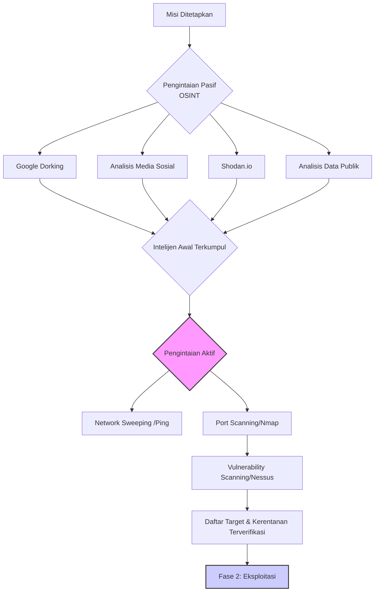
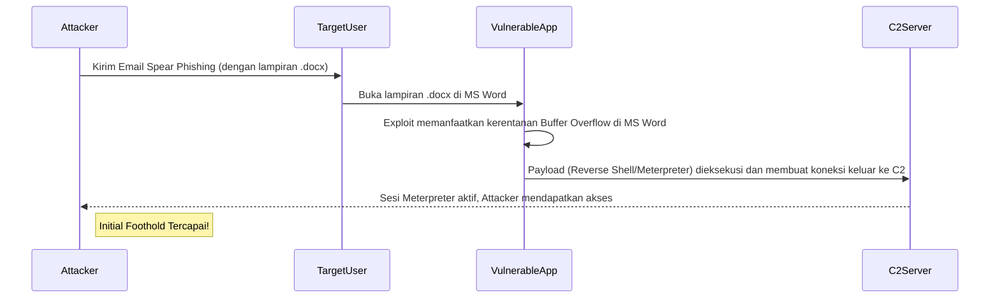
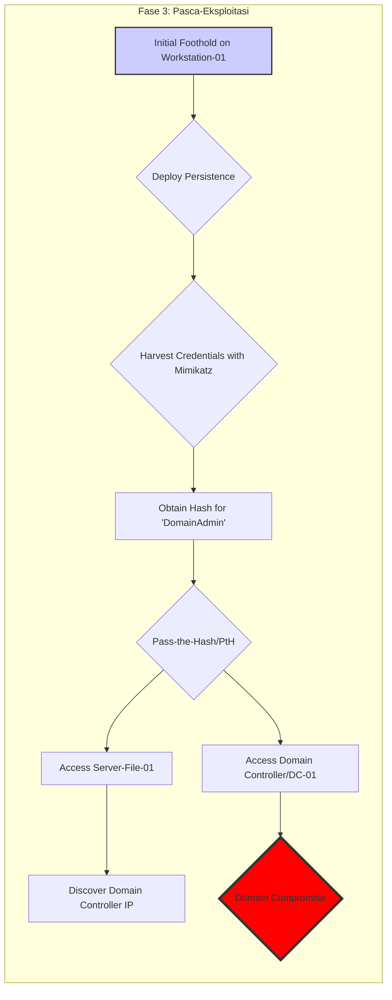
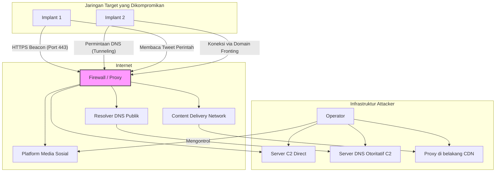

## **Modul Pembelajaran Minggu 7-9: Doktrin dan Praktik Operasi Siber Ofensif (OCO)**

**Abstrak**

Modul pembelajaran intensif selama tiga minggu ini akan membawa para peserta ke dalam jantung Operasi Siber Ofensif (OCO), domain yang seringkali dianggap sebagai ujung tombak (*tip of the spear*) dari proyeksi kekuatan siber suatu negara. Setelah membangun fondasi pertahanan dan memahami lanskap ancaman, fokus kita kini beralih secara metodologis ke "sisi lain dari koin": bagaimana operasi ofensif direncanakan, disiapkan, dan dieksekusi. Modul ini akan mendekonstruksi keseluruhan siklus hidup serangan siber, yang secara konseptual dibingkai oleh model *Cyber Kill Chain*®, mulai dari fase pengintaian intelijen yang senyap, eksploitasi kerentanan teknis, hingga teknik-teknik canggih untuk mempertahankan akses, bergerak secara lateral di dalam jaringan yang dikompromikan, dan mengelola komando serta kendali jarak jauh. Puncak dari modul ini adalah serangkaian sesi interaktif yang dirancang untuk mentranslasikan teori menjadi analisis praktis, termasuk studi mendalam terhadap taktik, teknik, dan prosedur (TTPs) kelompok *Advanced Persistent Threat* (APT) negara-bangsa, analisis arsitektural *malware* kelas militer, dan simulasi perencanaan uji penetrasi (*penetration testing*) secara terstruktur.

-----

### **Bagian 1: Teknik *Reconnaissance* dan *Scanning* – Fase Intelijen dalam Peperangan Siber**

Setiap operasi militer yang berhasil didahului oleh pengumpulan intelijen yang superior. Di domain siber, fase ini dikenal sebagai *reconnaissance* (pengintaian) dan merupakan langkah pertama dan mungkin yang paling krusial dalam model *Cyber Kill Chain*®. Tujuan dari fase ini adalah untuk membangun gambaran operasional (*operational picture*) yang sedetail mungkin mengenai target—infrastruktur teknisnya, postur pertahanannya, dan yang terpenting, elemen manusianya—semua dilakukan sebelum melancarkan satu pun kode eksploitasi. Operasi pengintaian yang matang secara signifikan meningkatkan probabilitas keberhasilan dan mengurangi risiko deteksi. Fase ini dapat dibagi menjadi dua kategori utama: pengintaian pasif dan pengintaian aktif.

#### **1.1. Pengintaian Pasif (*Passive Reconnaissance*): Memetakan Target Tanpa Menyentuhnya**

Pengintaian pasif, juga dikenal sebagai *Open-Source Intelligence* (OSINT), adalah seni mengumpulkan informasi vital tentang target dari sumber-sumber yang tersedia untuk umum, tanpa berinteraksi secara langsung dengan sistem target. Keuntungan utamanya adalah **risiko deteksi yang mendekati nol**. Aktor ancaman dapat membangun profil target yang sangat kaya hanya dengan kesabaran dan keahlian dalam menambang data publik.

  * **a. Google Dorking (Advanced Search Engine Queries)**

      * **Konsep:** Menggunakan operator pencarian lanjutan di mesin pencari seperti Google untuk menemukan informasi spesifik yang tidak seharusnya terindeks atau mudah ditemukan. Ini bukan peretasan, melainkan penggunaan mesin pencari secara ahli.
      * **Contoh Operator dan Aplikasinya:**
          * `site:[targetdomain.com]`: Membatasi pencarian hanya pada situs web target.
          * `filetype:[pdf/xls/docx]`: Mencari tipe file spesifik. Sangat berguna untuk menemukan laporan internal, daftar harga, atau manual teknis yang secara tidak sengaja dipublikasikan.
          * `inurl:[admin/login]`: Mencari halaman dengan kata "admin" atau "login" di URL-nya, berpotensi menemukan portal login internal.
          * `intitle:"index of"`: Mencari direktori server yang tidak terkonfigurasi dengan benar, yang seringkali membocorkan struktur file dan file-file sensitif.
      * **Skenario Militer:** Seorang analis intelijen dapat menggunakan kueri seperti `site:angkatanlaut.mil.id filetype:pdf "latihan gabungan"` untuk mencoba menemukan dokumen PDF terkait latihan gabungan yang mungkin secara tidak sengaja dapat diakses publik.

  * **b. Shodan.io (Mesin Pencari untuk Perangkat Terhubung)**

      * **Konsep:** Shodan bukanlah mesin pencari untuk konten web, melainkan untuk perangkat yang terhubung ke internet (*Internet of Things* - IoT). Shodan secara kontinu memindai seluruh rentang alamat IPv4 dan mengumpulkan "banner" dari layanan yang berjalan di setiap perangkat (misalnya, server web, kamera CCTV, PLC, sistem SCADA).
      * **Informasi yang Diperoleh:** Versi perangkat lunak yang berjalan, port yang terbuka, lokasi geografis, dan terkadang kredensial default.
      * **Aplikasi Maritim:** Seorang penyerang dapat mencari istilah seperti `"port:502"` (protokol Modbus yang umum di ICS/SCADA) yang dikombinasikan dengan nama negara atau kota pelabuhan untuk menemukan sistem kontrol industri maritim yang secara tidak aman terekspos ke internet. Mereka juga dapat mencari merek kamera CCTV yang umum digunakan di pelabuhan untuk menemukan perangkat yang masih menggunakan kata sandi default.

  * **c. Analisis Media Sosial dan Jejak Digital Personel**

      * **Konsep:** Personel adalah perpanjangan dari organisasi. Jejak digital mereka dapat mengungkapkan informasi berharga tentang budaya, teknologi, dan kerentanan organisasi.
      * **Sumber:** LinkedIn, Facebook, Twitter, Instagram, dll.
      * **Informasi yang Dicari:**
          * **Struktur Organisasi:** Profil LinkedIn dapat digunakan untuk memetakan hierarki, nama-nama perwira kunci, dan hubungan antar departemen.
          * **Teknologi yang Digunakan:** Personel IT mungkin menyebutkan sertifikasi atau keahlian mereka (misalnya, "Spesialis Firewall Cisco ASA," "Administrator Jaringan Juniper"), yang secara tidak langsung membocorkan teknologi yang digunakan oleh organisasi.
          * **Informasi Pribadi untuk *Spear Phishing*:** Hobi, minat, acara yang dihadiri, dan nama kolega dapat digunakan untuk membuat umpan *phishing* yang sangat personal dan meyakinkan.
          * **Geolokasi:** Foto yang di-posting dengan data EXIF yang tidak dihapus dapat membocorkan lokasi geografis yang tepat dari fasilitas militer atau posisi personel.

  * **d. Analisis Data Publik dan Korporat**

      * **Sumber:** Basis data WHOIS untuk informasi pendaftaran domain, arsip web (*Wayback Machine*) untuk melihat versi lama situs web, rilis pers, laporan tahunan, dan pengumuman lowongan pekerjaan.
      * **Informasi Kritis dari Lowongan Pekerjaan:** Pengumuman lowongan untuk posisi IT atau siber seringkali mencantumkan persyaratan teknis yang sangat spesifik (mis.,"Dibutuhkan administrator dengan pengalaman 5 tahun dalam mengelola VMware vSphere 6.7 dan firewall Palo Alto seri PA-5200"). Ini adalah hadiah bagi penyerang, memberikan mereka daftar pasti perangkat keras dan lunak yang perlu mereka cari kerentanannya.

#### **1.2. Pengintaian Aktif (*Active Reconnaissance*): Berinteraksi dengan Target untuk Memvalidasi Intelijen**

Setelah membangun hipotesis dari fase pasif, aktor ancaman akan beralih ke pengintaian aktif untuk memvalidasi asumsi dan mendapatkan data teknis yang lebih granular. Fase ini melibatkan pengiriman paket data secara langsung ke infrastruktur target, yang secara inheren **meningkatkan risiko deteksi**. Oleh karena-Ggitu, teknik ini harus dilakukan dengan hati-hati, seringkali melalui serangkaian proksi atau komputer yang telah dikompromikan (*zombies*) untuk menyamarkan sumber serangan.

  * **a. *Network Sweeping* (Penyapuan Jaringan)**

      * **Tujuan:** Mengidentifikasi host atau sistem yang "hidup" (aktif dan merespons) dalam suatu rentang alamat IP.
      * **Metode Umum:** Menggunakan protokol *Internet Control Message Protocol* (ICMP). Alat seperti `fping` atau `nmap` dapat mengirimkan permintaan *ICMP Echo Request* (ping) ke setiap alamat IP dalam sebuah subnet. Host yang merespons menunjukkan bahwa mereka aktif. Namun, banyak administrator jaringan memblokir ICMP, sehingga teknik lain diperlukan.

  * **b. *Port Scanning* (Pemindaian Port)**

      * **Tujuan:** Setelah mengidentifikasi host yang hidup, langkah selanjutnya adalah menemukan "pintu" atau layanan yang terbuka pada host tersebut. Setiap layanan (server web, server email, basis data) berjalan pada "port" logis tertentu.
      * **Alat Standar Industri:** `nmap` (*Network Mapper*).
      * **Teknik Pemindaian Umum:**
          * **TCP Connect Scan (`-sT`):** Teknik yang paling sederhana dan paling berisik. Nmap mencoba menyelesaikan *three-way handshake* TCP secara penuh dengan setiap port. Jika berhasil, port tersebut terbuka. Teknik ini sangat mudah dideteksi dan dicatat dalam log.
          * **TCP SYN Stealth Scan (`-sS`):** Teknik default dan paling populer. Nmap mengirimkan paket SYN (paket pertama dalam *handshake*), seolah-olah ingin membuka koneksi. Jika port terbuka, target akan merespons dengan SYN/ACK. Nmap kemudian tidak menyelesaikan *handshake* dan malah mengirimkan paket RST (reset). Karena koneksi penuh tidak pernah terjalin, teknik ini lebih sulit dideteksi oleh mekanisme logging dasar.
          * **UDP Scan (`-sU`):** Memindai layanan berbasis UDP (seperti DNS, SNMP). Pemindaian UDP jauh lebih lambat dan lebih sulit diinterpretasikan daripada pemindaian TCP.

  * **c. *Vulnerability Scanning* (Pemindaian Kerentanan)**

      * **Tujuan:** Setelah mengetahui port mana yang terbuka dan layanan apa yang berjalan di sana, pemindai kerentanan akan mencoba mengidentifikasi kelemahan keamanan yang diketahui pada layanan tersebut.
      * **Cara Kerja:** Pemindai ini memiliki basis data besar berisi ribuan kerentanan yang diketahui (*Common Vulnerabilities and Exposures* - CVE). Mereka akan berinteraksi dengan layanan target untuk memeriksa versi perangkat lunak, konfigurasi, dan "sidik jari" lainnya, lalu membandingkannya dengan basis data kerentanan.
      * **Alat Populer:** Nessus, OpenVAS (sumber terbuka), Qualys.
      * **Output:** Laporan terperinci yang mencantumkan kerentanan yang ditemukan, tingkat keparahannya (misalnya, menggunakan *Common Vulnerability Scoring System* - CVSS), dan seringkali, tautan ke modul eksploitasi yang ada. Bagi penyerang, ini adalah peta jalan untuk fase berikutnya.

#### **1.3. Diagram Proses Pengintaian**

Berikut adalah representasi alur kerja fase intelijen dalam format Mermaid:

-----

### **Bagian 2: Eksploitasi Kerentanan – Membuka Pintu Masuk Awal**

Fase eksploitasi adalah momen di mana penyerang beralih dari pengumpulan informasi pasif menjadi tindakan ofensif aktif. Tujuannya adalah untuk memanfaatkan salah satu kerentanan yang diidentifikasi pada fase pengintaian untuk mendapatkan eksekusi kode (*code execution*) di sistem target. Ini adalah langkah kritis untuk mendapatkan "pijakan awal" (*initial foothold*) di dalam jaringan musuh.

#### **2.1. Terminologi Fundamental: Kerentanan, Eksploitasi, dan Payload**

Untuk memahami fase ini, penting untuk membedakan tiga konsep inti:

  * **Kerentanan (*Vulnerability*):** Cacat atau kelemahan dalam desain, implementasi, atau konfigurasi perangkat lunak atau perangkat keras yang dapat dieksploitasi untuk menyebabkan perilaku yang tidak diinginkan.
      * **Analogi:** Desain kunci yang cacat pada sebuah pintu benteng.
  * **Eksploitasi (*Exploit*):** Sepotong kode atau serangkaian perintah yang dirancang khusus untuk memanfaatkan satu kerentanan spesifik.
      * **Analogi:** Kunci khusus atau alat pembobol yang dibuat untuk membuka kunci yang cacat tersebut.
  * **Payload:** Kode berbahaya yang sebenarnya ingin dijalankan oleh penyerang di sistem target setelah eksploitasi berhasil. Payload inilah yang mencapai tujuan penyerang.
      * **Analogi:** Mata-mata atau penyabot yang diselundupkan masuk ke dalam benteng setelah pintu berhasil dibuka. Contoh payload yang umum adalah *Reverse Shell*, yang membuka koneksi kembali ke penyerang, atau *downloader* yang mengunduh *malware* tahap kedua.

#### **2.2. Taksonomi Kerentanan Umum yang Dieksploitasi**

Ribuan jenis kerentanan perangkat lunak ada, namun beberapa kelas kerentanan secara historis menjadi favorit para penyerang karena dampaknya yang tinggi.

  * **a. *Buffer Overflows***

      * **Konsep:** Kerentanan klasik dan sangat kuat yang terjadi ketika sebuah program mencoba menulis data ke dalam sebuah *buffer* (area memori sementara) melebihi kapasitasnya. Data yang berlebih ini akan "meluap" dan menimpa area memori yang berdekatan, yang mungkin berisi data penting lain, pointer, atau bahkan instruksi program (seperti alamat kembali atau *return address*).
      * **Mekanisme Eksploitasi:** Penyerang secara sengaja mengirimkan input yang terlalu besar yang berisi kode berbahaya (*shellcode*) sebagai bagian dari data yang meluap. Mereka kemudian menimpa *return address* sehingga ketika fungsi selesai, alih-alih kembali ke alur program yang normal, CPU akan melompat ke alamat *shellcode* penyerang dan mengeksekusinya dengan hak akses dari program yang rentan tersebut.
      * **Relevansi:** Meskipun banyak bahasa pemrograman modern dan sistem operasi memiliki mitigasi, kerentanan ini masih ditemukan pada perangkat lunak lama, firmware perangkat IoT, dan sistem OT.

  * **b. Injeksi SQL (*SQL Injection* - SQLi)**

      * **Konsep:** Kerentanan pada aplikasi web yang berinteraksi dengan basis data SQL. Terjadi ketika input dari pengguna tidak divalidasi atau disanitasi dengan benar sebelum dimasukkan ke dalam kueri SQL.
      * **Mekanisme Eksploitasi:** Penyerang memasukkan sintaks SQL berbahaya ke dalam kolom input (misalnya, kolom pencarian atau formulir login). Kueri yang dimodifikasi ini kemudian dieksekusi oleh basis data.
      * **Dampak:** Penyerang dapat melewati otentikasi, membaca data sensitif dari seluruh basis data (misalnya, data pengguna, informasi rahasia), memodifikasi atau menghapus data, dan dalam beberapa kasus, bahkan mendapatkan eksekusi perintah pada sistem operasi server basis data.

  * **c. Eksploitasi Sisi Klien (*Client-Side Exploitation*)**

      * **Konsep:** Daripada menyerang server yang mungkin dijaga ketat, serangan ini menargetkan aplikasi di sisi pengguna (klien), seperti browser web, pembaca PDF, atau paket Microsoft Office.
      * **Vektor Pengiriman:** Umumnya melalui *spear phishing* (lampiran berbahaya) atau serangan *watering hole*.
      * **Mekanisme Eksploitasi:** Pengguna ditipu untuk membuka file yang tampaknya tidak berbahaya (misalnya, file `.docx` atau `.pdf`). File ini berisi kode eksploitasi yang memanfaatkan kerentanan di Microsoft Word atau Adobe Reader untuk menjalankan payload di komputer korban.
      * **Signifikansi:** Ini adalah vektor *Initial Access* yang paling umum digunakan oleh kelompok APT karena ia melewati banyak pertahanan perimeter (seperti *firewall*) dan mengeksploitasi pengguna secara langsung.

#### **2.3. *Zero-Day Exploits*: Senjata Strategis Negara-Bangsa**

  * **Definisi:** Eksploitasi untuk kerentanan yang **belum diketahui oleh vendor perangkat lunak atau publik**. Vendor memiliki "nol hari" (*zero days*) untuk membuat perbaikan (*patch*).
  * **Nilai Strategis:** *Zero-day* adalah aset siber yang sangat berharga dan kuat. Karena tidak ada *patch* atau *signature* antivirus yang ada untuknya, ia hampir pasti berhasil menembus sistem yang sepenuhnya mutakhir dan ter-update. Kepemilikan arsenal *zero-day exploits* adalah indikator kuat dari kapabilitas siber sebuah negara-bangsa.
  * **Ekonomi & Pasar Gelap:** Ada pasar gelap yang berkembang pesat untuk *zero-day*, di mana para peneliti keamanan menjual temuan mereka kepada pemerintah atau *cyber mercenaries* dengan harga ratusan ribu hingga jutaan dolar per eksploitasi, tergantung pada platform yang ditargetkan (iOS dan Android adalah yang paling mahal).
  * **Contoh Penggunaan:** Stuxnet menggunakan empat *zero-day* Windows yang berbeda, sebuah indikasi jelas dari tingkat sumber daya dan dukungan negara di baliknya.

#### **2.4. Kerangka Kerja Eksploitasi: Metasploit Framework**

  * **Konsep:** Metasploit adalah platform sumber terbuka yang paling populer untuk pengembangan, pengujian, dan penggunaan kode eksploitasi. Ia secara signifikan menyederhanakan proses eksploitasi.
  * **Komponen Inti:**
      * **Perpustakaan Eksploitasi:** Berisi ribuan modul eksploitasi yang siap pakai untuk berbagai kerentanan yang diketahui.
      * **Perpustakaan Payload:** Menyediakan berbagai jenis payload, dari *reverse shell* sederhana hingga *payload* canggih seperti Meterpreter.
      * **Meterpreter:** Sebuah payload canggih yang berjalan sepenuhnya di memori sistem target (tanpa menyentuh disk, sehingga lebih sulit dideteksi), dan menyediakan fungsionalitas pasca-eksploitasi yang luas (misalnya, merekam ketikan, mengunduh file, memutar kamera web).
  * **Implikasi:** Metasploit mendemokratisasi proses eksploitasi, memungkinkan bahkan penyerang dengan keterampilan menengah untuk melancarkan serangan yang canggih.

#### **2.5. Diagram Alur Proses Eksploitasi**

-----

### **Bagian 3: *Persistence* dan *Lateral Movement* – Memperluas dan Mempertahankan Akses**

Mendapatkan akses awal (*initial foothold*) hanyalah permulaan dari sebuah operasi siber yang serius. Bagi aktor sekelas APT, akses awal ini bersifat rapuh; ia bisa hilang jika komputer yang terinfeksi di-*restart*, perangkat lunak diperbarui, atau kredensial pengguna diubah. Oleh karena itu, dua tujuan taktis berikutnya menjadi prioritas utama: **menanamkan persistensi** untuk memastikan akses yang tahan lama, dan **melakukan gerakan lateral** untuk memperluas pijakan dari satu sistem ke sistem lain di dalam jaringan, bergerak semakin dekat ke target bernilai tinggi.

#### **3.1. *Persistence*: Seni Bertahan di Dalam Jaringan Musuh**

Persistensi adalah kumpulan teknik yang digunakan oleh *malware* atau penyerang untuk tetap aktif di dalam sistem target bahkan setelah terjadi peristiwa seperti *reboot*, pemutusan sesi, atau perubahan kredensial. Ini adalah jaminan kelangsungan hidup bagi operasi ofensif. Aktor yang canggih akan menanamkan beberapa mekanisme persistensi sebagai redundansi.

  * **a. Teknik Persistensi Berbasis Sistem Operasi Windows**

      * ***Registry Run Keys***
          * **Konsep:** Windows Registry adalah basis data hierarkis yang menyimpan pengaturan konfigurasi tingkat rendah untuk sistem operasi dan aplikasi. Ada beberapa *key* (kunci) spesifik di dalam Registry yang secara otomatis akan mengeksekusi program apapun yang terdaftar di dalamnya setiap kali pengguna login atau sistem boot.
          * **Lokasi Kunci Umum:**
              * `HKEY_CURRENT_USER\Software\Microsoft\Windows\CurrentVersion\Run`
              * `HKEY_LOCAL_MACHINE\Software\Microsoft\Windows\CurrentVersion\Run`
          * **Mekanisme:** Setelah mendapatkan akses, penyerang hanya perlu menambahkan entri baru di salah satu kunci ini yang menunjuk ke lokasi *payload* berbahaya mereka. Ini adalah salah satu teknik persistensi yang paling tua dan paling umum.
      * ***Scheduled Tasks* (Tugas Terjadwal)**
          * **Konsep:** Utilitas Penjadwal Tugas (*Task Scheduler*) di Windows adalah fitur yang sah untuk mengotomatisasi eksekusi skrip dan program pada waktu atau interval tertentu (misalnya, setiap jam, setiap kali sistem *boot*, atau saat pengguna login).
          * **Mekanisme:** Penyerang dapat membuat tugas terjadwal baru yang tersembunyi untuk menjalankan *payload* mereka secara berkala. Teknik ini sedikit lebih tersembunyi daripada *Run Keys* dan memberikan kontrol yang lebih granular atas waktu eksekusi.
      * ***Services* (Layanan)**
          * **Konsep:** Layanan Windows adalah aplikasi yang berjalan di latar belakang, seringkali dimulai saat sistem boot tanpa memerlukan interaksi pengguna.
          * **Mekanisme:** Penyerang dapat membuat layanan berbahaya baru atau membajak (*hijack*) layanan yang sudah ada yang salah dikonfigurasi. Dengan berjalan sebagai layanan, *payload* seringkali dapat dieksekusi dengan hak akses sistem yang tinggi (SYSTEM), memberikan kontrol penuh atas mesin.
      * ***DLL Hijacking***
          * **Konsep:** Teknik yang lebih canggih yang mengeksploitasi cara Windows memuat *Dynamic-Link Libraries* (DLL). Ketika sebuah aplikasi yang sah dimulai, ia akan mencari file-file DLL yang dibutuhkannya dalam urutan direktori yang telah ditentukan.
          * **Mekanisme:** Jika penyerang dapat menempatkan file DLL berbahaya dengan nama yang sama persis seperti DLL yang sah di lokasi yang akan dicari terlebih dahulu oleh aplikasi, maka aplikasi yang sah tersebut akan secara tidak sengaja memuat dan mengeksekusi DLL berbahaya penyerang.

  * **b. Teknik Persistensi Tingkat Lanjut: *Rootkits* dan *Bootkits***

      * **Konsep:** Ini adalah bentuk persistensi yang paling tersembunyi dan paling sulit dihilangkan. Tujuannya bukan hanya untuk bertahan, tetapi juga untuk secara aktif menyembunyikan keberadaan penyerang dari sistem operasi itu sendiri.
      * ***User-Mode Rootkits:*** Memodifikasi respons dari panggilan API sistem operasi. Misalnya, ketika administrator mencoba melihat daftar proses yang berjalan, *rootkit* akan mencegat permintaan ini dan menghapus nama proses berbahaya dari daftar sebelum menampilkannya.
      * ***Kernel-Mode Rootkits:*** Beroperasi pada tingkat kernel OS, memberikan kontrol yang hampir mutlak. Mereka dapat menyembunyikan file, proses, koneksi jaringan, dan bahkan memanipulasi perangkat keras secara langsung.
      * ***Bootkits:*** Bentuk yang paling ekstrem, menginfeksi proses *booting* itu sendiri dengan memodifikasi *Master Boot Record* (MBR) atau *Unified Extensible Firmware Interface* (UEFI). *Bootkit* akan dimuat bahkan sebelum sistem operasi dimulai, memungkinkannya untuk merusak integritas OS saat sedang dimuat dan membuatnya hampir mustahil untuk dideteksi oleh perangkat lunak antivirus yang berjalan di dalam OS tersebut.

#### **3.2. *Lateral Movement*: Menaklukkan Jaringan dari Dalam**

Setelah persistensi tercapai pada titik pendaratan awal (*beachhead*), tujuan berikutnya adalah bergerak secara lateral untuk mencapai target yang sebenarnya. Target sebenarnya jarang berada di mesin pertama yang berhasil dikompromikan (yang mungkin hanya laptop staf junior). Target sebenarnya mungkin adalah server basis data, stasiun kerja seorang insinyur R\&D, atau, yang paling berharga, *Domain Controller* (DC) dalam lingkungan Windows Active Directory.

  * **a. Pengumpulan Kredensial (*Credential Harvesting*)**

      * **Tujuan:** Mendapatkan kata sandi (baik dalam bentuk *plaintext* maupun *hash*) dari mesin yang telah dikompromikan. Kredensial ini adalah kunci untuk membuka pintu ke mesin lain di jaringan.
      * **Alat Kunci: Mimikatz**
          * **Fungsi:** Mimikatz adalah alat pasca-eksploitasi yang sangat kuat, sering disebut sebagai "pisau Swiss Army" untuk peretas Windows. Salah satu fungsinya yang paling terkenal adalah kemampuan untuk mengekstrak kredensial *plaintext*, *hash*, dan tiket Kerberos langsung dari memori, khususnya dari proses *Local Security Authority Subsystem Service* (LSASS.exe).
          * **Implikasi:** Bahkan jika seorang pengguna dengan hak akses tinggi (seperti administrator domain) login ke sebuah mesin yang terinfeksi hanya untuk sesaat, Mimikatz dapat mencuri kredensial mereka dari memori, yang kemudian dapat digunakan oleh penyerang untuk mengakses sistem lain, termasuk *Domain Controller*.

  * **b. Teknik Gerakan Lateral Inti**

      * ***Pass-the-Hash* (PtH)**
          * **Konsep:** Teknik fundamental dalam lingkungan Windows. Dalam banyak skenario otentikasi jaringan (misalnya, menggunakan protokol NTLM), Windows tidak benar-benar mengirimkan kata sandi *plaintext* melalui jaringan. Sebaliknya, ia mengirimkan *hash* dari kata sandi tersebut.
          * **Mekanisme Eksploitasi:** Jika seorang penyerang berhasil mencuri *hash* NTLM seorang pengguna (misalnya, menggunakan Mimikatz), mereka tidak perlu memecahkan (*crack*) *hash* tersebut untuk mendapatkan kata sandi aslinya. Mereka dapat langsung "melewatkan" (*pass*) *hash* itu sendiri ke sistem lain untuk melakukan otentikasi seolah-olah mereka adalah pengguna yang sah.
      * ***Pass-the-Ticket* (PtT)**
          * **Konsep:** Serupa dengan PtH, tetapi untuk lingkungan yang menggunakan otentikasi Kerberos (standar di Active Directory). Dalam Kerberos, otentikasi didasarkan pada "tiket" yang dienkripsi yang dikeluarkan oleh *Key Distribution Center* (KDC), yang biasanya berjalan di *Domain Controller*.
          * **Mekanisme Eksploitasi:** Jika penyerang dapat mencuri tiket Kerberos yang valid dari memori sebuah mesin (misalnya, tiket TGT atau *ticket-granting ticket*), mereka dapat menyuntikkan tiket ini ke dalam sesi mereka sendiri dan menggunakannya untuk meminta akses ke layanan lain di dalam domain (seperti server file atau server email) sebagai pengguna yang sah.
      * **Eksploitasi Melalui Layanan Jarak Jauh yang Sah**
          * **Konsep:** Setelah mendapatkan kredensial yang valid (baik *hash* maupun *plaintext*), penyerang akan "hidup dari tanah" (*living off the land*) dengan menggunakan alat administrasi Windows yang sudah ada dan sah untuk bergerak, sehingga aktivitas mereka terlihat seperti lalu lintas administrasi normal.
          * **Alat yang Umum Digunakan:**
              * **PsExec:** Bagian dari suite Sysinternals, memungkinkan eksekusi proses di sistem jarak jauh.
              * **Windows Management Instrumentation (WMI):** Antarmuka standar untuk mengelola perangkat Windows, dapat digunakan untuk menjalankan perintah dari jarak jauh.
              * **Remote Desktop Protocol (RDP):** Jika RDP diaktifkan, penyerang dapat login dengan antarmuka grafis penuh ke sistem lain menggunakan kredensial yang dicuri.

#### **3.3. Diagram Alur Gerakan Lateral**

Diagram ini mengilustrasikan siklus hidup pasca-eksploitasi, dari pijakan awal hingga penguasaan domain.

-----

### **Bagian 4: Teknik *Command and Control* (C2) – Menjaga Hubungan dengan Aset yang Dikompromikan**

Setelah penyerang berhasil menempatkan *implant* atau *backdoor* di dalam jaringan target, mereka memerlukan cara untuk berkomunikasi dengannya. Infrastruktur dan protokol komunikasi ini dikenal sebagai *Command and Control* (C2 atau C\&C). Tujuan utama dari arsitektur C2 adalah untuk menyediakan saluran komunikasi yang **tersembunyi, andal, dan tangguh** yang memungkinkan penyerang untuk mengirimkan perintah, memperbarui *malware*, dan yang terpenting, mengekstrak data curian (*exfiltration*) tanpa terdeteksi oleh sistem pertahanan jaringan seperti *firewall*, IDS/IPS, dan proksi web.

#### **4.1. Arsitektur Infrastruktur C2**

  * **a. Model Terpusat (*Centralized*)**

      * **Deskripsi:** Model klasik di mana semua *implant* yang terinfeksi berkomunikasi langsung dengan satu atau beberapa server C2 yang dikendalikan oleh penyerang.
      * **Keuntungan:** Sederhana untuk dirancang dan dikelola.
      * **Kelemahan:** Merupakan titik tunggal kegagalan (*single point of failure*). Jika tim bertahan berhasil mengidentifikasi dan memblokir alamat IP atau domain dari server C2, semua *implant* akan menjadi "yatim piatu" dan kehilangan kendali.

  * **b. Model *Peer-to-Peer* (P2P)**

      * **Deskripsi:** *Implant* yang terinfeksi tidak berkomunikasi dengan server pusat, melainkan membentuk jaringan P2P di antara mereka sendiri. Perintah dari penyerang akan disebarkan dari satu *peer* ke *peer* lainnya, dan data yang diekstrak akan dirutekan kembali melalui jalur yang sama.
      * **Keuntungan:** Sangat tangguh. Tidak ada satu titik pun yang bisa dijatuhkan untuk melumpuhkan seluruh *botnet*.
      * **Kelemahan:** Jauh lebih kompleks untuk dirancang dan dikelola. Komunikasi P2P juga dapat menghasilkan lalu lintas internal yang "berisik" yang bisa dideteksi.

  * **c. Model Terdesentralisasi Menggunakan Infrastruktur Pihak Ketiga**

      * **Deskripsi:** Teknik yang semakin populer di kalangan APT. Daripada membangun infrastruktur C2 mereka sendiri, penyerang memanfaatkan layanan web yang sah dan tepercaya sebagai perantara.
      * **Keuntungan:** Sangat sulit dideteksi dan diblokir. Tim bertahan tidak dapat begitu saja memblokir akses ke platform seperti Twitter, Gmail, atau GitHub tanpa mengganggu operasi bisnis yang sah.
      * **Contoh:** Sebuah *implant* mungkin diprogram untuk secara berkala memeriksa akun Twitter tertentu yang dikendalikan penyerang. Perintah baru akan diposting sebagai tweet yang dienkode. Atau, data yang diekstrak dapat diunggah sebagai draf ke akun Gmail atau sebagai *commit* ke repositori GitHub pribadi.

#### **4.2. Protokol dan Teknik Komunikasi C2 Terselubung**

Pilihan protokol sangat menentukan tingkat kesenyapan komunikasi C2.

  * **a. HTTP/HTTPS**

      * **Deskripsi:** Protokol yang paling umum digunakan. Komunikasi C2 dibungkus agar terlihat seperti lalu lintas web normal yang keluar dari jaringan. Port 80 (HTTP) dan 443 (HTTPS) hampir selalu diizinkan keluar melalui *firewall*.
      * **HTTPS:** Penggunaan HTTPS (HTTP terenkripsi) menambahkan lapisan kesulitan bagi para pembela, karena isi dari komunikasi C2 dienkripsi dengan SSL/TLS, sehingga tidak dapat diperiksa oleh IDS/IPS tradisional tanpa melakukan dekripsi (*SSL inspection*), yang merupakan proses yang intensif secara komputasi.
      * **Teknik Penyamaran Lanjutan:**
          * ***Domain Fronting:*** Sebuah teknik di mana penyerang menyembunyikan domain C2 mereka yang sebenarnya di balik domain layanan konten besar yang tepercaya (misalnya, Google atau Akamai). *Firewall* hanya akan melihat koneksi ke domain yang sah, sementara di dalam *header* HTTPS yang terenkripsi, permintaan tersebut sebenarnya diarahkan ke server C2 penyerang.

  * **b. *DNS Tunneling***

      * **Deskripsi:** Teknik yang sangat tersembunyi yang menyalahgunakan protokol *Domain Name System* (DNS). DNS adalah protokol fundamental internet untuk menerjemahkan nama domain menjadi alamat IP, dan lalu lintasnya hampir tidak pernah diblokir atau diperiksa secara mendalam.
      * **Mekanisme:**
          * **Perintah (C2 ke Implant):** Penyerang dapat menyandikan perintah dalam data respons DNS (misalnya, dalam *TXT record*).
          * **Eksfiltrasi Data (Implant ke C2):** *Implant* akan menyandikan data curian ke dalam serangkaian permintaan DNS untuk subdomain yang sangat panjang dan unik (misalnya, `[data-terenkode].malicious-c2.com`). Server DNS otoritatif penyerang akan menerima permintaan ini, mengekstrak data dari nama subdomain, dan tidak pernah benar-benar memberikan respons alamat IP.

  * **c. *Beaconing* dan Teknik Evasion**

      * **Konsep *Beaconing*:** *Implant* tidak mempertahankan koneksi konstan ke server C2. Sebaliknya, ia akan "tidur" (*sleep*) untuk periode waktu tertentu, lalu "bangun" dan secara singkat menghubungi server C2 untuk memeriksa perintah baru. Pola panggilan pulang ini disebut *beacon*.
      * **Deteksi Berbasis Pola:** Analis jaringan dapat mendeteksi *beacon* dengan mencari koneksi yang berulang secara teratur ke tujuan yang sama (misalnya, koneksi setiap 5 menit tepat).
      * **Teknik Evasion (Penghindaran):**
          * ***Jitter:*** Untuk menghindari pola yang teratur, *malware* canggih akan mengintroduksi *jitter* atau variasi acak pada interval tidurnya. Alih-alih setiap 300 detik, intervalnya mungkin 300 detik +/- 30 detik.
          * ***Long-Haul C2:*** Untuk target yang sangat sensitif, *implant* dapat diprogram untuk tidur selama berhari-hari atau bahkan berminggu-minggu di antara *beacon*. Ini membuatnya sangat sulit dideteksi tetapi juga memperlambat kecepatan operasi.

#### **4.3. Diagram Arsitektur Komunikasi C2**

-----

### **Bagian 5: Sesi Interaktif – Studi Kasus, Analisis, dan Simulasi**

Bagian terakhir dari modul ini adalah tentang penerapan pengetahuan. Peserta akan bekerja dalam kelompok untuk menganalisis skenario dunia nyata dan mensimulasikan proses perencanaan ofensif dari perspektif pertahanan.

#### **5.1. Diskusi Kelompok A: Studi Taktik, Teknik, dan Prosedur (TTPs) Kelompok APT Negara-Bangsa**

  * **Tujuan:** Memahami bahwa tidak semua APT diciptakan sama. Setiap kelompok memiliki "sidik jari" operasional yang unik. Memahami TTPs spesifik dari musuh yang paling mungkin dihadapi memungkinkan pengembangan deteksi dan pertahanan yang disesuaikan.
  * **Tugas:** Bandingkan dan kontraskan dua kelompok APT berikut menggunakan basis data MITRE ATT\&CK® dan laporan intelijen ancaman publik:
      * **Kelompok 1: APT29 (alias Cozy Bear, The Dukes)** - Diatribusikan ke Intelijen Luar Negeri Rusia (SVR).
      * **Kelompok 2: APT10 (alias Stone Panda, Red Apollo)** - Diatribusikan ke Kementerian Keamanan Negara Tiongkok (MSS).
  * **Area Analisis:**
    1.  **Target Industri & Geografis:** Siapa target utama mereka? Sektor apa (pemerintahan, pertahanan, teknologi) dan negara mana yang paling sering mereka targetkan?
    2.  **Taktik *Initial Access* Pilihan:** Apakah mereka lebih menyukai *spear phishing* dengan tautan, lampiran, atau mereka dikenal karena mengeksploitasi aplikasi yang menghadap ke internet?
    3.  ***Malware* dan *Tools* Khas:** *Malware* kustom apa yang menjadi ciri khas mereka? Apakah mereka sering menggunakan alat sumber terbuka atau "hidup dari tanah"? (Contoh: APT29 dikenal karena penggunaan PowerShell yang ekstensif).
    4.  **Taktik Pertahanan Evasion:** Teknik spesifik apa yang mereka gunakan untuk tetap tidak terdeteksi? (Contoh: APT29 dikenal karena menonaktifkan *logging* keamanan).
    5.  **Tujuan Akhir (Motivasi):** Apakah operasi mereka tampaknya lebih didorong oleh spionase politik tradisional (APT29) atau spionase ekonomi dan pencurian kekayaan intelektual (APT10)?
  * **Sumber:**
      * APT29: [https://attack.mitre.org/groups/G0016/](https://attack.mitre.org/groups/G0016/)
      * APT10: [https://attack.mitre.org/groups/G0045/](https://attack.mitre.org/groups/G0045/)

#### **5.2. Diskusi Kelompok B: Analisis Arsitektur *Malware* Kelas Militer**

  * **Tujuan:** Mendekonstruksi fungsionalitas *malware* canggih dari perspektif arsitektural untuk memahami desain dan tujuannya.
  * **Skenario Hipotetis:** Tim Anda adalah analis *malware* yang menerima sampel *malware* baru yang dijuluki "**TRITON-MARITIME**". Intelijen awal menunjukkan bahwa *malware* ini dirancang khusus untuk menargetkan Sistem Kontrol Industri (ICS) di lingkungan maritim. Analisis awal mengungkapkan komponen-komponen berikut:
      * **Komponen 1 (Dropper):** Sebuah skrip PowerShell yang sangat diobfuskasi (*obfuscated*) yang disebarkan melalui *spear phishing* kepada para insinyur pelabuhan.
      * **Komponen 2 (Implant):** Sebuah DLL yang berjalan di memori (*fileless*) yang membangun persistensi melalui WMI Event Subscription.
      * **Komponen 3 (Modul Komunikasi):** Menggunakan DNS Tunneling untuk komunikasi C2, dengan fallback ke API Microsoft Graph (Office 365) jika DNS diblokir.
      * **Komponen 4 (Modul Payload):** Berisi pustaka kode yang dirancang untuk berkomunikasi menggunakan protokol ICS spesifik seperti Modbus/TCP dan DNP3. Ia dapat membaca status dari *Programmable Logic Controller* (PLC) dan menulis nilai baru ke register PLC.
  * **Tugas Analisis:**
    1.  **Rekonstruksi *Kill Chain*:** Gambarkan bagaimana *malware* ini beroperasi, mulai dari *Initial Access* hingga *Actions on Objectives*, menggunakan komponen-komponen di atas.
    2.  **Analisis Desain Evasion:** Fitur desain apa saja dalam *malware* ini yang secara spesifik ditujukan untuk menghindari deteksi oleh antivirus tradisional dan analisis jaringan?
    3.  **Penilaian Tujuan (Intent):** Berdasarkan arsitekturnya, apa kemungkinan tujuan akhir dari *malware* ini? Apakah untuk **spionase** (mencuri data operasional PLC), **disrupsi** (mengirim perintah *shutdown* ke PLC), atau **sabotase** (mengirim parameter operasional yang berbahaya ke PLC, seperti menyebabkan derek beroperasi di luar batas amannya)? Justifikasi jawaban Anda.
    4.  **Indikator Kompromi (IoC):** Tanda-tanda apa (di level host dan jaringan) yang akan Anda cari untuk mendeteksi infeksi "TRITON-MARITIME"?

#### **5.3. Simulasi Kelompok C: Perencanaan Uji Penetrasi (*Penetration Testing*)**

  * **Tujuan:** Mensimulasikan fase perencanaan dari operasi siber etis (*ethical hacking*) untuk mengidentifikasi kelemahan dari perspektif penyerang, dengan tujuan akhir untuk memperkuat pertahanan.
  * **Skenario & Aturan Pelibatan (RoE):**
      * **Klien:** Komando Pertahanan Siber TNI AL.
      * **Target:** Jaringan IT hipotetis dari Pangkalan Angkatan Laut X. Jaringan ini mencakup segmen jaringan administratif, segmen jaringan logistik, dan koneksi terbatas ke jaringan OT yang mengelola kontrol akses fisik pangkalan.
      * **Tujuan Tes:** Mengidentifikasi jalur serangan yang paling mungkin yang dapat digunakan oleh aktor sekelas APT untuk mencapai salah satu dari dua tujuan: (1) mendapatkan akses ke server basis data logistik (yang berisi jadwal pergerakan kapal) atau (2) mendapatkan akses ke sistem yang dapat memanipulasi kontrol gerbang pangkalan.
      * **Batasan (RoE):** Tes ini murni perencanaan (*whiteboard hacking*). Tidak ada eksploitasi aktual yang akan dijalankan. Serangan *Denial-of-Service* dan rekayasa sosial terhadap personel secara fisik dilarang.
  * **Tugas Perencanaan:** Kelompok Anda harus menghasilkan sebuah **Rencana Uji Penetrasi** singkat yang mencakup:
    1.  **Fase Pengintaian:** Metode OSINT dan pengintaian aktif apa yang akan Anda gunakan untuk memetakan permukaan serangan Pangkalan AL X? Informasi spesifik apa yang Anda cari?
    2.  **Pemodelan Ancaman & Vektor Serangan:** Berdasarkan asumsi hasil pengintaian, identifikasi **tiga (3) vektor serangan *Initial Access*** yang paling menjanjikan. Untuk setiap vektor, petakan kemungkinan jalur serangan (menggunakan Taktik ATT\&CK®) dari *Initial Access* hingga mencapai salah satu dari dua tujuan yang ditetapkan.
    3.  **Definisi "Bendera" (*Flags*):** Tentukan "bendera" atau bukti konkrit apa yang akan Anda kumpulkan untuk membuktikan bahwa Anda telah mencapai tujuan tanpa benar-benar menyebabkan kerusakan (misalnya, mengambil *screenshot* dari daftar tabel di basis data logistik, atau menunjukkan kemampuan untuk mengeksekusi perintah `whoami` pada server kontrol gerbang).
    4.  **Pertimbangan Risiko:** Risiko apa yang mungkin timbul dari pengujian ini (bahkan dalam perencanaan), dan bagaimana Anda akan memitigasinya?

-----

### **Sumber Pembelajaran dan Bacaan Lanjutan Tambahan**

1.  **Kerangka Kerja dan Alat Ofensif (untuk dipelajari, bukan digunakan secara ilegal):**

      * **Metasploit Framework Unleashed:** Kursus gratis dari Offensive Security mengenai penggunaan Metasploit. [https://www.offsec.com/metasploit-unleashed/](https://www.offsec.com/metasploit-unleashed/)
      * **Cobalt Strike:** Kerangka kerja simulasi musuh komersial yang sangat populer. Membaca blog dan dokumentasinya memberikan wawasan luar biasa tentang TTPs modern. [https://www.cobaltstrike.com/](https://www.cobaltstrike.com/)
      * **The C2 Matrix:** Sebuah proyek yang mengkatalogkan dan membandingkan berbagai kerangka kerja C2. [https://www.thec2matrix.com/](https://www.thec2matrix.com/)

2.  **Laporan Teknis Mendalam (Analisis Malware & Kampanye APT):**

      * **Blog-blog dari Tim Intelijen Ancaman:**
          * Mandiant: [https://www.mandiant.com/resources/blog](https://www.mandiant.com/resources/blog)
          * CrowdStrike: [https://www.crowdstrike.com/blog/](https://www.crowdstrike.com/blog/)
          * Talos (Cisco): [https://blog.talosintelligence.com/](https://blog.talosintelligence.com/)
      * **Analisis Mendalam tentang TRITON/TRISIS:** Laporan dari Mandiant mengenai malware yang menargetkan sistem keselamatan industri. [https://www.mandiant.com/resources/blog/triton-actor-ttp-profile-technical-deep-dive](https://www.google.com/search?q=https://www.mandiant.com/resources/blog/triton-actor-ttp-profile-technical-deep-dive)

3.  **Buku dan Sumber Daya Konseptual:**

      * David Bianco, "*The Pyramid of Pain*". Artikel blog ini adalah bacaan fundamental untuk memahami bagaimana memprioritaskan intelijen ancaman. [http://detect-respond.blogspot.com/2013/03/the-pyramid-of-pain.html](http://detect-respond.blogspot.com/2013/03/the-pyramid-of-pain.html)
      * Sergio Caltagirone, dkk., "*The Diamond Model of Intrusion Analysis*". Model konseptual untuk menganalisis insiden siber. [https://www.activeresponse.org/the-diamond-model-of-intrusion-analysis/](https://www.google.com/search?q=https://www.activeresponse.org/the-diamond-model-of-intrusion-analysis/)
