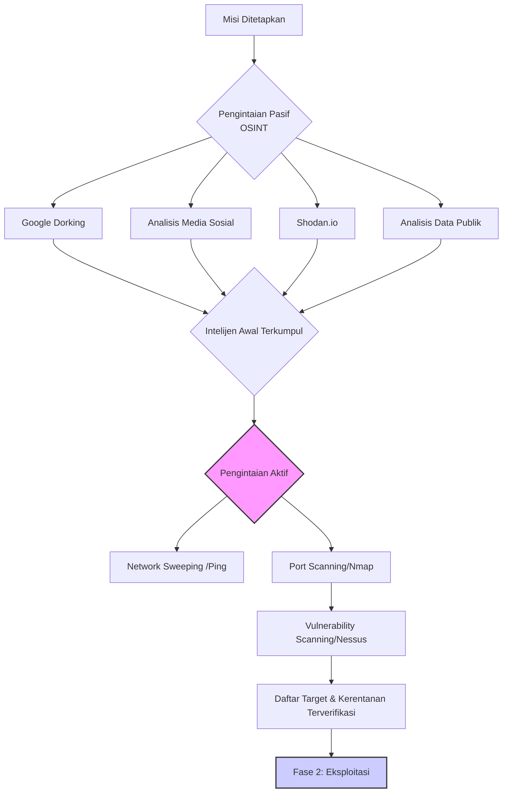
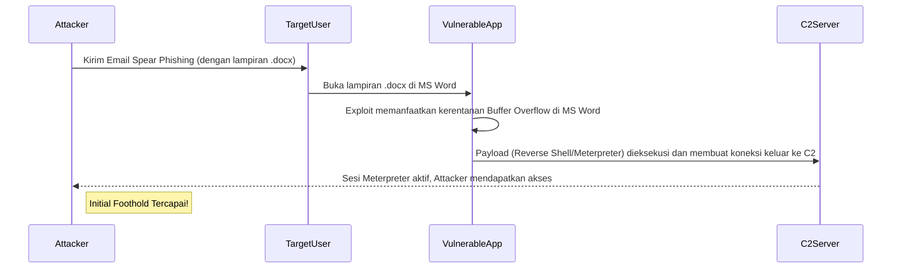

## **Modul Pembelajaran Minggu 7-9: Doktrin dan Praktik Operasi Siber Ofensif (OCO)**

**Abstrak**

Modul pembelajaran intensif selama tiga minggu ini akan membawa para peserta ke dalam jantung Operasi Siber Ofensif (OCO), domain yang seringkali dianggap sebagai ujung tombak (*tip of the spear*) dari proyeksi kekuatan siber suatu negara. Setelah membangun fondasi pertahanan dan memahami lanskap ancaman, fokus kita kini beralih secara metodologis ke "sisi lain dari koin": bagaimana operasi ofensif direncanakan, disiapkan, dan dieksekusi. Modul ini akan mendekonstruksi keseluruhan siklus hidup serangan siber, yang secara konseptual dibingkai oleh model *Cyber Kill Chain*®, mulai dari fase pengintaian intelijen yang senyap, eksploitasi kerentanan teknis, hingga teknik-teknik canggih untuk mempertahankan akses, bergerak secara lateral di dalam jaringan yang dikompromikan, dan mengelola komando serta kendali jarak jauh. Puncak dari modul ini adalah serangkaian sesi interaktif yang dirancang untuk mentranslasikan teori menjadi analisis praktis, termasuk studi mendalam terhadap taktik, teknik, dan prosedur (TTPs) kelompok *Advanced Persistent Threat* (APT) negara-bangsa, analisis arsitektural *malware* kelas militer, dan simulasi perencanaan uji penetrasi (*penetration testing*) secara terstruktur.

-----

### **Bagian 1: Teknik *Reconnaissance* dan *Scanning* – Fase Intelijen dalam Peperangan Siber**

Setiap operasi militer yang berhasil didahului oleh pengumpulan intelijen yang superior. Di domain siber, fase ini dikenal sebagai *reconnaissance* (pengintaian) dan merupakan langkah pertama dan mungkin yang paling krusial dalam model *Cyber Kill Chain*®. Tujuan dari fase ini adalah untuk membangun gambaran operasional (*operational picture*) yang sedetail mungkin mengenai target—infrastruktur teknisnya, postur pertahanannya, dan yang terpenting, elemen manusianya—semua dilakukan sebelum melancarkan satu pun kode eksploitasi. Operasi pengintaian yang matang secara signifikan meningkatkan probabilitas keberhasilan dan mengurangi risiko deteksi. Fase ini dapat dibagi menjadi dua kategori utama: pengintaian pasif dan pengintaian aktif.

#### **1.1. Pengintaian Pasif (*Passive Reconnaissance*): Memetakan Target Tanpa Menyentuhnya**

Pengintaian pasif, juga dikenal sebagai *Open-Source Intelligence* (OSINT), adalah seni mengumpulkan informasi vital tentang target dari sumber-sumber yang tersedia untuk umum, tanpa berinteraksi secara langsung dengan sistem target. Keuntungan utamanya adalah **risiko deteksi yang mendekati nol**. Aktor ancaman dapat membangun profil target yang sangat kaya hanya dengan kesabaran dan keahlian dalam menambang data publik.

  * **a. Google Dorking (Advanced Search Engine Queries)**

      * **Konsep:** Menggunakan operator pencarian lanjutan di mesin pencari seperti Google untuk menemukan informasi spesifik yang tidak seharusnya terindeks atau mudah ditemukan. Ini bukan peretasan, melainkan penggunaan mesin pencari secara ahli.
      * **Contoh Operator dan Aplikasinya:**
          * `site:[targetdomain.com]`: Membatasi pencarian hanya pada situs web target.
          * `filetype:[pdf/xls/docx]`: Mencari tipe file spesifik. Sangat berguna untuk menemukan laporan internal, daftar harga, atau manual teknis yang secara tidak sengaja dipublikasikan.
          * `inurl:[admin/login]`: Mencari halaman dengan kata "admin" atau "login" di URL-nya, berpotensi menemukan portal login internal.
          * `intitle:"index of"`: Mencari direktori server yang tidak terkonfigurasi dengan benar, yang seringkali membocorkan struktur file dan file-file sensitif.
      * **Skenario Militer:** Seorang analis intelijen dapat menggunakan kueri seperti `site:angkatanlaut.mil.id filetype:pdf "latihan gabungan"` untuk mencoba menemukan dokumen PDF terkait latihan gabungan yang mungkin secara tidak sengaja dapat diakses publik.

  * **b. Shodan.io (Mesin Pencari untuk Perangkat Terhubung)**

      * **Konsep:** Shodan bukanlah mesin pencari untuk konten web, melainkan untuk perangkat yang terhubung ke internet (*Internet of Things* - IoT). Shodan secara kontinu memindai seluruh rentang alamat IPv4 dan mengumpulkan "banner" dari layanan yang berjalan di setiap perangkat (misalnya, server web, kamera CCTV, PLC, sistem SCADA).
      * **Informasi yang Diperoleh:** Versi perangkat lunak yang berjalan, port yang terbuka, lokasi geografis, dan terkadang kredensial default.
      * **Aplikasi Maritim:** Seorang penyerang dapat mencari istilah seperti `"port:502"` (protokol Modbus yang umum di ICS/SCADA) yang dikombinasikan dengan nama negara atau kota pelabuhan untuk menemukan sistem kontrol industri maritim yang secara tidak aman terekspos ke internet. Mereka juga dapat mencari merek kamera CCTV yang umum digunakan di pelabuhan untuk menemukan perangkat yang masih menggunakan kata sandi default.

  * **c. Analisis Media Sosial dan Jejak Digital Personel**

      * **Konsep:** Personel adalah perpanjangan dari organisasi. Jejak digital mereka dapat mengungkapkan informasi berharga tentang budaya, teknologi, dan kerentanan organisasi.
      * **Sumber:** LinkedIn, Facebook, Twitter, Instagram, dll.
      * **Informasi yang Dicari:**
          * **Struktur Organisasi:** Profil LinkedIn dapat digunakan untuk memetakan hierarki, nama-nama perwira kunci, dan hubungan antar departemen.
          * **Teknologi yang Digunakan:** Personel IT mungkin menyebutkan sertifikasi atau keahlian mereka (misalnya, "Spesialis Firewall Cisco ASA," "Administrator Jaringan Juniper"), yang secara tidak langsung membocorkan teknologi yang digunakan oleh organisasi.
          * **Informasi Pribadi untuk *Spear Phishing*:** Hobi, minat, acara yang dihadiri, dan nama kolega dapat digunakan untuk membuat umpan *phishing* yang sangat personal dan meyakinkan.
          * **Geolokasi:** Foto yang di-posting dengan data EXIF yang tidak dihapus dapat membocorkan lokasi geografis yang tepat dari fasilitas militer atau posisi personel.

  * **d. Analisis Data Publik dan Korporat**

      * **Sumber:** Basis data WHOIS untuk informasi pendaftaran domain, arsip web (*Wayback Machine*) untuk melihat versi lama situs web, rilis pers, laporan tahunan, dan pengumuman lowongan pekerjaan.
      * **Informasi Kritis dari Lowongan Pekerjaan:** Pengumuman lowongan untuk posisi IT atau siber seringkali mencantumkan persyaratan teknis yang sangat spesifik (mis.,"Dibutuhkan administrator dengan pengalaman 5 tahun dalam mengelola VMware vSphere 6.7 dan firewall Palo Alto seri PA-5200"). Ini adalah hadiah bagi penyerang, memberikan mereka daftar pasti perangkat keras dan lunak yang perlu mereka cari kerentanannya.

#### **1.2. Pengintaian Aktif (*Active Reconnaissance*): Berinteraksi dengan Target untuk Memvalidasi Intelijen**

Setelah membangun hipotesis dari fase pasif, aktor ancaman akan beralih ke pengintaian aktif untuk memvalidasi asumsi dan mendapatkan data teknis yang lebih granular. Fase ini melibatkan pengiriman paket data secara langsung ke infrastruktur target, yang secara inheren **meningkatkan risiko deteksi**. Oleh karena-Ggitu, teknik ini harus dilakukan dengan hati-hati, seringkali melalui serangkaian proksi atau komputer yang telah dikompromikan (*zombies*) untuk menyamarkan sumber serangan.

  * **a. *Network Sweeping* (Penyapuan Jaringan)**

      * **Tujuan:** Mengidentifikasi host atau sistem yang "hidup" (aktif dan merespons) dalam suatu rentang alamat IP.
      * **Metode Umum:** Menggunakan protokol *Internet Control Message Protocol* (ICMP). Alat seperti `fping` atau `nmap` dapat mengirimkan permintaan *ICMP Echo Request* (ping) ke setiap alamat IP dalam sebuah subnet. Host yang merespons menunjukkan bahwa mereka aktif. Namun, banyak administrator jaringan memblokir ICMP, sehingga teknik lain diperlukan.

  * **b. *Port Scanning* (Pemindaian Port)**

      * **Tujuan:** Setelah mengidentifikasi host yang hidup, langkah selanjutnya adalah menemukan "pintu" atau layanan yang terbuka pada host tersebut. Setiap layanan (server web, server email, basis data) berjalan pada "port" logis tertentu.
      * **Alat Standar Industri:** `nmap` (*Network Mapper*).
      * **Teknik Pemindaian Umum:**
          * **TCP Connect Scan (`-sT`):** Teknik yang paling sederhana dan paling berisik. Nmap mencoba menyelesaikan *three-way handshake* TCP secara penuh dengan setiap port. Jika berhasil, port tersebut terbuka. Teknik ini sangat mudah dideteksi dan dicatat dalam log.
          * **TCP SYN Stealth Scan (`-sS`):** Teknik default dan paling populer. Nmap mengirimkan paket SYN (paket pertama dalam *handshake*), seolah-olah ingin membuka koneksi. Jika port terbuka, target akan merespons dengan SYN/ACK. Nmap kemudian tidak menyelesaikan *handshake* dan malah mengirimkan paket RST (reset). Karena koneksi penuh tidak pernah terjalin, teknik ini lebih sulit dideteksi oleh mekanisme logging dasar.
          * **UDP Scan (`-sU`):** Memindai layanan berbasis UDP (seperti DNS, SNMP). Pemindaian UDP jauh lebih lambat dan lebih sulit diinterpretasikan daripada pemindaian TCP.

  * **c. *Vulnerability Scanning* (Pemindaian Kerentanan)**

      * **Tujuan:** Setelah mengetahui port mana yang terbuka dan layanan apa yang berjalan di sana, pemindai kerentanan akan mencoba mengidentifikasi kelemahan keamanan yang diketahui pada layanan tersebut.
      * **Cara Kerja:** Pemindai ini memiliki basis data besar berisi ribuan kerentanan yang diketahui (*Common Vulnerabilities and Exposures* - CVE). Mereka akan berinteraksi dengan layanan target untuk memeriksa versi perangkat lunak, konfigurasi, dan "sidik jari" lainnya, lalu membandingkannya dengan basis data kerentanan.
      * **Alat Populer:** Nessus, OpenVAS (sumber terbuka), Qualys.
      * **Output:** Laporan terperinci yang mencantumkan kerentanan yang ditemukan, tingkat keparahannya (misalnya, menggunakan *Common Vulnerability Scoring System* - CVSS), dan seringkali, tautan ke modul eksploitasi yang ada. Bagi penyerang, ini adalah peta jalan untuk fase berikutnya.

#### **1.3. Diagram Proses Pengintaian**

Berikut adalah representasi alur kerja fase intelijen dalam format Mermaid:

-----

### **Bagian 2: Eksploitasi Kerentanan – Membuka Pintu Masuk Awal**

Fase eksploitasi adalah momen di mana penyerang beralih dari pengumpulan informasi pasif menjadi tindakan ofensif aktif. Tujuannya adalah untuk memanfaatkan salah satu kerentanan yang diidentifikasi pada fase pengintaian untuk mendapatkan eksekusi kode (*code execution*) di sistem target. Ini adalah langkah kritis untuk mendapatkan "pijakan awal" (*initial foothold*) di dalam jaringan musuh.

#### **2.1. Terminologi Fundamental: Kerentanan, Eksploitasi, dan Payload**

Untuk memahami fase ini, penting untuk membedakan tiga konsep inti:

  * **Kerentanan (*Vulnerability*):** Cacat atau kelemahan dalam desain, implementasi, atau konfigurasi perangkat lunak atau perangkat keras yang dapat dieksploitasi untuk menyebabkan perilaku yang tidak diinginkan.
      * **Analogi:** Desain kunci yang cacat pada sebuah pintu benteng.
  * **Eksploitasi (*Exploit*):** Sepotong kode atau serangkaian perintah yang dirancang khusus untuk memanfaatkan satu kerentanan spesifik.
      * **Analogi:** Kunci khusus atau alat pembobol yang dibuat untuk membuka kunci yang cacat tersebut.
  * **Payload:** Kode berbahaya yang sebenarnya ingin dijalankan oleh penyerang di sistem target setelah eksploitasi berhasil. Payload inilah yang mencapai tujuan penyerang.
      * **Analogi:** Mata-mata atau penyabot yang diselundupkan masuk ke dalam benteng setelah pintu berhasil dibuka. Contoh payload yang umum adalah *Reverse Shell*, yang membuka koneksi kembali ke penyerang, atau *downloader* yang mengunduh *malware* tahap kedua.

#### **2.2. Taksonomi Kerentanan Umum yang Dieksploitasi**

Ribuan jenis kerentanan perangkat lunak ada, namun beberapa kelas kerentanan secara historis menjadi favorit para penyerang karena dampaknya yang tinggi.

  * **a. *Buffer Overflows***

      * **Konsep:** Kerentanan klasik dan sangat kuat yang terjadi ketika sebuah program mencoba menulis data ke dalam sebuah *buffer* (area memori sementara) melebihi kapasitasnya. Data yang berlebih ini akan "meluap" dan menimpa area memori yang berdekatan, yang mungkin berisi data penting lain, pointer, atau bahkan instruksi program (seperti alamat kembali atau *return address*).
      * **Mekanisme Eksploitasi:** Penyerang secara sengaja mengirimkan input yang terlalu besar yang berisi kode berbahaya (*shellcode*) sebagai bagian dari data yang meluap. Mereka kemudian menimpa *return address* sehingga ketika fungsi selesai, alih-alih kembali ke alur program yang normal, CPU akan melompat ke alamat *shellcode* penyerang dan mengeksekusinya dengan hak akses dari program yang rentan tersebut.
      * **Relevansi:** Meskipun banyak bahasa pemrograman modern dan sistem operasi memiliki mitigasi, kerentanan ini masih ditemukan pada perangkat lunak lama, firmware perangkat IoT, dan sistem OT.

  * **b. Injeksi SQL (*SQL Injection* - SQLi)**

      * **Konsep:** Kerentanan pada aplikasi web yang berinteraksi dengan basis data SQL. Terjadi ketika input dari pengguna tidak divalidasi atau disanitasi dengan benar sebelum dimasukkan ke dalam kueri SQL.
      * **Mekanisme Eksploitasi:** Penyerang memasukkan sintaks SQL berbahaya ke dalam kolom input (misalnya, kolom pencarian atau formulir login). Kueri yang dimodifikasi ini kemudian dieksekusi oleh basis data.
      * **Dampak:** Penyerang dapat melewati otentikasi, membaca data sensitif dari seluruh basis data (misalnya, data pengguna, informasi rahasia), memodifikasi atau menghapus data, dan dalam beberapa kasus, bahkan mendapatkan eksekusi perintah pada sistem operasi server basis data.

  * **c. Eksploitasi Sisi Klien (*Client-Side Exploitation*)**

      * **Konsep:** Daripada menyerang server yang mungkin dijaga ketat, serangan ini menargetkan aplikasi di sisi pengguna (klien), seperti browser web, pembaca PDF, atau paket Microsoft Office.
      * **Vektor Pengiriman:** Umumnya melalui *spear phishing* (lampiran berbahaya) atau serangan *watering hole*.
      * **Mekanisme Eksploitasi:** Pengguna ditipu untuk membuka file yang tampaknya tidak berbahaya (misalnya, file `.docx` atau `.pdf`). File ini berisi kode eksploitasi yang memanfaatkan kerentanan di Microsoft Word atau Adobe Reader untuk menjalankan payload di komputer korban.
      * **Signifikansi:** Ini adalah vektor *Initial Access* yang paling umum digunakan oleh kelompok APT karena ia melewati banyak pertahanan perimeter (seperti *firewall*) dan mengeksploitasi pengguna secara langsung.

#### **2.3. *Zero-Day Exploits*: Senjata Strategis Negara-Bangsa**

  * **Definisi:** Eksploitasi untuk kerentanan yang **belum diketahui oleh vendor perangkat lunak atau publik**. Vendor memiliki "nol hari" (*zero days*) untuk membuat perbaikan (*patch*).
  * **Nilai Strategis:** *Zero-day* adalah aset siber yang sangat berharga dan kuat. Karena tidak ada *patch* atau *signature* antivirus yang ada untuknya, ia hampir pasti berhasil menembus sistem yang sepenuhnya mutakhir dan ter-update. Kepemilikan arsenal *zero-day exploits* adalah indikator kuat dari kapabilitas siber sebuah negara-bangsa.
  * **Ekonomi & Pasar Gelap:** Ada pasar gelap yang berkembang pesat untuk *zero-day*, di mana para peneliti keamanan menjual temuan mereka kepada pemerintah atau *cyber mercenaries* dengan harga ratusan ribu hingga jutaan dolar per eksploitasi, tergantung pada platform yang ditargetkan (iOS dan Android adalah yang paling mahal).
  * **Contoh Penggunaan:** Stuxnet menggunakan empat *zero-day* Windows yang berbeda, sebuah indikasi jelas dari tingkat sumber daya dan dukungan negara di baliknya.

#### **2.4. Kerangka Kerja Eksploitasi: Metasploit Framework**

  * **Konsep:** Metasploit adalah platform sumber terbuka yang paling populer untuk pengembangan, pengujian, dan penggunaan kode eksploitasi. Ia secara signifikan menyederhanakan proses eksploitasi.
  * **Komponen Inti:**
      * **Perpustakaan Eksploitasi:** Berisi ribuan modul eksploitasi yang siap pakai untuk berbagai kerentanan yang diketahui.
      * **Perpustakaan Payload:** Menyediakan berbagai jenis payload, dari *reverse shell* sederhana hingga *payload* canggih seperti Meterpreter.
      * **Meterpreter:** Sebuah payload canggih yang berjalan sepenuhnya di memori sistem target (tanpa menyentuh disk, sehingga lebih sulit dideteksi), dan menyediakan fungsionalitas pasca-eksploitasi yang luas (misalnya, merekam ketikan, mengunduh file, memutar kamera web).
  * **Implikasi:** Metasploit mendemokratisasi proses eksploitasi, memungkinkan bahkan penyerang dengan keterampilan menengah untuk melancarkan serangan yang canggih.

#### **2.5. Diagram Alur Proses Eksploitasi**

-----

