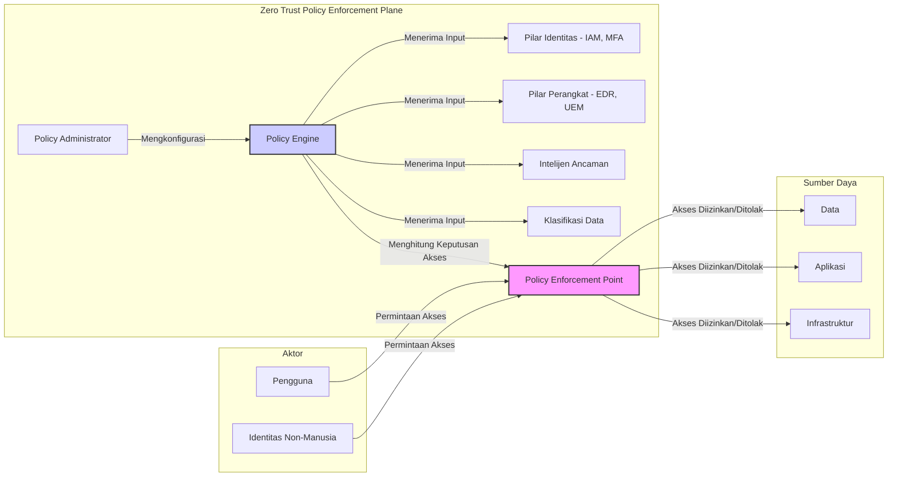
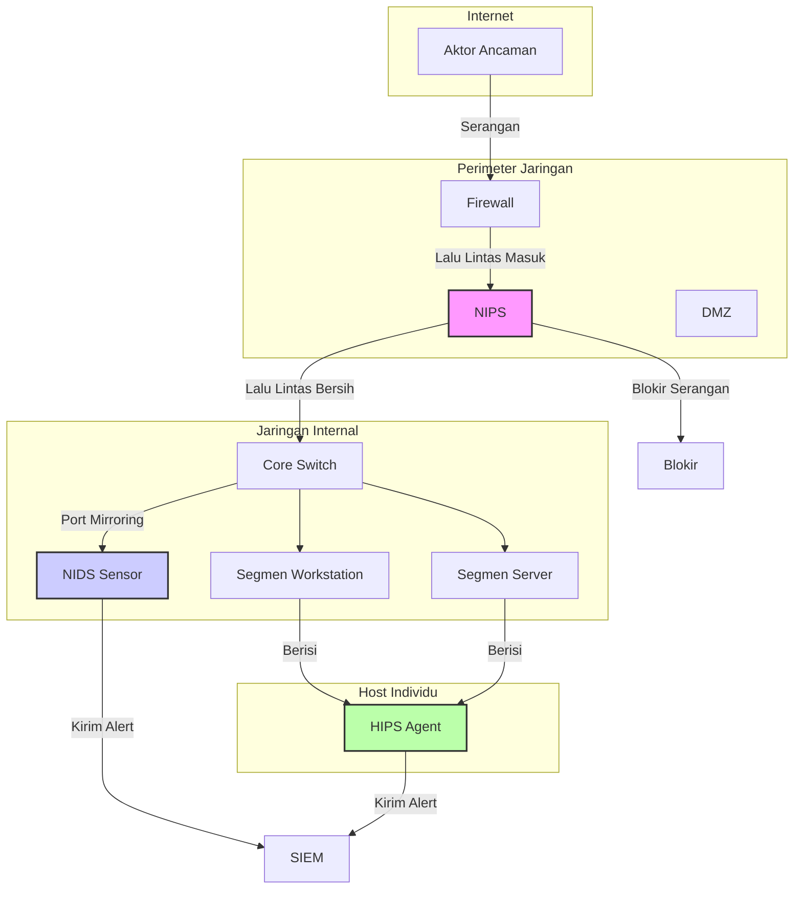

## **Modul Pembelajaran Mendalam Minggu 10-12: Paradigma dan Praktik Operasi Siber Defensif (DCO)**

**Abstrak**

Modul pembelajaran lanjutan selama tiga minggu ini akan memfokuskan analisis pada domain Operasi Siber Defensif (DCO), sebuah komponen fundamental dan paling kritis dari postur pertahanan siber suatu negara. Setelah sebelumnya mengkaji lanskap ancaman dan metodologi ofensif, modul ini secara sistematis akan melakukan dekonstruksi terhadap paradigma, arsitektur, dan proses yang membentuk pertahanan siber modern yang tangguh. Kita akan beralih dari model pertahanan berbasis perimeter yang usang ke paradigma **Zero Trust Architecture (ZTA)** yang dinamis dan berpusat pada identitas. Selanjutnya, modul ini akan melakukan penyelaman teknis ke dalam "sistem saraf" pertahanan jaringan, yaitu **Sistem Deteksi dan Pencegahan Intrusi (IDS/IPS)**, serta "pusat komando dan kendali" analitisnya, yaitu **Security Information and Event Management (SIEM)**. Puncak dari modul ini adalah pembahasan komprehensif mengenai doktrin dan praktik **Respons Insiden (*Incident Response*) dan Pemulihan (*Recovery*)**, yang merupakan ujian akhir dari ketahanan siber sebuah organisasi. Seluruh pengetahuan teoretis ini akan disintesiskan melalui serangkaian sesi interaktif, termasuk perancangan arsitektur pertahanan ZTA, simulasi konfigurasi alat deteksi, dan sebuah *table-top exercise* respons insiden yang realistis.

-----

### **Bagian 1: Konsep *Zero Trust Architecture* (ZTA) – Merevolusi Paradigma Pertahanan**

Selama beberapa dekade, model dominan dalam keamanan siber adalah **model pertahanan berbasis perimeter**, yang secara konseptual dapat dianalogikan dengan **benteng abad pertengahan (*castle-and-moat*)**. Model ini mengasumsikan bahwa segala sesuatu di dalam jaringan internal ("di dalam tembok benteng") dapat dipercaya, sementara segala sesuatu di luar ("di luar parit") tidak dapat dipercaya. Seluruh upaya pertahanan difokuskan pada penguatan perimeter (tembok, gerbang, parit) menggunakan teknologi seperti *firewall* dan proksi. Namun, paradigma ini telah runtuh secara fundamental di hadapan realitas lanskap ancaman modern.

#### **1.1. Kegagalan Model Perimeter: Pendorong Lahirnya Zero Trust**

  * **Disolusi Perimeter Jaringan:** Konsep "perimeter" yang jelas tidak lagi ada. Pengguna bekerja dari jarak jauh (*remote work*), data disimpan di *cloud* publik, dan perangkat pribadi (*Bring Your Own Device* - BYOD) mengakses sumber daya internal. Batas antara "dalam" dan "luar" telah menjadi kabur dan tidak relevan.
  * **Ancaman dari Dalam (*Insider Threats*):** Model perimeter secara inheren tidak berdaya melawan ancaman dari dalam, baik yang berniat jahat (*malicious insider*) maupun yang tidak disengaja (*unintentional insider*). Sekali seorang penyerang berhasil menembus perimeter (misalnya melalui *spear phishing*), mereka seringkali memiliki kebebasan untuk bergerak secara lateral di dalam jaringan internal yang "dipercaya".
  * **Serangan Rantai Pasok (*Supply Chain Attacks*):** Aktor ancaman tidak lagi hanya menyerang perimeter secara langsung. Mereka mengkompromikan vendor perangkat lunak atau perangkat keras yang dipercaya, menanamkan *malware* di dalam produk yang sah yang kemudian dibawa masuk melewati perimeter.

Kegagalan sistemik inilah yang melahirkan kebutuhan akan paradigma baru yang radikal. Konsep ini pertama kali diartikulasikan oleh John Kindervag saat di Forrester Research pada tahun 2010, dengan sebuah postulat yang sederhana namun kuat: **"Never trust, always verify."** Inilah esensi dari *Zero Trust Architecture* (ZTA).

#### **1.2. Definisi dan Tiga Prinsip Inti Zero Trust**

**Zero Trust** adalah sebuah model keamanan strategis yang beroperasi berdasarkan asumsi bahwa tidak ada kepercayaan implisit yang diberikan kepada aset atau akun pengguna berdasarkan lokasi fisik atau jaringan mereka (baik di dalam maupun di luar perimeter jaringan). ZTA bukanlah sebuah produk tunggal yang dapat dibeli, melainkan sebuah **filosofi dan pendekatan arsitektural** yang memerlukan integrasi berbagai teknologi dan proses.

ZTA dibangun di atas tiga prinsip inti:

1.  **Verifikasi Secara Eksplisit (*Verify Explicitly*):** Selalu lakukan otentikasi dan otorisasi berdasarkan semua titik data yang tersedia, termasuk identitas pengguna, lokasi, kesehatan perangkat, layanan atau beban kerja, klasifikasi data, dan anomali. Jangan pernah mempercayai permintaan akses hanya karena ia berasal dari alamat IP internal.
2.  **Gunakan Akses dengan Hak Istimewa Terendah (*Use Least Privilege Access*):** Batasi akses pengguna hanya pada sumber daya yang benar-benar mereka butuhkan untuk melakukan pekerjaan mereka (*need-to-know*). Implementasikan akses *just-in-time* (JIT) dan *just-enough-access* (JEA), di mana hak akses yang lebih tinggi diberikan hanya untuk durasi yang diperlukan dan dicabut secara otomatis sesudahnya.
3.  **Asumsikan Telah Terjadi Pelanggaran (*Assume Breach*):** Perlakukan setiap permintaan akses seolah-olah berasal dari jaringan yang tidak terpercaya. Lakukan segmentasi mikro pada jaringan untuk membatasi ruang gerak penyerang jika mereka berhasil mendapatkan akses. Enkripsi semua komunikasi dari ujung ke ujung (*end-to-end*). Kumpulkan telemetri dari seluruh lingkungan untuk mendeteksi anomali dan merespons ancaman dengan cepat.

#### **1.3. Pilar Fundamental Implementasi Zero Trust Architecture**

Implementasi ZTA yang komprehensif melibatkan penguatan dan integrasi kapabilitas di lima pilar fundamental.

  * **a. Identitas (*Identity*)**

      * **Konsep:** Identitas (baik pengguna manusia maupun identitas non-manusia seperti layanan atau perangkat) menjadi **perimeter keamanan yang baru**.
      * **Teknologi Kunci:**
          * ***Identity and Access Management* (IAM):** Sistem terpusat untuk mengelola identitas digital dan hak aksesnya.
          * ***Identity Provider* (IdP):** Sistem yang menciptakan, memelihara, dan mengelola informasi identitas sambil menyediakan layanan otentikasi (Contoh: Microsoft Entra ID/Azure AD, Okta).
          * ***Multi-Factor Authentication* (MFA):** Mengharuskan pengguna untuk menyediakan lebih dari satu bukti identitas (misalnya, kata sandi + kode dari aplikasi authenticator + sidik jari). Ini adalah kontrol keamanan paling efektif untuk melawan pencurian kredensial.
          * ***Single Sign-On* (SSO):** Memungkinkan pengguna untuk login sekali dan mendapatkan akses ke berbagai aplikasi tanpa perlu memasukkan kredensial berulang kali, sambil tetap menerapkan kebijakan keamanan yang terpusat.

  * **b. Perangkat (*Devices* / *Endpoints*)**

      * **Konsep:** Setiap perangkat yang mencoba mengakses sumber daya harus diverifikasi kesehatannya dan kepatuhannya terhadap kebijakan keamanan. Perangkat yang tidak aman atau terinfeksi tidak boleh diizinkan mengakses data sensitif, bahkan jika kredensial penggunanya valid.
      * **Teknologi Kunci:**
          * ***Unified Endpoint Management* (UEM) / *Mobile Device Management* (MDM):** Alat untuk mengelola dan memberlakukan kebijakan keamanan pada laptop, ponsel, dan tablet (misalnya, mewajibkan enkripsi disk, menginstal pembaruan keamanan).
          * ***Endpoint Detection and Response* (EDR):** Generasi berikutnya dari antivirus. EDR secara kontinu memonitor aktivitas di level *endpoint* (proses yang berjalan, koneksi jaringan, modifikasi file) untuk mendeteksi perilaku berbahaya yang mungkin lolos dari deteksi berbasis *signature*.

  * **c. Jaringan (*Network*)**

      * **Konsep:** Jaringan tidak lagi dianggap sebagai zona terpercaya. Tujuannya adalah untuk memecah jaringan besar yang datar menjadi segmen-segmen kecil yang terisolasi untuk mencegah gerakan lateral.
      * **Teknologi Kunci:**
          * ***Microsegmentation* (Segmentasi Mikro):** Menggunakan *firewall* perangkat lunak (*software-defined firewall*) untuk menciptakan zona keamanan yang sangat granular di sekitar setiap aplikasi atau bahkan setiap beban kerja (*workload*). Jika satu server dikompromikan, aturan segmentasi mikro akan mencegahnya berkomunikasi dengan server lain kecuali secara eksplisit diizinkan.
          * **Enkripsi Jaringan:** Semua lalu lintas, bahkan di dalam jaringan internal (lalu lintas *east-west*), harus dienkripsi untuk mencegah penyadapan.

  * **d. Aplikasi dan Beban Kerja (*Applications & Workloads*)**

      * **Konsep:** Setiap aplikasi harus diamankan, baik itu aplikasi lawas di pusat data lokal maupun aplikasi modern berbasis *microservices* di *cloud*.
      * **Teknologi Kunci:**
          * ***Secure Software Development Lifecycle* (SSDLC):** Mengintegrasikan praktik keamanan sejak fase awal pengembangan aplikasi.
          * ***Web Application Firewall* (WAF):** *Firewall* yang dirancang khusus untuk melindungi aplikasi web dari serangan umum seperti injeksi SQL dan *Cross-Site Scripting* (XSS).
          * **API Security Gateways:** Mengamankan *Application Programming Interfaces* (API) yang merupakan tulang punggung aplikasi modern.

  * **e. Data**

      * **Konsep:** Pada akhirnya, semua pilar lain ada untuk melindungi data. Keamanan harus melekat pada data itu sendiri.
      * **Teknologi Kunci:**
          * **Klasifikasi Data:** Mengidentifikasi dan melabeli data berdasarkan tingkat sensitivitasnya (misalnya, Rahasia Negara, Rahasia Militer, Publik).
          * ***Data Loss Prevention* (DLP):** Alat yang memonitor dan memblokir upaya untuk memindahkan data sensitif keluar dari jaringan atau ke lokasi yang tidak sah.
          * **Enkripsi Data:** Melindungi data baik saat diam (*at rest* - di hard drive), saat bergerak (*in transit* - melalui jaringan), maupun saat digunakan (*in use* - di memori).

#### **1.4. Diagram Konseptual Zero Trust Architecture**

Diagram di atas mengilustrasikan alur kerja ZTA. Setiap permintaan akses dari **Aktor** ke **Sumber Daya** tidak langsung dihubungkan. Sebaliknya, ia harus melewati **Policy Enforcement Point (PEP)**. PEP akan meminta keputusan dari **Policy Engine (PE)**, yang secara dinamis menghitung apakah akses harus diberikan berdasarkan sinyal *real-time* dari berbagai pilar (identitas pengguna, kesehatan perangkat, dll.).

-----

### **Bagian 2: Sistem Deteksi dan Pencegahan Intrusi (IDS/IPS) – Sistem Saraf Pusat Pertahanan Jaringan**

Jika ZTA adalah strategi besar, maka IDS/IPS adalah salah satu komponen taktis paling vital di garis depan. Sistem ini berfungsi sebagai "penjaga" atau "sistem saraf" jaringan, yang secara terus-menerus memonitor lalu lintas untuk mencari tanda-tanda aktivitas berbahaya atau pelanggaran kebijakan. Memahami perbedaan, jenis, dan metodologi deteksi mereka adalah fundamental bagi setiap praktisi pertahanan siber.

#### **2.1. Perbedaan Fundamental: IDS vs. IPS**

  * **Intrusion Detection System (IDS) - Sistem Deteksi Intrusi**

      * **Fungsi:** Bekerja secara pasif. IDS "mendengarkan" lalu lintas jaringan (biasanya melalui salinan lalu lintas dari *port mirroring* atau *network tap*) dan menganalisisnya. Jika ia mendeteksi aktivitas yang mencurigakan, tugasnya adalah **mencatatnya dan mengirimkan peringatan (alert)** kepada administrator keamanan.
      * **Analogi:** Sebuah **sistem alarm pencuri** di sebuah gedung. Ia akan berbunyi keras dan memberi tahu penjaga keamanan ketika ada penyusup, tetapi ia tidak secara fisik menghentikan penyusup tersebut.
      * **Keuntungan:** Tidak menambah latensi pada jaringan karena tidak berada di jalur lalu lintas utama (*out-of-band*).
      * **Kerugian:** Bersifat reaktif. Ia hanya memberi tahu Anda bahwa sesuatu yang buruk telah terjadi; ia tidak mencegahnya.

  * **Intrusion Prevention System (IPS) - Sistem Pencegahan Intrusi**

      * **Fungsi:** Bekerja secara aktif. IPS ditempatkan *inline* di jalur lalu lintas utama (seperti *firewall*). Ia menganalisis setiap paket yang lewat. Jika ia mendeteksi paket atau aliran lalu lintas yang berbahaya, ia dapat **secara aktif memblokirnya** sebelum mencapai target.
      * **Analogi:** Sebuah **penjaga keamanan bersenjata atau pintu putar otomatis** di pintu masuk gedung. Ia tidak hanya mendeteksi penyusup, tetapi juga secara fisik mencegah mereka masuk.
      * **Keuntungan:** Mampu mencegah serangan secara *real-time*.
      * **Kerugian:** Jika terjadi kesalahan konfigurasi atau kegagalan perangkat keras, ia dapat menjadi titik tunggal kegagalan yang melumpuhkan lalu lintas jaringan yang sah. Ia juga menambah sedikit latensi.

Saat ini, sebagian besar vendor menawarkan perangkat terintegrasi yang disebut **Unified Threat Management (UTM)** atau **Next-Generation Firewall (NGFW)** yang memiliki fungsionalitas IDS dan IPS.

#### **2.2. Klasifikasi Berdasarkan Penempatan: NIDS/NIPS vs. HIDS/HIPS**

  * **a. Network-based IDS/IPS (NIDS/NIPS)**

      * **Penempatan:** Sensor NIDS/NIPS ditempatkan di titik-titik strategis dalam jaringan (misalnya, di belakang *firewall* perimeter, atau di antara segmen jaringan internal) untuk memonitor lalu lintas yang mengalir di antara banyak sistem.
      * **Kelebihan:**
          * **Visibilitas Luas:** Dapat memonitor seluruh segmen jaringan dari satu titik.
          * **Deteksi Dini:** Dapat mendeteksi aktivitas pemindaian dan upaya serangan sebelum mencapai *host* target.
          * **Independen dari OS:** Tidak bergantung pada sistem operasi dari *host* yang dilindunginya.
      * **Kelemahan:**
          * **Titik Buta pada Lalu Lintas Terenkripsi:** Jika lalu lintas dienkripsi (misalnya, HTTPS), NIDS/NIPS tidak dapat memeriksa isinya kecuali ada proses dekripsi.
          * **Kesulitan pada Jaringan Berkecepatan Sangat Tinggi:** Mungkin tidak mampu memeriksa setiap paket tanpa kehilangan (*packet drop*) pada jaringan yang sangat sibuk.
          * **Tidak Dapat Melihat Aktivitas Internal Host:** NIDS/NIPS tidak tahu apa yang terjadi di dalam sebuah *host* (misalnya, proses mana yang berjalan).

  * **b. Host-based IDS/IPS (HIDS/HIPS)**

      * **Penempatan:** Agen perangkat lunak HIDS/HIPS diinstal pada setiap *endpoint* individual (server, laptop).
      * **Kelebihan:**
          * **Visibilitas Mendalam:** Dapat memonitor aktivitas internal *host*, seperti panggilan sistem (*system calls*), modifikasi file log dan registry, serta proses yang berjalan. Ini memberikan konteks yang sangat kaya.
          * **Dapat Menganalisis Lalu Lintas Terenkripsi:** Karena berada di *host*, ia dapat memeriksa lalu lintas setelah didekripsi oleh sistem operasi.
          * **Deteksi Serangan Spesifik Host:** Dapat mendeteksi serangan yang tidak terlihat di tingkat jaringan, seperti *buffer overflow* atau upaya eskalasi hak istimewa.
      * **Kelemahan:**
          * **Memerlukan Deployment dan Manajemen yang Kompleks:** Harus diinstal dan dipelihara pada setiap *host*.
          * **Mengonsumsi Sumber Daya Host:** Agen HIDS/HIPS menggunakan sebagian kecil CPU dan RAM dari *host* tempat ia berjalan.
          * **Dapat Dinonaktifkan:** Jika penyerang berhasil mendapatkan hak akses administrator pada sebuah *host*, mereka dapat mencoba menonaktifkan atau merusak agen HIDS/HIPS.

**Strategi Pertahanan Terbaik:** Menggunakan pendekatan berlapis (*defense-in-depth*) dengan **mengkombinasikan NIDS/NIPS dan HIDS/HIPS**. NIDS/NIPS memberikan pertahanan di perimeter dan segmen jaringan, sementara HIDS/HIPS (atau EDR modern) memberikan pertahanan mendalam di setiap aset kritis.

#### **2.3. Metodologi Deteksi**

Bagaimana IDS/IPS tahu bahwa sesuatu itu berbahaya? Mereka menggunakan beberapa metode utama:

  * **a. Deteksi Berbasis Tanda Tangan (*Signature-Based Detection*)**

      * **Konsep:** Metode tradisional dan paling dasar. IDS/IPS memiliki basis data besar berisi "tanda tangan" atau *signature* dari serangan yang diketahui. Tanda tangan ini bisa berupa urutan byte spesifik dalam *payload* paket (misalnya, untuk mendeteksi *shellcode*), pola lalu lintas tertentu, atau *hash* dari file *malware* yang dikenal.
      * **Analogi:** Petugas keamanan di bandara yang memiliki buku berisi foto-foto buronan. Dia membandingkan setiap wajah yang lewat dengan foto-foto di bukunya.
      * **Kelebihan:** Sangat akurat dalam mendeteksi ancaman yang diketahui. Tingkat positif palsu (*false positives*) sangat rendah.
      * **Kelemahan:** **Sama sekali tidak efektif melawan serangan baru atau *zero-day*** yang belum memiliki tanda tangan. Basis data tanda tangan harus terus menerus diperbarui.

  * **b. Deteksi Berbasis Anomali (*Anomaly-Based Detection*)**

      * **Konsep:** Metode ini bekerja dengan terlebih dahulu membangun sebuah "garis dasar" (*baseline*) dari perilaku jaringan yang normal selama periode waktu tertentu. Setelah *baseline* terbentuk, IDS/IPS akan memonitor jaringan untuk setiap deviasi atau anomali yang signifikan dari perilaku normal tersebut.
      * **Analogi:** Petugas keamanan yang telah bekerja di gedung yang sama selama bertahun-tahun. Dia mungkin tidak tahu persis siapa penyusupnya, tetapi dia memiliki intuisi yang kuat ketika dia melihat seseorang atau sesuatu yang "tidak pada tempatnya" atau "aneh".
      * **Kelebihan:** **Mampu mendeteksi serangan baru atau *zero-day*** yang belum pernah terlihat sebelumnya.
      * **Kelemahan:** Cenderung menghasilkan **tingkat positif palsu yang tinggi**. Perubahan perilaku jaringan yang sah (misalnya, pengenalan aplikasi baru) dapat secara keliru ditandai sebagai anomali. Memerlukan periode "pembelajaran" dan penyetelan (*tuning*) yang hati-hati.

  * **c. Deteksi Berbasis Analisis Protokol Statefull (*Stateful Protocol Analysis*)**

      * **Konsep:** Metode ini membandingkan lalu lintas jaringan dengan definisi standar dan ekspektasi dari protokol yang digunakan (misalnya, RFC untuk HTTP atau DNS). Ia mencari penyimpangan dari penggunaan protokol yang sah.
      * **Contoh:** Jika sebuah perintah HTTP GET dikirim ke port yang biasanya digunakan untuk SMTP (email), atau jika sebuah respons DNS memiliki format yang tidak standar, metode ini akan menandainya sebagai anomali.
      * **Keuntungan:** Dapat mendeteksi serangan yang mencoba menyembunyikan diri di dalam protokol yang tampaknya sah.

  * **d. Deteksi Berbasis Heuristik dan Kecerdasan Buatan (AI/ML)**

      * **Konsep:** Merupakan evolusi dari deteksi berbasis anomali. Menggunakan algoritma *machine learning* (ML) dan model statistik untuk menganalisis miliaran titik data dari jaringan dan *host* untuk mengidentifikasi pola-pola kompleks yang berkorelasi tinggi dengan perilaku berbahaya, bahkan jika pola tersebut belum pernah terlihat sebelumnya.
      * **Aplikasi:** Sangat efektif dalam mendeteksi TTPs canggih seperti gerakan lateral atau eksfiltrasi data yang "low and slow".

#### **2.4. Diagram Penempatan IDS/IPS dalam Jaringan**

-----

